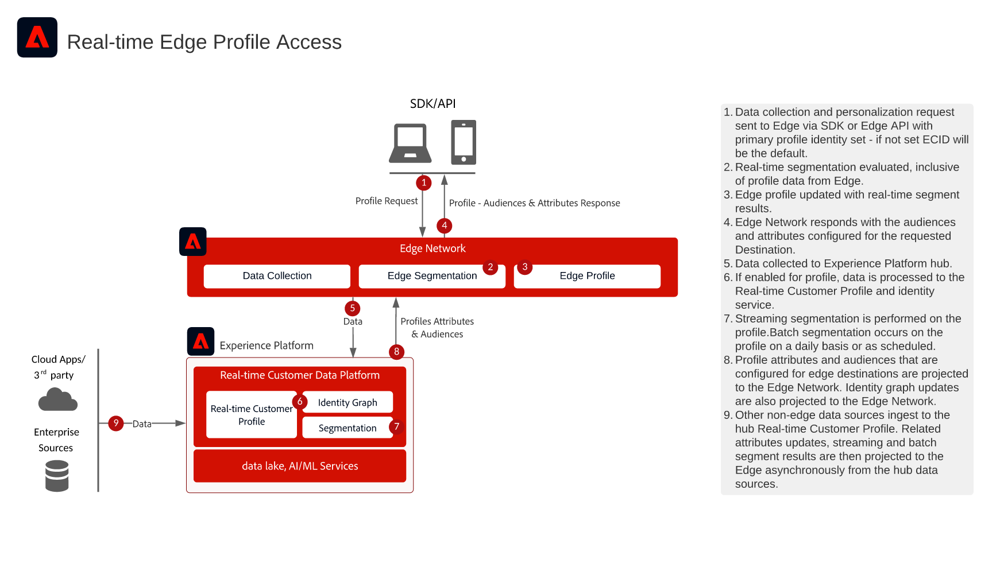

# リアルタイムのEdgeプロファイルアクセス

>[!TIP]
>このアーキテクチャは、Personalizationの[ ユースケースパターン ](/help/blueprints/use-case-patterns/personalization/edge-profile-access.md)としても文書化されています。

この図は、web アプリケーションとモバイルアプリケーションがエッジで[!UICONTROL  リアルタイム顧客プロファイル ]のAdobe Experience Platformにアクセスし、高スループットで低遅延のパーソナライズを実現する方法を示しています。

アプリケーションは、ミリ秒単位の遅延で、エッジにあるリアルタイムのプロファイル属性およびオーディエンスにアクセスできます。 プロファイルに属性、オーディエンスメンバーシップ、モデル駆動機能を属性として保存し、webとモバイルのチャネル全体で同じページと次のページのパーソナライゼーションをリアルタイムで実行できます。

この機能を利用すれば、リアルタイムの行動から得られるオーディエンス、リアルタイムの顧客プロファイルに取り込まれた属性、計算されたインサイトなど、リアルタイムの顧客プロファイルにもとづいて、web サイトやモバイルアプリケーションで、高度にパーソナライズされた体験を提供できます。

>[!NOTE]
>
>Edgeのプロファイルアクセスは、webやモバイルのインバウンドパーソナライゼーション、リアルタイムのオファー決定など、スループットが高く低遅延のユースケース向けに設計されています。 エージェントによるサポートやセールスインタラクションなど、スループットが低いシナリオの場合は、Hub プロファイル参照APIの方が適切です。

## アプリケーション

* Real-time Customer Data Platform
* Adobe Experience Platform Data Collection （Web SDK / モバイルSDK）
* Edge Network Server API

## ユースケース

* webとモバイルのチャネルでリアルタイムにパーソナライズされ、既知の顧客体験を提供
* リアルタイムのプロファイル属性とオーディエンスにもとづく、同一ページと次のページのパーソナライゼーション
* リアルタイムの行動データ、属性、計算されたインサイトなど、顧客プロファイルにもとづくコンテンツとオファーのパーソナライゼーションを実現します
* パーソナライゼーションエンジン、コンテンツ管理システム、外部アプリケーションとの統合によるリアルタイムの意思決定
* リアルタイムのプロファイルコンテキストによるテストとコンテンツ最適化

## アーキテクチャ図

{width="1000" zoomable="yes"}

## ガードレール

* [[!UICONTROL  リアルタイム顧客プロファイル ] データのガードレール](https://experienceleague.adobe.com/docs/experience-platform/profile/guardrails.html?lang=ja)
* [Edge Network ガードレール](https://experienceleague.adobe.com/docs/experience-platform/edge-network-server-api/guardrails.html)
* Edge プロファイルには、14日間の有効期間（TTL）があります。 ユーザーが14日間エッジでアクティブでなかった場合、エッジプロファイルは期限切れになり、ハブから取得する必要が生じる可能性があり、最初のページのパーソナライゼーションに影響を与える可能性があります。
* Edge personalizationは、エッジセグメント化の条件を満たすオーディエンスに対して、リアルタイムのオーディエンスメンバーシップの評価をサポートします。 ハブからのバッチオーディエンスとストリーミングオーディエンスも、適切な設定でエッジで利用できます。

## 関連ドキュメント

### 配信先設定

* [ カスタム Personalization Connection](https://experienceleague.adobe.com/en/docs/experience-platform/destinations/catalog/personalization/custom-personalization) - プライマリ実装ガイド
* [Personalizationの宛先の概要](https://experienceleague.adobe.com/en/docs/experience-platform/destinations/catalog/personalization/overview)
* [エッジのパーソナライゼーション宛先に対するオーディエンスのアクティブ化](https://experienceleague.adobe.com/en/docs/experience-platform/destinations/ui/activate/activate-edge-personalization-destinations)
* [エッジ上のプロファイル属性をリアルタイムで検索し](https://experienceleague.adobe.com/en/docs/experience-platform/destinations/ui/activate/activate-edge-profile-lookup)

### SDK ドキュメント

* [Experience Platform Web SDKのドキュメント](https://experienceleague.adobe.com/docs/experience-platform/web-sdk/home.html)
* [Experience Platform Mobile SDKのドキュメント](https://developer.adobe.com/client-sdks/home/)
* [Edge Network Server API ドキュメント](https://experienceleague.adobe.com/docs/experience-platform/edge-network-server-api/overview.html?lang=ja)
* [Experience Platform Tags ドキュメント](https://experienceleague.adobe.com/docs/experience-platform/tags/home.html?lang=ja)
* [Web SDKでのコマンド応答](https://experienceleague.adobe.com/docs/experience-platform/web-sdk/commands/command-responses.html)

### プロファイルとセグメント化に関するドキュメント

* [[!UICONTROL  リアルタイム顧客プロファイル ] ドキュメント](https://experienceleague.adobe.com/docs/experience-platform/profile/home.html)
* [プロファイルガードレール](https://experienceleague.adobe.com/docs/experience-platform/profile/guardrails.html?lang=ja)

### チュートリアル

* [Real-Time CDPとAdobe Targetによる次のヒットのパーソナライゼーション](https://experienceleague.adobe.com/docs/platform-learn/tutorials/experience-cloud/next-hit-personalization.html)
* [データストリーム設定](https://experienceleague.adobe.com/docs/experience-platform/datastreams/configure.html?lang=ja)
