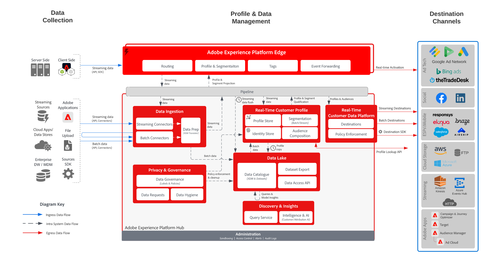

# Adobe Real-Time CDPの活用

このアーキテクチャでは、Adobe [!DNL Real-Time Customer Data Platform] （[!DNL Real-Time CDP]）が、ストリーミングおよびバッチデータフローを通じて、オーディエンスとプロファイルデータを広告、ソーシャル、クラウドストレージ、エンタープライズの宛先にアクティベートする方法を示します。

## オーディエンスとプロファイルのアクティベーション

アーキテクチャは、[!DNL Real-Time CDP]個のオーディエンスとプロファイルから宛先アプリケーションへの共有アクティベーションパスを示しています。 広告およびソーシャルプラットフォーム向けの配信先アクティベーションだけでなく、保存、分析、下流のアプリケーションワークフローに使用されるエンタープライズ配信先も含まれます。

{width="1000" zoomable="yes"}

## サポートされるユースケースパターン

上記のアーキテクチャは、次のユースケースパターンをサポートしています。

- [&#x200B; オーディエンスの宛先へのアクティベーション &#x200B;](/help/blueprints/use-case-patterns/audience-building-activation/audience-activation-to-destinations.md) – 広告、ソーシャル、クラウドストレージ、CRM、その他のエンタープライズ宛先に対して評価オーディエンスをアクティベートします。
- [匿名の訪問者のweb パーソナライゼーション &#x200B;](/help/blueprints/use-case-patterns/personalization/anonymous-visitor-web-personalization.md) — デジタルチャネルをまたいで、オーディエンスのアクティブ化とプロファイルベースのパーソナライゼーションをサポートします。

## プライマリデータフローと統合ポイント

- 複数のソースから顧客データを[!DNL Real-Time CDP]に取り込みます。
- [!DNL Real-Time Customer Profile]でIDとプロファイル属性を統合します。
- プロファイルをオーディエンスに評価して活用。
- 広告、ソーシャル、クラウドストレージ、エンタープライズ配信先へのオーディエンスのストリームまたはバッチ処理とプロファイルの変更。
- 下流のマーケティング、営業、サポート、分析、パーソナライゼーションワークフローで、アクティブ化されたプロファイルデータとオーディエンスデータを使用します。

## 関連トピックス

- [Adobe Real-Time CDPの宛先](https://experienceleague.adobe.com/en/docs/experience-platform/destinations/home)
- [配信先でオーディエンスを活用](https://experienceleague.adobe.com/en/docs/experience-platform/destinations/ui/activate/activate-batch-profile-destinations)
- [Adobe Real-Time CDPのガードレール](https://experienceleague.adobe.com/en/docs/experience-platform/rtcdp/guardrails/overview)
