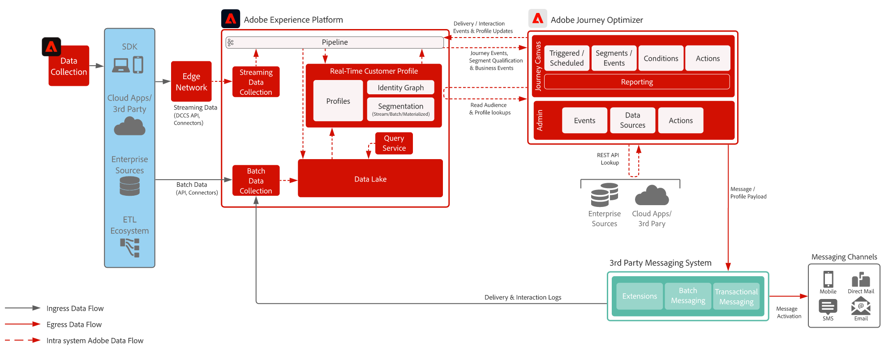

# サードパーティーメッセージ

>[!TIP]
>このアーキテクチャは、「キャンペーン管理とオーケストレーション」の下に[&#x200B; ユースケースパターン &#x200B;](/help/blueprints/use-case-patterns/campaign-management-orchestration/third-party-messaging.md)として文書化されています。

Adobe Journey Optimizerをサードパーティのメッセージングシステムと組み合わせて使用し、パーソナライズされたコミュニケーションを送信する方法を示します。

 

## アーキテクチャ

{width="1000" zoomable="yes"}

 

トポロジには、[!DNL Journey Optimizer]がサードパーティにトランザクションペイロードを送信していることが表示されます
カスタムアクションまたはREST API統合によるメッセージングアプリケーション。 [&#x200B; サードパーティのメッセージのユースケース パターンを使用](/help/blueprints/use-case-patterns/campaign-management-orchestration/third-party-messaging.md)
前提条件、ガードレール、導入ガイダンスに関する情報を提供します。

 

## 関連ドキュメント

* [Experience Platform ドキュメント](https://experienceleague.adobe.com/docs/experience-platform.html?lang=ja)
* [Experience Platform Tags ドキュメント](https://experienceleague.adobe.com/docs/experience-platform/tags/home.html?lang=ja)
* [Experience Platform Mobile SDKのドキュメント](https://experienceleague.adobe.com/docs/mobile.html)
* [Journey Optimizer ドキュメント](https://experienceleague.adobe.com/docs/journey-optimizer/using/ajo-home.html)
* [Journey Optimizerの製品説明](https://helpx.adobe.com/jp/legal/product-descriptions/adobe-journey-optimizer.html)
