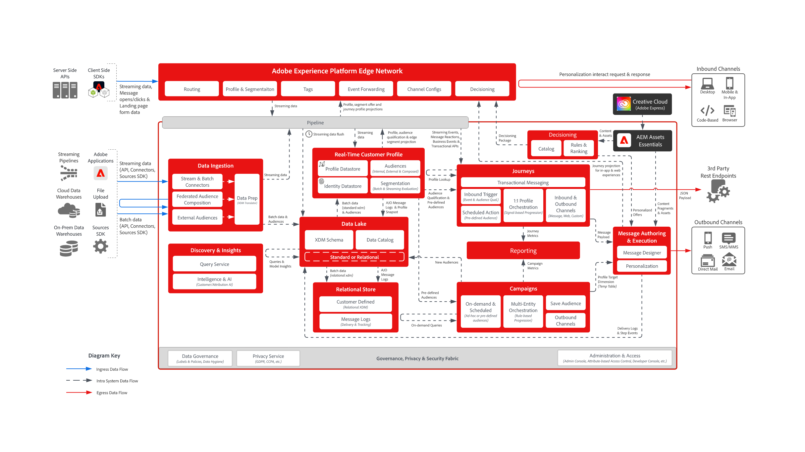

# アーキテクチャ図

アーキテクチャ図とは、システムの統合ポイント、データとコンテンツのフロー、一連の処理など、Adobe Experience Platformとアプリケーションが連携する過程を視覚的かつ技術的に示したものです。 [ ユースケースパターン ](/help/blueprints/use-case-patterns/overview.md)のステップバイステップのガイダンスに入る前に、ソリューションの設計を理解するために使用します。

これらの図は、次のカテゴリに整理されています。 特定のカテゴリーのランディングページやリードダイアグラムに移動するには、カードを選択します。左側のナビゲーションを使用して、カテゴリー内のあらゆるダイアグラムを参照します。

<table style="table-layout:fixed; width:100%;">
<tr>
  <td style="width:33%; vertical-align:top; padding:10px; box-sizing:border-box;">
    
    

      <a href="architecture-overviews/overview.md">
        <strong> アーキテクチャの概要</strong>
      </a>
      
Adobe Experience Cloud アプリケーション、Adobe Experience Platform、デプロイメント SDKの連携に関する情報、ガードレール、遅延を解説します。

    

  </td>
  <td style="width:33%; vertical-align:top; padding:10px; box-sizing:border-box;">
    
    

      <a href="audience-profile-activation/overview.md">
        <strong> オーディエンスとプロファイルのアクティベーション </strong>
      </a>
      
Adobe Real-Time CDPでオーディエンスとプロファイルを構築し、配信先やアプリケーションに対して活用する方法。

    

  </td>
  <td style="width:33%; vertical-align:top; padding:10px; box-sizing:border-box;">
    
    

      <a href="b2b-activation-marketing/overview.md">
        <strong>B2B アクティベーションとマーケティング </strong>
      </a>
      
Real-Time Customer Data Platform B2B editionによる、チャネルと配信先をまたいだアカウントベースおよびピープルベースのオーディエンスアクティベーション。

    

  </td>
</tr>
<tr>
  <td style="width:33%; vertical-align:top; padding:10px; box-sizing:border-box;">
    
    

      <a href="customer-insights/overview.md">
        <strong>顧客インサイト </strong>
      </a>
      
Customer Journey Analyticsが、クロスチャネルの行動データを統合、分析し、Real-Time CDPやJourney Optimizerと統合される方法。

    

  </td>
  <td style="width:33%; vertical-align:top; padding:10px; box-sizing:border-box;">
    
    

      <a href="customer-journeys/journey-optimizer/journey-optimizer-overview.md">
        <strong> カスタマージャーニー</strong>
      </a>
      
Journey Optimizerによるイベント駆動型ジャーニーオーケストレーション、エッジとハブでの意思決定、Adobe Campaignによるバッチオーケストレーション。

    

  </td>
  <td style="width:33%; vertical-align:top; padding:10px; box-sizing:border-box;"></td>
</tr>
</table>

## 関連コンテンツ

* [ ユースケースパターン ](/help/blueprints/use-case-patterns/overview.md) – これらのアーキテクチャ上に構築される反復可能な実装アプローチ
* [主なビジネス目標](/help/blueprints/business-objectives/overview.md) – これらのアーキテクチャが達成するビジネス成果
* [業界ユースケース ](/help/blueprints/industry-use-cases/use-case-catalog.md) – これらのパターンの垂直固有のアプリケーション
