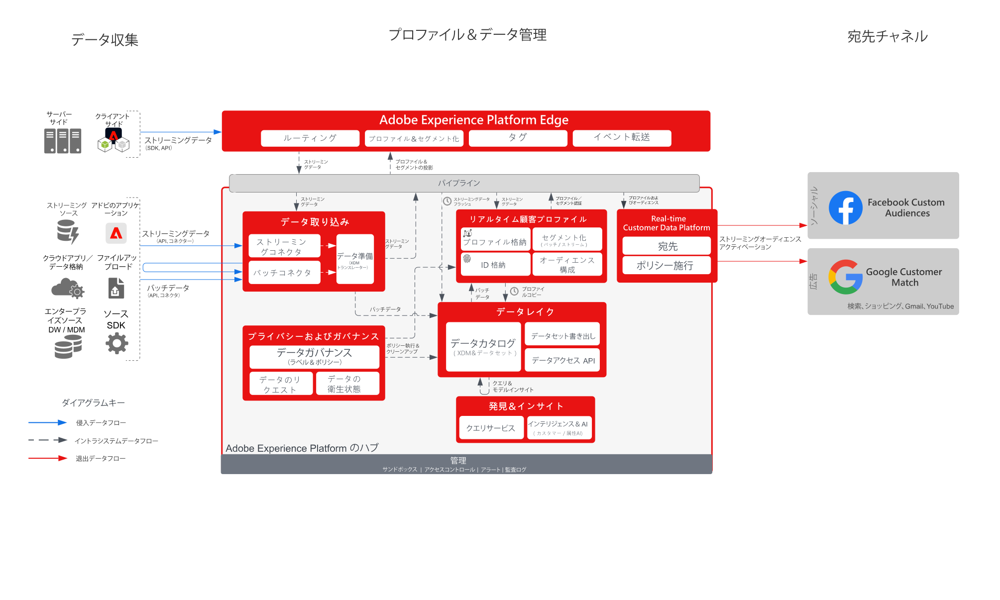

# Audience ActivationからソーシャルおよびAdvertisingの宛先

>[!TIP]
>このブループリントは、「オーディエンスの構築とアクティベーション」の下の[ ユースケースパターン ](/help/blueprints/use-case-patterns/audience-building-activation/audience-activation-to-destinations.md)としても利用できます。

複数のソースから顧客データを取り込み、顧客の単一のプロファイルビューを構築します。 これらのプロファイルをセグメント化して、マーケティングやパーソナライゼーション用のオーディエンスを作成したり、FacebookやGoogleなどの広告ネットワークとオーディエンスを共有して、これらのオーディエンスをターゲットにした施策やパーソナライズされた施策を展開したりできます。

## ユースケース

* ソーシャルおよび広告の宛先の既知のオーディエンスに対するオーディエンスターゲティング。
* オンラインおよびオフライン属性を使用したオンラインパーソナライズ機能。

## アプリケーション

* Real-time Customer Data Platform

## アーキテクチャ

## ガードレール

[プロファイルとセグメント化のガードレール](https://experienceleague.adobe.com/docs/experience-platform/profile/guardrails.html?lang=ja)

## 関連ドキュメント

Facebook Custom Audiences へのアクティベーション - [宛先の設定](https://experienceleague.adobe.com/docs/experience-platform/destinations/catalog/social/facebook.html?lang=ja)

Google Customer Match へのアクティベーション - [宛先の設定](https://experienceleague.adobe.com/docs/experience-platform/destinations/catalog/advertising/google-customer-match.html?lang=ja)