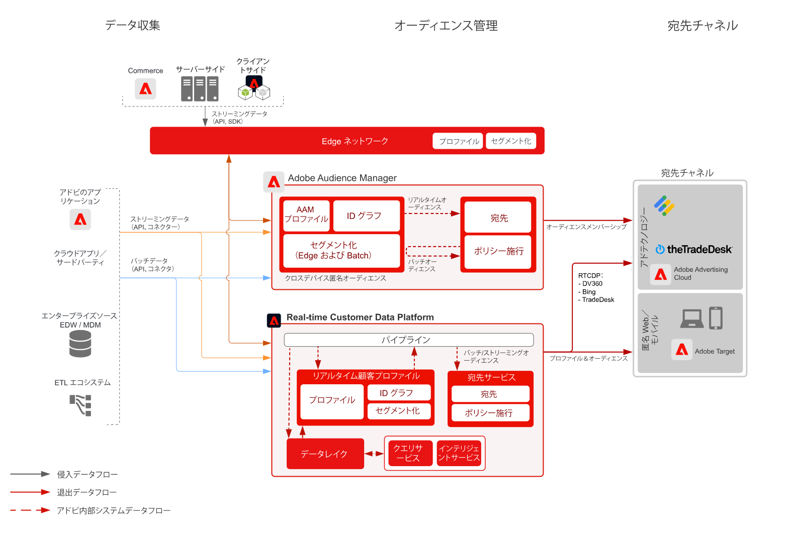

# 匿名Audience Activationのブループリント

匿名および行動顧客データに基づいて、web および広告チャネルをまたいでオーディエンスをターゲットできます。この機能を使用すると、デバイスをまたいでパーソナライズされた一貫性のあるリアルタイムカスタマーエクスペリエンスを実現します。

## ユースケース

* 匿名デジタルオーディエンスのターゲティングおよびパーソナライズ機能を実行する。
* サポートされている広告ネットワークでのターゲティング用にオーディエンスを作成する。

## アプリケーション

* Adobe Audience Manager

## 構造

## 実装手順

<!-- These steps should link to help. -->

1. [Audience Manager を実装](https://experienceleague.corp.adobe.com/docs/audience-manager/user-guide/implementation-integration-guides/implement-audience-manager.html?lang=en#implementation-integration-guides)します。
1. Audience Manager にデータを収集します。
1. セグメント定義に使用するシグナルおよび特性を設定します。
1. Audience Manager でセグメントを作成します。
1. Audience Manager で宛先を設定して、オーディエンスを共有します。

## 関連ドキュメント

* [Audience Manager](https://experienceleague.adobe.com/docs/audience-manager.html?lang=ja)
* [[!UICONTROL Experience Cloud Audiences]](https://experienceleague.adobe.com/docs/core-services/interface/audiences/audience-library.html?lang=ja)
* [Audience Manager と Target の統合](https://experienceleague.adobe.com/docs/audience-manager/user-guide/implementation-integration-guides/integration-other-solutions/aam-target-integration.html?lang=ja)
* [Audience Managerを通じたAdobe Analyticsセグメントの共有](https://experienceleague.adobe.com/docs/analytics/components/segmentation/segmentation-workflow/seg-publish.html?lang=ja)
