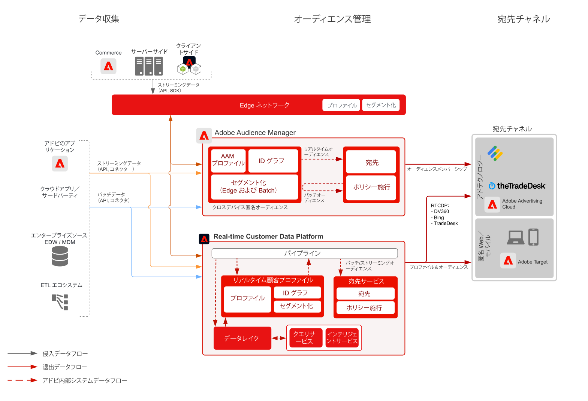

# デバイスベース - Audience Managerによる匿名オーディエンスターゲティング

>[!TIP]
>このブループリントは、Personalizationの[&#x200B; ユースケースパターン &#x200B;](/help/blueprints/use-case-patterns/personalization/anonymous-visitor-web-personalization.md)としても利用できます。

匿名オーディエンスのアクティベーションは、匿名デバイスおよび行動データに基づいて、web、モバイル、広告の各チャネルをまたいでオーディエンスをターゲティングしてパーソナライズする機能です。

## ユースケース

* Web サイト、モバイルアプリ、またはサポートされる広告チャネルで、匿名デジタルオーディエンスのターゲティングとパーソナライゼーションを実行します。
* 既知のデバイスや行動特性に基づいて、ランディングページと事前認証エクスペリエンスを最適化します。
* Audience Manager のサードパーティデータネットワークを活用して、ターゲティング用のオーディエンスをさらに絞り込み、拡張します。

## アプリケーション

* Audience Manager
* Real-time Customer Data Platform

Audience Manager と Real-time Customer Data Platform の両方を活用して、匿名オーディエンスアクティベーションをオンサイトと広告の宛先に使用できます。 Real-time Customer Data Platform は、[宛先ドキュメント](https://experienceleague.adobe.com/docs/experience-platform/destinations/catalog/advertising/overview.html?lang=ja)に記載されている匿名デバイス識別子を持つ広告の宛先のサブセットのみをサポートしていることに留意してください。

## アーキテクチャ

 

## Audience Manager の実装手順

* Audience Manager の実装について詳しくは、次の[ドキュメント](https://experienceleague.adobe.com/docs/audience-manager/user-guide/implementation-integration-guides/implement-audience-manager.html?lang=ja)を参照してください.