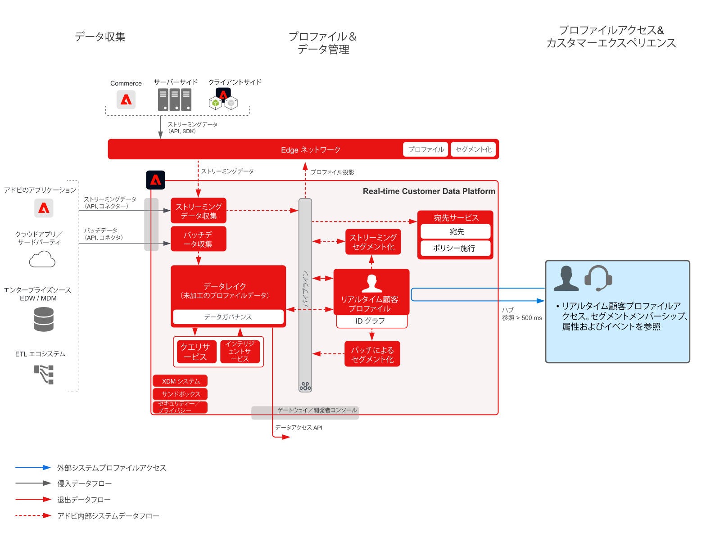

# 顧客アクティビティハブブループリント

顧客アクティビティハブブループリントは、外部アプリケーションが Adobe Experience Platform の[!UICONTROL リアルタイム顧客プロファイル]にアクセスする方法を示します。

外部アプリケーションは、API GET リクエストを使用して、プロファイルにアクセスできます。これにより、プロファイルに格納された属性、イベント、セグメントメンバーシップおよびモデル主導の機能を、外部のアドビ以外のアプリケーションで使用できます。

この機能によって、顧客がコールセンターに問い合わせる際にリッチコンテキストを表示できます。サポート担当者は、例えば、顧客のライフタイムバリュー、チャーン傾向またはマーケティングキャンペーンのエクスポージャーなどを表示できます。また、販売担当者は、より多くのコンテキストや顧客へのインサイトというメリットを得られます。

>[!NOTE]
>
>Profile Lookup API でサポートされている現在の待ち時間は約 500 ミリ秒なので、このアプローチは、リアルタイムディシジョンエンジン（同じページの web やモバイルのパーソナライズ機能など）とプロファイルの統合には適していません。

## ユースケース

* 担当者がサポートするインタラクションに、詳細な消費者コンテキスト（サポートおよび販売エクスペリエンスなど）を提供します。Experience Platform のプロファイルルックアップを使用して、担当者は、最近の購入、キャンペーンインタラクション、傾向、オーディエンスメンバーシップ、リアルタイム顧客プロファイルに格納されたその他の属性およびインサイトなど、消費者に対するより詳細なコンテキストを受け取ることができます。

## アーキテクチャ

## ガードレール

* [[!UICONTROL リアルタイム顧客プロファイル]データのガードレール](https://experienceleague.adobe.com/docs/experience-platform/profile/guardrails.html?lang=ja)

## 実装手順

1. データを取り込むために[スキーマを作成](https://experienceleague.adobe.com/?recommended=ExperiencePlatform-D-1-2021.1.xdm)します。
1. データを取り込むために[データセットを作成](https://experienceleague.adobe.com/docs/platform-learn/tutorials/data-ingestion/create-datasets-and-ingest-data.html?lang=ja)します。
1. 取り込まれたデータが統合プロファイルに確実にステッチできるようにするために、スキーマに[正しい ID および ID 名前空間を設定します](https://experienceleague.adobe.com/docs/platform-learn/tutorials/identities/label-ingest-and-verify-identity-data.html?lang=ja)。
1. [プロファイル用のスキーマおよびデータセットを有効にします](https://experienceleague.adobe.com/docs/platform-learn/tutorials/profiles/bring-data-into-the-real-time-customer-profile.html?lang=ja)。
1. Experience Platform に[データを取り込みます](https://experienceleague.adobe.com/?recommended=ExperiencePlatform-D-1-2020.1.dataingestion&amp;lang=ja)。
1. [結合ポリシーを設定](https://experienceleague.adobe.com/docs/platform-learn/tutorials/profiles/create-merge-policies.html?lang=ja)します。
1. [Entities API を使用して、レコードエンティティまたはエクスペリエンスイベントエンティティのどちらかから、プロファイル属性を検索](https://experienceleague.adobe.com/docs/experience-platform/profile/api/entities.html?lang=ja)します。

## 関連ドキュメント

* [Adobe Experience Platform Activation 製品説明](https://helpx.adobe.com/jp/legal/product-descriptions/adobe-experience-platform0.html)
* [[!UICONTROL リアルタイム顧客プロファイル]ドキュメント](https://experienceleague.adobe.com/docs/experience-platform/profile/home.html?lang=ja)
* [プロファイルのガードレール](https://experienceleague.adobe.com/docs/experience-platform/profile/guardrails.html)
* [Profile Lookup API](https://www.adobe.io/apis/experienceplatform/home/api-reference.html)
