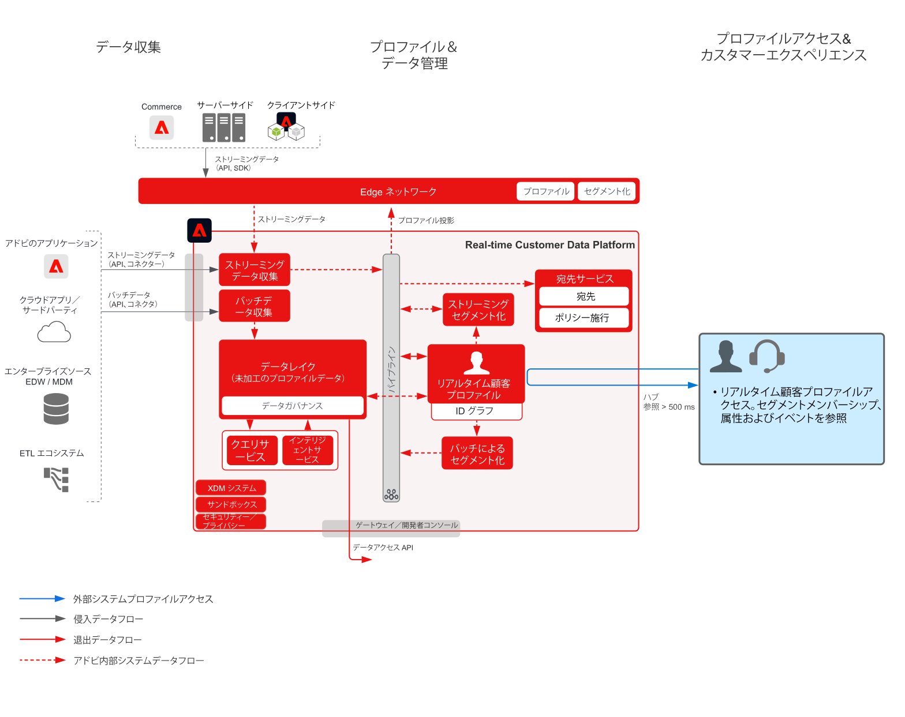

# サポートとセールスのシナリオのためのリアルタイムのプロファイルアクセス

>[!TIP]
>このブループリントは、「オーディエンスの構築とアクティベーション」の下の[&#x200B; ユースケースパターン &#x200B;](/help/blueprints/use-case-patterns/audience-building-activation/real-time-profile-lookup.md)としても利用できます。

サポートおよびセールス シナリオのリアルタイム プロファイル アクセス ブループリントでは、外部アプリケーションが[!UICONTROL &#x200B; リアルタイム顧客プロファイル &#x200B;]を使用してAdobe Experience Platformにアクセスする方法を示します。

外部アプリケーションは、API GET リクエストを使用して、プロファイルにアクセスできます。 これにより、プロファイルに格納された属性、イベント、セグメントメンバーシップおよびモデル主導の機能を、外部のアドビ以外のアプリケーションで使用できます。

この機能によって、顧客がコールセンターに問い合わせる際にリッチコンテキストを表示できます。 サポート担当者は、例えば、顧客のライフタイムバリュー、チャーン傾向またはマーケティングキャンペーンのエクスポージャーなどを表示できます。 また、販売担当者は、より多くのコンテキストや顧客へのインサイトというメリットを得られます。

>[!NOTE]
>
>ハブでのプロファイル検索は、web/モバイルのインバウンドパーソナライゼーションなど、スループットが高く、低遅延のユースケースを対象としたものではありません。 ハブでのプロファイル検索は、エージェントによるサポートやセールスインタラクションなど、低遅延のシナリオを目的としています。 web/モバイルのパーソナライゼーションやリアルタイムのオファー決定など、低遅延で高スループットのシナリオの場合は、Edge プロファイルを活用する必要があります。 Edge プロファイルは、Real-time Customer Data Platformの[&#x200B; カスタム Personalization Connection](https://experienceleague.adobe.com/ja/docs/experience-platform/destinations/catalog/personalization/custom-personalization)を通じてリアルタイム アクセスを有効にします。

## ユースケース

* 担当者がサポートするインタラクションに、詳細な消費者コンテキスト（サポートおよび販売エクスペリエンスなど）を提供します。 Experience Platform のプロファイルルックアップを使用して、担当者は、最近の購入、キャンペーンインタラクション、傾向、オーディエンスメンバーシップ、リアルタイム顧客プロファイルに格納されたその他の属性およびインサイトなど、消費者に対するより詳細なコンテキストを受け取ることができます。

## アーキテクチャ

## ガードレール

* [[!UICONTROL &#x200B; リアルタイム顧客プロファイル &#x200B;] データのガードレール](https://experienceleague.adobe.com/docs/experience-platform/profile/guardrails.html?lang=ja)

## 関連ドキュメント

* [Adobe Experience Platform アクティベーション製品の説明](https://helpx.adobe.com/jp/legal/product-descriptions/adobe-experience-platform0.html)
* [[!UICONTROL &#x200B; リアルタイム顧客プロファイル &#x200B;] ドキュメント](https://experienceleague.adobe.com/docs/experience-platform/profile/home.html?lang=ja)
* [プロファイルガードレール](https://experienceleague.adobe.com/docs/experience-platform/profile/guardrails.html?lang=ja)
* [プロファイル検索API](https://www.adobe.io/apis/experienceplatform/home/api-reference.html)
