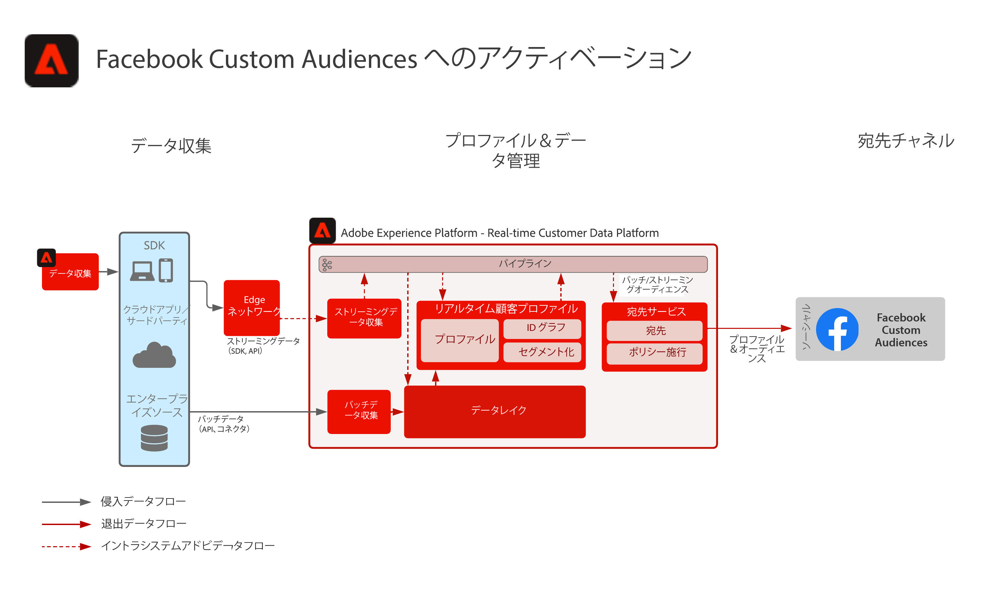

# facebook Custom Audiences へのアクティベーション

複数のソースから顧客データを取り込んで顧客の単一のプロファイル表示を作成し、これらのプロファイルをマーケティングやパーソナライゼーション用の作成済みオーディエンスにセグメント化し、Facebookなどの Social Ad Networks で共有します。

## ユースケース

* ソーシャルおよび広告の宛先の既知のオーディエンスに対するオーディエンスターゲティング。
* オンラインおよびオフライン属性を使用したオンラインパーソナライズ機能。アプリケーション
* リアルタイム顧客データプラットフォーム

## 構造

## 実装手順

1. プロファイルデータソースで使用する ID 名前空間を設定します。
   * 標準の名前空間（電子メール、Email SHA256 Hash など）を使用します（使用可能な場合）。
   * Facebookは、サポートされている id のリストを持ちます。 facebookカスタムオーディエンスに対してアクティブ化するには、アクティブ化するプロファイルに、サポートされている ID の 1 つが存在する必要があります。
   * 現在、Facebookでは次の ID がサポートされています。GAID、IDFA、phone_sha256、email_lc_sha256、extern_id。
   * 詳しくは、 [Facebook Destination Guide](https://experienceleague.adobe.com/docs/experience-platform/destinations/catalog/social/facebook.html?lang=en).
   * 標準の名前空間が適用可能な ID で使用できないカスタム名前空間を作成します。
1. プロファイルデータソーススキーマとデータセットを設定します。
   * すべてのプロファイルレコードソースデータのプロファイルレコードスキーマを作成します。
      * 各スキーマのプライマリ ID とセカンダリ ID を指定します。
      * プロファイル取り込み用にスキーマを有効にします。
   * すべてのプロファイルレコードソースデータのプロファイルレコードデータセットを作成し、関連するスキーマを割り当てます。
      * プロファイル取り込み用にデータセットを有効にします。
   * すべてのプロファイル時系列ベースのソースデータ用に、プロファイルエクスペリエンスイベントスキーマを作成します。
      * スキーマのプライマリ ID とセカンダリ ID を指定します。
   * プロファイル取り込み用にスキーマを有効にします。
   * すべてのプロファイルエクスペリエンスイベントソースデータのプロファイルエクスペリエンスイベントデータセットを作成し、関連するスキーマを割り当てます。
      * プロファイル取り込み用にデータセットを有効にします。
1. ソースコネクタを使用してソースデータを取り込み、上で設定した関連付けられたデータセットに取り込みます。
   * 資格情報を使用してソースコネクタアカウントを設定します。
   * データフローを設定して、指定したスケジュールでソースファイルまたはフォルダーの場所から指定したデータセットにデータを取り込みます。
   * ソースデータのフィールドをターゲットスキーマにマッピングします。
   * フィールドを変換して、Experience Platformに取り込むための正しい形式にします。
      * 日付変換
      * 必要に応じて小文字に変換（電子メールアドレスなど）
      * パターン変換（電話番号など）
      * エクスペリエンスイベントレコードに一意のレコード ID が存在しない場合は、その ID をソースデータに追加します。
      * 配列とマップタイプのフィールドを変換し、配列とマップの正しいマッピングとモデリングを、Experience Platformでのセグメント化に使用できるようにします。
1. ID グラフの正しい設定と、プロファイルの結合に含めるデータセットが正しく設定されていることを確認するには、プロファイル結合ポリシーを設定します。
1. データフローの実行後、プロファイルデータの取り込みが成功し、エラーが発生しなかったことを確認します。
   * Inspect ID の関係を正しく処理するための、複数のプロファイルの ID グラフ。
   * Inspectを使用して、複数のプロファイルの属性とイベントを設定し、属性とイベントをプロファイルに正しく取り込むようにします。
1. セグメントを作成してプロファイルオーディエンスを作成する
   * 属性とイベントに対するルールを使用して、セグメントビルダーでセグメントを作成します。
   * セグメントを保存して評価します。 セグメントは、指定されたスケジュールで 1 日 1 回評価されます。
      * セグメントルールがストリーミングセグメント化の対象である場合、新しいストリーミングデータがプロファイルに取り込まれると、セグメントは評価されます。 ストリーミングセグメントも、スケジュールされたバッチセグメント化の間、1 日に 1 回評価されます。
1. セグメントの結果が期待どおりであることを確認します。
   * 指定したセグメントのセグメント結果数を確認します。
   * セグメントに含める必要があるプロファイルを調べて、セグメントメンバーシップがプロファイルのセグメントメンバーシップ部分に含まれていることを確認します。
1. オーディエンスの宛先への配信を「宛先」設定で設定します。
   * 詳しくは、 [Facebook Destination Guide](https://experienceleague.adobe.com/docs/experience-platform/destinations/catalog/social/facebook.html?lang=en) facebookの宛先の設定について詳しくは、を参照してください。
   * 宛先を設定する際に、宛先に対してアクティブ化するオーディエンスを選択します。
   * 宛先へのオーディエンスの配信を開始する、宛先データフローのスケジュールされた開始日を決定します。
   * 各宛先には、送信する必要な属性とオプションの属性があります。
      * facebookの場合は、必要な ID の 1 つを含め、Experience Platform内のオーディエンスのプロファイルとFacebookがターゲット設定できるプロファイルとの照合に使用する必要があります。
   * 各宛先には、ストリーミング、バッチ、ファイルベース、JSON ペイロードのどちらでも、指定された配信タイプがあります。
      * facebookの場合、オーディエンスメンバーシップは、JSON 形式でFacebookエンドポイントにストリーミング方式で配信されます。
      * オーディエンスメンバーシップは、ストリーミングまたはバッチセグメント化の評価の後に、Experience Platformでストリーミング方式で配信されます。
1. 宛先フローによって、オーディエンスが期待どおりに宛先に配信されたことを確認します。
   * 監視インターフェイスをチェックして、オーディエンスが予想されるプロファイル数で配信されたことを確認します。 オーディエンスサイズは、アクティブ化されたプロファイルの予想数を反映する必要があります。Facebookなどの特定の宛先には E メールハッシュ ID などの特定のフィールドが必要であり、オーディエンスのメンバーであるプロファイルに存在しない場合は、宛先に対しては有効化されません。
   * スキップされたプロファイル ID がないか、必須の属性がないプロファイル ID を確認します。
   * 解決が必要なその他のエラーがないかを確認します。
1. オーディエンスが、期待される数のオーディエンスメンバーシップで終了先に対してアクティブ化されたことを確認します。
   * facebook Custom Audience ポータルにログインして、Real-time Customer Data Platformからのオーディエンスが配信されたことと、Facebook内のオーディエンスのプロファイルの一致率がReal-time Customer Data Platformからのオーディエンスのプロファイル数と合理的に一致していることを確認します。

## ガードレール

[プロファイルとセグメント化ガードレール](https://experienceleague.adobe.com/docs/experience-platform/profile/guardrails.html?lang=ja)

## 関連ドキュメント

facebook Custom Audiences へのアクティベーション — [宛先の設定](https://experienceleague.adobe.com/docs/experience-platform/destinations/catalog/social/facebook.html?lang=en)