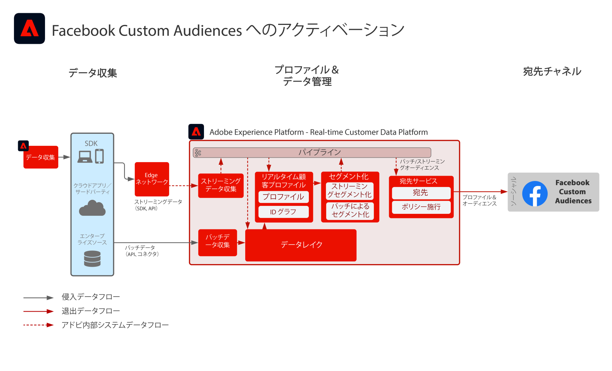

# Facebook Custom Audiences へのアクティベーション

複数のソースから顧客データを取り込んで顧客の単一のプロファイル表示を作成し、これらのプロファイルをセグメント化し、マーケティングやパーソナライズ機能用に、オーディエンスを構築し、これを Facebook などの Social Ad Networks で共有し、オーディエンスをターゲット化し、パーソナライズ機能キャンペーンを実施します。

## ユースケース

* ソーシャルおよび広告の宛先の既知のオーディエンスに対するオーディエンスターゲティング。
* オンラインおよびオフライン属性を使用したオンラインパーソナライズ機能。

## アプリケーション

* Real-time Customer Data Platform

## アーキテクチャ

## 実装手順

1. プロファイルデータソースで使用する ID 名前空間を設定します。
   * 標準の名前空間（電子メール、Email SHA256 Hash など）を使用します（使用可能な場合）。
   * Facebook は、サポートされている ID のリストを持ちます。Facebook Custom Audiences に対してアクティブ化するには、アクティブ化するプロファイルに、サポートされている ID のうちの 1 つが存在する必要があります。
   * 現在、Facebook では次の ID がサポートされています。GAID、IDFA、phone_sha256、email_lc_sha256、extern_id。
   * 詳細に関しては、 [Facebook Destination Guide](https://experienceleague.adobe.com/docs/experience-platform/destinations/catalog/social/facebook.html?lang=ja) を参照してください。
   * 標準の名前空間が適用可能な ID で使用できないカスタム名前空間を作成します。
1. プロファイルデータソーススキーマとデータセットを設定します。
   * すべてのプロファイルレコードソースデータ用のプロファイルレコードスキーマを作成します。
      * 各スキーマのプライマリ ID とセカンダリ ID を指定します。
      * プロファイル取り込み用にスキーマを有効にします。
   * 関連するスキーマを割り当て、すべてのプロファイルレコードソースデータ用のプロファイルレコードデータセットを作成します。
      * プロファイル取り込み用にデータセットを有効にします。
   * すべてのプロファイル時系列ベースのソースデータ用に、プロファイルエクスペリエンスイベントスキーマを作成します。
      * スキーマのプライマリ ID とセカンダリ ID を指定します。
   * プロファイル取り込み用にスキーマを有効にします。
   * 関連するスキーマを割り当て、すべてのプロファイルエクスペリエンスイベント用のプロファイルエクスペリエンスイベントデータセットを作成します。
      * プロファイル取り込み用にデータセットを有効にします。
1. ソースコネクタを使用して、ソースデータを、上で設定した関連付けられたデータセットに取り込みます。
   * 資格情報を使用してソースコネクタアカウントを設定します。
   * データフローを設定して、指定したスケジュールで、ソースファイルまたはフォルダーの場所から、指定したデータセットにデータを取り込みます。
   * ソースデータのフィールドをターゲットスキーマにマッピングします。
   * フィールドを変換して、Experience Platform に取り込むための正しい形式にします。
      * 日付変換
      * 必要に応じて小文字に変換（電子メールアドレスなど）
      * パターン変換（電話番号など）
      * 独自のレコード ID がソースデータに存在しない場合、エクスペリエンスイベントレコードに独自のレコード ID を追加します。
      * Experience Platform でのセグメント化のために、アレイとマップタイプのフィールドを変換し、アレイとマップの正しいマッピングとモデリングを確認します。
1. ID グラフの正しい設定と、プロファイルの結合に含めるデータセットが正しく設定されていることを確認するには、プロファイル結合ポリシーを設定します。
1. データフローの実行後、プロファイルデータの取り込みが成功し、エラーが発生しなかったことを確認します。
   * 複数のプロファイルの ID グラフを検査し、ID 関係が正しく処理されていることを確認します。
   * 複数のプロファイルの属性とイベントを検査し、プロファイルへの属性とイベントの正しい取り込みを確認します。
1. セグメントを作成してプロファイルオーディエンスを作成する
   * 属性とイベントに対するルールを使用して、セグメントビルダー内でセグメントを作成します。
   * 評価用にセグメントを保存します。セグメントは、指定されたスケジュールで 1 日 1 回評価されます。
      * セグメントルールがストリーミングセグメント化の対象である場合、新しいストリーミングデータがプロファイルに取り込まれると、セグメントは評価されます。ストリーミングセグメントも、スケジュールされたバッチセグメント化の間、1 日に 1 回評価されます。
1. セグメントの結果が期待どおりであることを確認します。
   * 指定したセグメントのセグメント結果数を確認します。
   * セグメントに含める必要があるプロファイルを調べて、セグメントメンバーシップがプロファイルのセグメントメンバーシップ部分に含まれていることを確認します。
1. オーディエンスの宛先への配信を「宛先」設定で設定します。
   * Facebook の宛先設定の詳細に関しては、 [Facebook Destination Guide](https://experienceleague.adobe.com/docs/experience-platform/destinations/catalog/social/facebook.html) を参照してください。
   * 宛先を設定する際に、宛先に対してアクティブ化するオーディエンスを選択します。
   * 宛先へのオーディエンスの配信を開始する、宛先データフローのスケジュールされた開始日を決定します。
   * 各宛先には、送信する必要な属性とオプションの属性があります。
      * Facebook の場合は、必要な ID の 1 つを含め、Experience Platform 内のオーディエンスのプロファイルと Facebook がターゲット設定できるプロファイルとの照合に使用する必要があります。
   * 各宛先には、ストリーミング、バッチ、ファイルベース、JSON ペイロードのいずれでも、指定された配信タイプがあります。
      * Facebook の場合、オーディエンスメンバーシップは、JSON 形式で、Facebook エンドポイントにストリーミング方式で配信されます。
      * オーディエンスメンバーシップは、Experience Platform でのストリーミングまたはバッチセグメンテーションの評価に続いて、ストリーミング方式で配信される予定です。
1. 宛先フローによって、オーディエンスが期待どおりに宛先に配信されたことを確認します。
   * 監視インターフェイスをチェックして、オーディエンスが予想されたプロファイル数で配信されたことを確認します。オーディエンスサイズは、アクティブ化されたプロファイルの予想数を反映する必要があります。Facebookなどの特定の宛先には電子メールハッシュ ID などの特定のフィールドが必要であり、オーディエンスのメンバーであるプロファイルに存在しない場合は、宛先に対しては有効化されません。
   * プロファイルの ID が欠落していたり、必須であった属性が欠落していたりして、プロファイルがスキップされていないかどうかを確認します。
   * 解決が必要なその他のエラーがないかを確認します。
1. オーディエンスが、期待された数のオーディエンスメンバーシップで、終了先に対してアクティブ化されたことを確認します。
   * Facebook Custom Audience ポータルにログインして、Real-time Customer Data Platform からのオーディエンスが配信されたことと、Facebook 内のオーディエンスのプロファイルの一致率が Real-time Customer Data Platform からのオーディエンスのプロファイル数と当然一致していることを確認します。

## ガードレール

[プロファイルとセグメント化ガードレール](https://experienceleague.adobe.com/docs/experience-platform/profile/guardrails.html?lang=ja)

## 関連ドキュメント

Facebook Custom Audiences へのアクティベーション — [宛先の設定](https://experienceleague.adobe.com/docs/experience-platform/destinations/catalog/social/facebook.html)