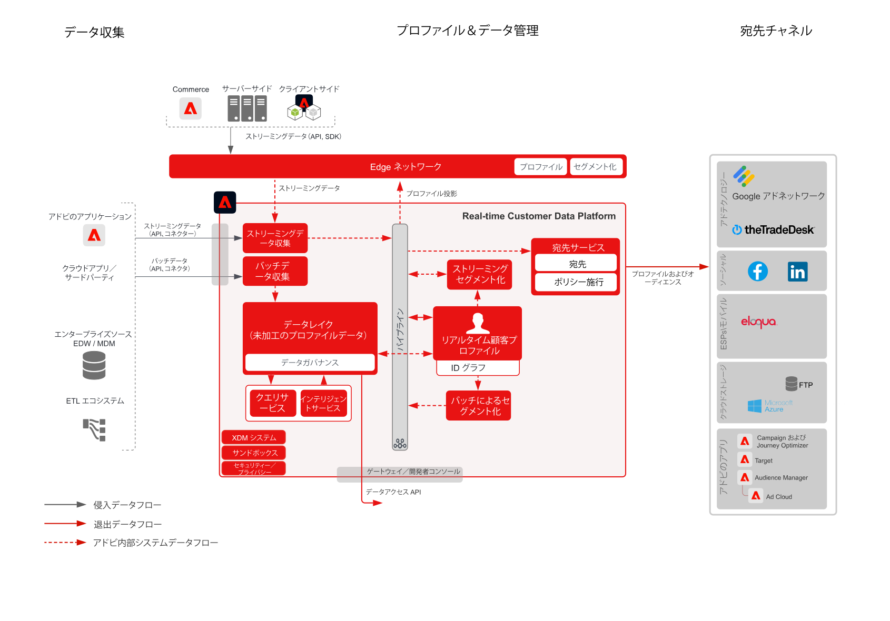

# ファイルとエンタープライズストリーミング宛先に対するオーディエンスとプロファイルのアクティベーションブループリント

プロファイルとオーディエンスの変更とイベントを、[!UICONTROL Real-time Customer Data Platform] からエンタープライズデータストアやアプリケーションにストリーミングまたはバッチで共有します。これらのプロファイルおよびオーディエンスイベントは、破棄された申し込みプロセスやウェビナー登録のフォローアップ、[!UICONTROL Real-time Customer Data Platform] の最新の顧客属性とインテリジェンスを使用したエンタープライズアプリケーションのアップデートなど、顧客に対する販売またはサポート活動を開始するために使用できます。

## ユースケース

* エンタープライズトラッキング、ストレージ、分析、顧客データおよびインサイトのアクティベーションに向けた、クラウドストレージ宛先またはストリーミング宛先へのプロファイルおよびオーディエンスのアクティベーション。

## アプリケーション

* Adobe Experience Platform Activation

## アーキテクチャ

## 関連ドキュメント

クラウドストレージとエンタープライズの宛先の設定に関するその他の詳細については、[&#x200B; 宛先のドキュメント &#x200B;](https://experienceleague.adobe.com/en/docs/experience-platform/destinations/catalog/cloud-storage/overview) を参照してください。

## ガードレール

[ガードレールのページに記載されているガードレールを参照します。](../experience-platform/guardrails.md)