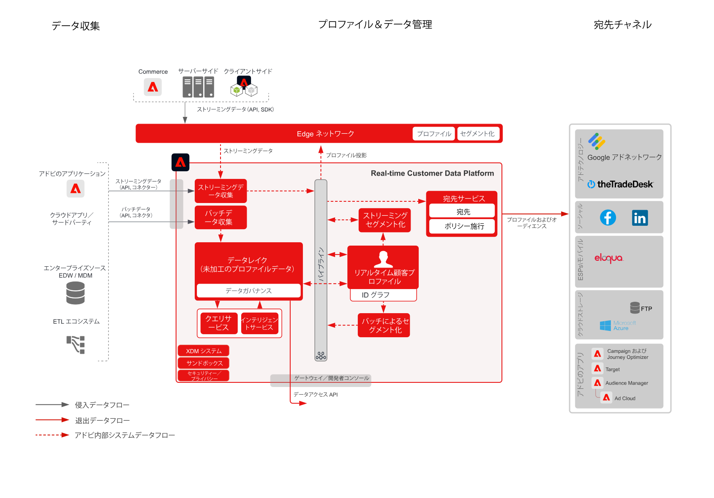

# エンタープライズ宛先へのオーディエンスとプロファイルのアクティベーション

>[!TIP]
>このブループリントは、「オーディエンスの構築とアクティベーション」の下の[&#x200B; ユースケースパターン &#x200B;](/help/blueprints/use-case-patterns/audience-building-activation/audience-activation-to-destinations.md)としても利用できます。

プロファイルとオーディエンスの変更とイベントを、[!UICONTROL Real-time Customer Data Platform] からエンタープライズデータストアやアプリケーションにストリーミングまたはバッチで共有します。 これらのプロファイルおよびオーディエンスイベントは、破棄された申し込みプロセスやウェビナー登録のフォローアップ、[!UICONTROL Real-time Customer Data Platform] の最新の顧客属性とインテリジェンスを使用したエンタープライズアプリケーションのアップデートなど、顧客に対する販売またはサポート活動を開始するために使用できます。

## ユースケース

* エンタープライズトラッキング、ストレージ、分析、顧客データおよびインサイトのアクティベーションに向けた、クラウドストレージ宛先またはストリーミング宛先へのプロファイルおよびオーディエンスのアクティベーション。

## アプリケーション

* Real-time Customer Data Platform

## アーキテクチャ

## 関連ドキュメント

クラウドストレージとエンタープライズ宛先の設定に関する追加の詳細については、[宛先ドキュメント &#x200B;](https://experienceleague.adobe.com/ja/docs/experience-platform/destinations/catalog/cloud-storage/overview)を参照してください。

## ガードレール

[ガードレール ページに記載されているガードレールを参照してください。](../experience-platform/guardrails.md)