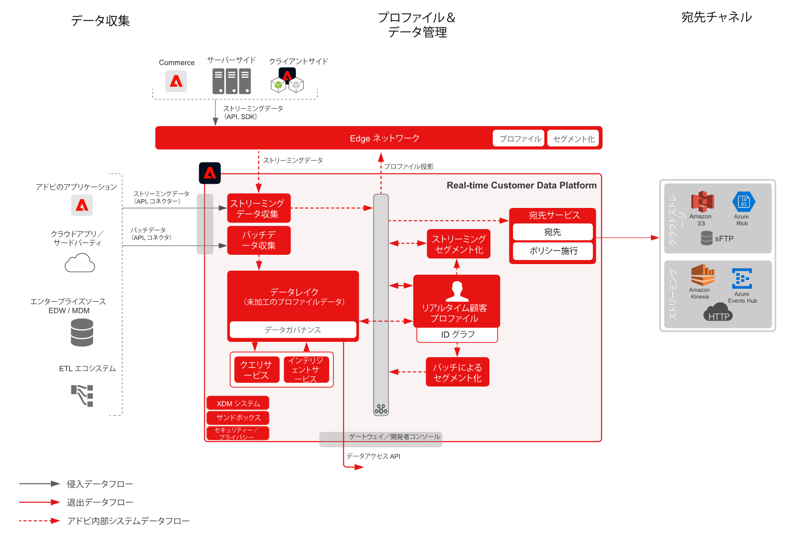

# ファイルおよびエンタープライズストリーミングの宛先のブループリントに対するオーディエンスとプロファイルのアクティベーション

次の場所からストリーミングまたはバッチでプロファイルとオーディエンスの変更とイベントを共有 [!UICONTROL Real-time Customer Data Platform] をエンタープライズデータストアおよびアプリケーションに追加します。 これらのプロファイルおよびオーディエンスイベントを使用して、廃止されたアプリケーションプロセスやウェビナー登録に関するフォローアップや、最新の顧客属性とインテリジェンスを使用してエンタープライズアプリケーションを更新するなど、顧客への販売またはサポート活動を開始できます。 [!UICONTROL Real-time Customer Data Platform].

## 使用例

* エンタープライズトラッキング、ストレージ、分析、顧客データおよびインサイトのアクティベーションに向けた、クラウドストレージ宛先またはストリーミング宛先へのプロファイルおよびオーディエンスのアクティベーション。

## アプリケーション

* Adobe Experience Platform  Activation

## アーキテクチャ

## ガードレール

[オーディエンスとプロファイルのアクティベーションの概要ページに説明されているガードレールを参照してください。](overview.md)

## 実装の手順

1. データを取り込むために[スキーマを作成](https://experienceleague.adobe.com/?recommended=ExperiencePlatform-D-1-2021.1.xdm&amp;lang=ja)します。
1. データを取り込むために[データセットを作成](https://experienceleague.adobe.com/docs/platform-learn/tutorials/data-ingestion/create-datasets-and-ingest-data.html?lang=ja)します。
1. 取り込まれたデータが統合プロファイルに確実にステッチできるようにするために、スキーマに[正しい ID および ID 名前空間を設定します](https://experienceleague.adobe.com/docs/platform-learn/tutorials/identities/label-ingest-and-verify-identity-data.html?lang=ja)。
1. [プロファイル用のスキーマおよびデータセットを有効にします](https://experienceleague.adobe.com/docs/platform-learn/tutorials/profiles/bring-data-into-the-real-time-customer-profile.html?lang=ja)。
1. Experience Platform に[データを取り込みます](https://experienceleague.adobe.com/?recommended=ExperiencePlatform-D-1-2020.1.dataingestion&amp;lang=ja)。
1. [プロビジョニング [!UICONTROL Real-time Customer Data Platform] セグメント共有](https://www.adobe.com/go/audiences) Experience PlatformとAudience Managerの間で共有されます。Experience Platformで定義されたオーディエンスの場合は、Audience Managerに共有されます。
1. Experience Platform で[セグメントを作成します。](https://experienceleague.adobe.com/docs/platform-learn/tutorials/segments/create-segments.html?lang=ja)セグメントをバッチとして、またはストリーミングとして評価するかを、システムが自動的に判定します。
1. プロファイル属性およびオーディエンスメンバーシップを目的の宛先に共有するための[宛先を設定します。](https://experienceleague.adobe.com/docs/platform-learn/tutorials/destinations/create-destinations-and-activate-data.html?lang=ja)

## 関連ドキュメント

* [宛先ドキュメント](https://experienceleague.adobe.com/docs/experience-platform/destinations/catalog/overview.html?lang=ja)
* [クラウドストレージ宛先の概要](https://experienceleague.adobe.com/docs/experience-platform/destinations/catalog/cloud-storage/overview.html?lang=ja#catalog)
* [HTTP 宛先](https://experienceleague.adobe.com/docs/experience-platform/destinations/catalog/http-destination.html?lang=ja#overview)
* [[!UICONTROL Real-time Customer Data Platform] 製品の説明](https://helpx.adobe.com/jp/legal/product-descriptions/real-time-customer-data-platform.html)
* [プロファイルおよびセグメント化ガイドライン](https://experienceleague.adobe.com/docs/experience-platform/profile/guardrails.html?lang=ja)
* [セグメント化ドキュメント](https://experienceleague.adobe.com/docs/experience-platform/segmentation/api/streaming-segmentation.html?lang=ja)

## 関連するビデオとチュートリアル

* [[!UICONTROL Real-time Customer Data Platform] 概要](https://experienceleague.adobe.com/docs/platform-learn/tutorials/application-services/rtcdp/understanding-the-real-time-customer-data-platform.html?lang=ja)
* [のデモ [!UICONTROL Real-time Customer Data Platform]](https://experienceleague.adobe.com/docs/platform-learn/tutorials/application-services/rtcdp/demo.html?lang=ja)
* [セグメントの作成](https://experienceleague.adobe.com/docs/platform-learn/tutorials/segments/create-segments.html?lang=ja)
