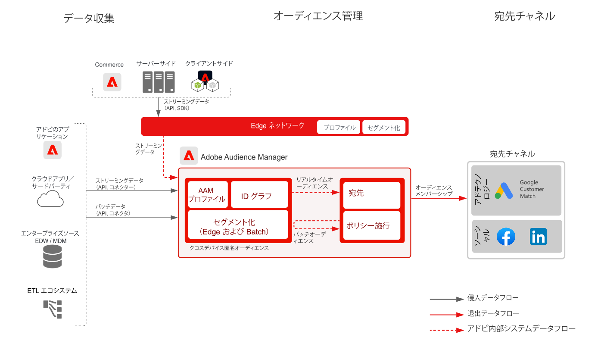

# 既知の顧客アクティベーションブループリント

オンライン行動と共に、オフライン属性およびイベント（オフラインの注文、トランザクション、CRM、ロイヤリティデータなど）を、オンラインターゲティングとパーソナライズ機能に使用します。

ガバナンスコントロールが組み込まれた拡大された識別子は、既知の顧客とコミュニケーションをとる機会を増やします。既知のプロファイルベースの宛先（電子メールプロバイダー、ソーシャルネットワーク、広告など）に対して、オーディエンスをアクティブ化します。

追加の詳細は、Experience Platform と Experience Cloud アプリケーションの間の統合に特有な、[Experience Cloud アプリケーションを使用したオーディエンスとプロファイルのアクティベーションブループリント](platform-and-applications.md)で提供されます。

## ユースケース

* ソーシャルおよび広告の宛先の既知のオーディエンスに対するオーディエンスターゲティング。
* オンラインおよびオフライン属性を使用したオンラインパーソナライズ機能。
* 既知のチャネル（電子メール、SMS など）に対するオーディエンスをアクティブ化します。

## アプリケーション

* [!UICONTROL Real-time Customer Data Platform]
* Audience Manager People-Based Destinations は、Facebook、LinkedIn、Google Customer Match に対するユーザーベースのアクティベーションにも利用できます。

## アーキテクチャ

### Real-time Customer Data Platform を使用した既知の顧客のアクティベーション

 

### Audience Manager People-Based Destinations を使用した既知の顧客のアクティベーション

 

## ガードレール

[オーディエンスとプロファイルのアクティベーションの概要ページに説明されているガードレールを参照してください。](overview.md)

## Real-time Customer Data Platform の実装手順

1. データを取り込むために[スキーマを作成](https://experienceleague.adobe.com/?recommended=ExperiencePlatform-D-1-2021.1.xdm)します。
1. データを取り込むために[データセットを作成](https://experienceleague.adobe.com/docs/platform-learn/tutorials/data-ingestion/create-datasets-and-ingest-data.html?lang=ja)します。
1. 取り込まれたデータが統合プロファイルに確実にステッチできるようにするために、スキーマに[正しい ID および ID 名前空間を設定します](https://experienceleague.adobe.com/docs/platform-learn/tutorials/identities/label-ingest-and-verify-identity-data.html?lang=ja)。
1. [プロファイル用のスキーマおよびデータセットを有効にします](https://experienceleague.adobe.com/docs/platform-learn/tutorials/profiles/bring-data-into-the-real-time-customer-profile.html?lang=ja)。
1. Experience Platform に[データを取り込みます](https://experienceleague.adobe.com/?recommended=ExperiencePlatform-D-1-2020.1.dataingestion&amp;lang=ja)。
1. Experience Platform で定義されたオーディエンスが Audience Manager に共有されるように、[Experience Platform と Audience Manager の間の [!UICONTROL Real-time Customer Data Platform の]セグメント共有を](https://www.adobe.com/go/audiences)プロビジョニングします。
1. Experience Platform で[セグメントを作成します。](https://experienceleague.adobe.com/docs/platform-learn/tutorials/segments/create-segments.html?lang=ja)セグメントをバッチとして、またはストリーミングとして評価するかを、システムが自動的に判定します。
1. プロファイル属性およびオーディエンスメンバーシップを目的の宛先に共有するための[宛先を設定します。](https://experienceleague.adobe.com/docs/platform-learn/tutorials/destinations/create-destinations-and-activate-data.html?lang=ja)

## 実装に関する考慮事項

* プロファイルデータを宛先に共有するには、宛先ペイロードの宛先で使用される特定の ID 値を含める必要があります。ターゲットの宛先に必要な ID は、Platform に取り込まれ、[!UICONTROL リアルタイム顧客プロファイル]の ID として設定される必要があります。

* Real-time Customer Data Platform から Audience Manager、Analytics、Target、Campaign、Journey Optimizer へのオーディエンスの共有に関する詳細は、[オーディエンスとプロファイルのアクティベーション（Experience Cloud アプリケーションブループリント）](platform-and-applications.md)を参照してください。

## Audience Manager People-Based Destinations の実装手順

* Audience Manager の実装について詳しくは、次の[ドキュメント](https://experienceleague.adobe.com/docs/audience-manager/user-guide/implementation-integration-guides/implement-audience-manager.html?lang=ja)を参照してください.

* Audience Manager で People-Based Destinations を実装する方法について詳しくは、次の[ドキュメント](https://experienceleague.adobe.com/docs/audience-manager/user-guide/faqs/faq-people-based-destinations.html?lang=ja)を参照してください。

## 関連ドキュメント

* [[!UICONTROL Real-time Customer Data Platform] 製品説明](https://helpx.adobe.com/jp/legal/product-descriptions/real-time-customer-data-platform.html)
* [プロファイルおよびセグメント化ガイドライン](https://experienceleague.adobe.com/docs/experience-platform/profile/guardrails.html?lang=ja)
* [セグメント化ドキュメント](https://experienceleague.adobe.com/docs/experience-platform/segmentation/api/streaming-segmentation.html?lang=ja)
* [宛先ドキュメント](https://experienceleague.adobe.com/docs/experience-platform/destinations/catalog/overview.html?lang=ja)

## 関連ビデオおよびチュートリアル

* [[!UICONTROL Real-time Customer Data Platform] の概要](https://experienceleague.adobe.com/docs/platform-learn/tutorials/application-services/rtcdp/understanding-the-real-time-customer-data-platform.html?lang=ja)
* [[!UICONTROL Real-time Customer Data Platform] のデモ](https://experienceleague.adobe.com/docs/platform-learn/tutorials/application-services/rtcdp/demo.html?lang=ja)
* [セグメントの作成](https://experienceleague.adobe.com/docs/platform-learn/tutorials/segments/create-segments.html)
