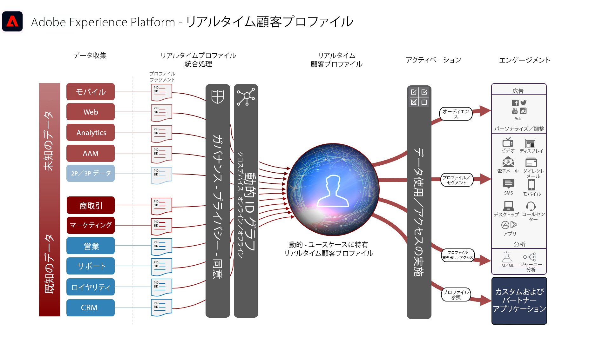

# オーディエンスとプロファイルのアクティベーション

データドリブン型マーケティングでは、オーディエンスとプロファイルのアクティベーションが成功のカギです。ただし、多くのブランドでは、依然としてチャネルファーストのアクティベーションに注力し、多くの場合、リーチやパーソナライズ機能に一貫性がありません。

チャネルファーストのアプローチでは、各チャネルは分断して機能し、パーソナライズの取り組みは、そのチャネルのブランドとやり取りする顧客のみをターゲットにします。このアプローチは、顧客が多くの異なるタッチポイントをまたいでブランドとやり取りしているという現実を反映していません。オーディエンスとプロファイルのアクティベーションでは、ブランドは、複数のチャネルをまたいで顧客インタラクションを結びつけ、すべてのチャネルに対してアクティベーションできる一元化されたプロファイルとオーディエンスを実現できます。

| ブループリント | 説明 | Experience Cloud アプリケーション |
|---|---|---|
| **[匿名オーディエンスアクティベーション](anonymous.md)** | <ul><li>匿名および行動顧客データについて、Web および広告チャネルをまたいでオーディエンスをターゲットします。</li><li>サードパーティオーディエンスデータと統合して、パーソナライズ機能を強化します。</li></ul> | <ul><li>Adobe Audience Manager</li></ul> |
| **[オンライン／オフラインオーディエンスアクティベーション](online-offline.md)** | <ul><li>既知のプロファイルベースの宛先（電子メールプロバイダー、ソーシャルネットワーク、広告など）に対してアクティブ化します。 </li><li>オンライン行動と共に、オフライン属性およびイベント（オフラインの注文、トランザクション、CRM、ロイヤリティデータなど）を、オンラインターゲティングとパーソナライズ機能に使用します。</li></ul> | <ul><li>Adobe Experience Platform</li><li> [!UICONTROL リアルタイム顧客データプラットフォーム]</li><li>Adobe Audience Manager（オプション）</li></ul> |
| **[エンタープライズ宛先へのオーディエンスおよびプロファイルのアクティベーション](enterprise-destinations.md)** | <ul><li>アクティベーションとレポートのユースケースに応じて、プロファイルとオーディエンスの変更をエンタープライズデータストアにレプリケートとアップデートを実行します。 </li></ul><ul><li>[!UICONTROL リアルタイム顧客データプラットフォーム]からエンタープライズシステムやアプリケーションへの顧客行動の通知によって、顧客に対するセールスやサポート活動を開始します。</li></ul> | <ul><li>Adobe Experience Platform</li><li>[!UICONTROL リアルタイム顧客データプラットフォーム]</li><li>Experience Platform アクティベーション</li><li>Adobe Audience Manager（オプション）</li></ul> |
| **[Experience Cloud アプリケーションを使用したオーディエンスとプロファイルのアクティベーション](platform-and-applications.md)** | <ul><li>Experience Platform でプロファイルおよびオーディエンスを管理し、Experience Cloud アプリケーションを使用して共有します</li><li>Experience Platform でリッチな顧客セグメントおよびインサイトを構築および共有し、Experience Cloud アプリケーションを使用して共有します</li></ul> | <ul><li>Adobe Experience Platform</li><li>[!UICONTROL リアルタイム顧客データプラットフォーム]</li><li>Experience Platform アクティベーション</li><li>Experience Cloud アプリケーション</li></ul> |
| **[顧客アクティビティハブ](customer-activity.md)** | <ul><li>担当者がサポートするインタラクションに、詳細な消費者コンテキスト（サポートおよび販売エクスペリエンスなど）を提供します。Experience Platform のプロファイルルックアップを使用して、担当者は、最近の購入、キャンペーンインタラクション、傾向、オーディエンスメンバーシップ、リアルタイム顧客プロファイルに格納されたその他の属性およびインサイトなど、消費者に関するより詳細なコンテキストを受け取ることができます。</li></ul> | <ul><li>Adobe Experience Platform</li></ul> |

## リアルタイム顧客プロファイルアーキテクチャ

以下の図に、Experience Platform のリアルタイム顧客プロファイルのコアコンポーネントの概要を示します。

最初のデータソースが Experience Platform に取り込まれます。データソースがプロファイル処理用に設定されている場合、リアルタイム顧客プロファイルにフィードされます。各データソース用に設定される各データソースおよび各プライマリ ID レコード用に、単一のプロファイルフラグメントまたはドキュメントが作成されます。さらに、データがプロファイルに取り込まれるので、ID サービスでも処理されます。スキーマで複数の ID がマークされ、対応する値がレコードに入力されているデータソースからのレコードは、ID サービス内の ID 関係として処理されます。

1 つの ID のみを持つレコードは、さらにグラフに入力するための ID リンクを持たないので、ID サービスで処理されないことに注意してください。また、ID サービスは、プライマリ ID とセカンダリ ID を区別しないことにも注意してください。単に ID をまたいだ ID 関係が処理されます。

ID グラフは、関連付けられた様々なソースプロファイルフラグメントをまたいで関係を提供するので、プロファイルフラグメントの結合が発生します。フラグメントが結合されているので、結合ポリシーが、使用されるソースフラグメントと ID グラフを決定します。確実に最新のプロファイルの結合を表示するために、プロファイルにアクセスするといつでも、プロファイルフラグメントの結合が発生します。ガバナンスおよびポリシールールにより、認証されたセグメントおよび属性のみを、指定された宛先に対して確実にアクティブ化できます。

## オーディエンスとプロファイルのアクティベーションブループリントのガードレール

* [プロファイルおよびセグメント化ガイドライン](https://experienceleague.adobe.com/docs/experience-platform/profile/guardrails.html?lang=ja)

### 属性と ID のアクティブ化

* [!UICONTROL リアルタイム顧客データプラットフォーム]は、オーディエンスのメンバーシップをアクティブにするほか、アクティベーション対象として選択したセグメントのメンバーであるプロファイルに対して発生する、属性および ID の変更をアクティブにできます。属性やアイデンティティをアクティブ化することが目的の場合は、属性やアイデンティティのアップデートが送信されるすべてのプロファイルを含むグローバルセグメントを定義する必要があります。この時点で、セグメントと目的の属性を選択し、宛先設定の一部としてアクティブ化できます。
* バッチ宛先は、属性のみを変更するイベントのアクティベーションをサポートしていません。オーディエンスの全メンバーシップまたは増分メンバーシップは、アクティベーションのために選択した属性と共に送信できますが、バッチ宛先を使用した属性のみの変更イベントはアクティブにできません。

### ストリーミング宛先へのバッチセグメントのアクティブ化

* ストリーミング宛先へのバッチセグメントアクティベーションがサポートされています。バッチセグメントジョブは、ストリーミングアクティベーションに向けたセグメントジョブが完了すると、パイプラインにメッセージを配置します

### バッチ宛先へのストリーミングセグメントのアクティブ化

* バッチ宛先へのストリーミングセグメントアクティベーションがサポートされます。バッチ宛先スケジュールは、バッチ宛先スケジュールに基づいてプロファイルセグメントメンバーシップをエクスポートします。これには、ストリーミングメソッドとバッチメソッドで決定されたセグメントメンバーシップの両方が含まれます。

### エクスペリエンスイベントのアクティブ化

* 未加工のエクスペリエンスイベントのアクティブ化はサポートされていません。エクスペリエンスイベントに対してアクティブ化するには、エクスペリエンスイベントロジックを含めるまたは除外するための必要なルールを使用して、セグメントを作成する必要があります。これにより、エクスペリエンスイベントに対して定義されたセグメントが作成され、セグメントのメンバーシップは、生のエクスペリエンスのイベントをアクティブ化するプロキシとしてアクティブ化できます。また、[!UICONTROL Launch サーバーサイド]を使用して、SDK を介して収集した未加工のエクスペリエンスイベントのアクティブ化も検討してください。

## 関連するブログ投稿

* [[!DNL Blueprints for Audience Activation in Adobe Experience Platform]](https://medium.com/adobetech/a-blueprint-for-audience-activation-in-adobe-experience-platform-b2b30fae90fd)
* [[!DNL How Adobe Experience Platform Predictive Audiences improves Personalized Experiences]](https://medium.com/adobetech/how-adobe-experience-platform-predictive-audiences-improves-personalized-experiences-1f75a60cb7a3)
* [[!DNL Adobe Experience Platform Web SDK for Audience Management]](https://medium.com/adobetech/adobe-experience-platform-web-sdk-for-audience-management-751fa6d063bc)
