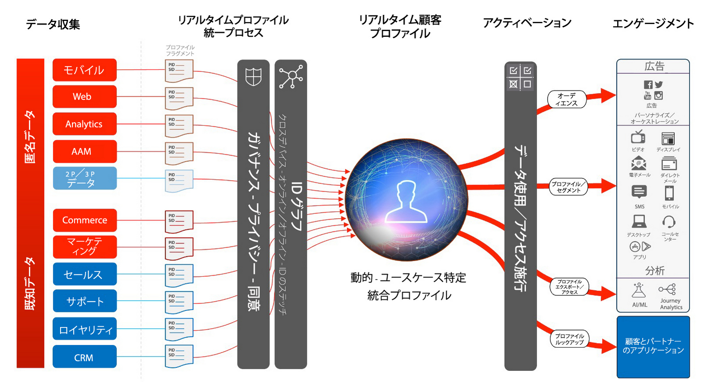

# オーディエンスおよびプロファイルのアクティベーションのブループリント

データドリブン型マーケティングでは、オーディエンスとプロファイルのアクティベーションが成功のカギです。ただし、多くのブランドでは、依然としてチャネルファーストのアクティベーションに注力し、多くの場合、リーチやパーソナライズ機能に一貫性がありません。

チャネルファーストのアプローチでは、各チャネルは他チャネルと連携せずに機能し、パーソナライズの取り組みは、そのチャネルのブランドとやり取りする顧客のみをターゲットにします。このアプローチは、顧客が多くの異なるタッチポイントをまたいでブランドとやり取りしているという現実を反映していません。オーディエンスとプロファイルのアクティベーションでは、ブランドは、複数のチャネルをまたいで顧客インタラクションを結びつけ、すべてのチャネルに対してアクティベーションできる一元化されたプロファイルとオーディエンスを実現できます。

オーディエンスとプロファイルのアクティベーションのブループリント

- [匿名オーディエンスアクティベーション](/help/blueprints/audience-activation/anonymous.md)
- 既知のカスタマーアクティベーション（RTCDP）
   - [概要](/help/blueprints/audience-activation/known.md)
   - [ソーシャルおよび広告チャネルに対するアクティベーション](/help/blueprints/audience-activation/advertising-activation.md)
   - [ファイルおよびエンタープライズストリーミング宛先に対するアクティベーション](/help/blueprints/audience-activation/enterprise-destinations.md)
   - [顧客アクティビティハブ](/help/blueprints/audience-activation/customer-activity.md)
   - [セグメントの一致](/help/blueprints/audience-activation/segment-match.md)
   - [Experience Cloudアプリケーションを使用したアクティベーション](/help/blueprints/audience-activation/platform-and-applications.md)

## リアルタイム顧客プロファイルアーキテクチャ

以下の図に、Experience Platform のリアルタイム顧客プロファイルのコアコンポーネントの概要を示します。

プロファイル、セグメント化、アクティベーションに関連するその他のドキュメントについては、 [RTCDP 概要ドキュメント](https://experienceleague.adobe.com/en/docs/experience-platform/rtcdp/home) および [リアルタイム顧客プロファイルの概要](https://experienceleague.adobe.com/en/docs/experience-platform/profile/home) ページ。

## オーディエンスとプロファイルのアクティベーションブループリントのガードレール

* ガードレールの詳細とエンドツーエンドの遅延については、[デプロイメントガードレールドキュメント](../experience-platform/deployment/guardrails.md)および[プロファイルとセグメント化ガードレール](https://experienceleague.adobe.com/docs/experience-platform/profile/guardrails.html?lang=ja)を参照してください。