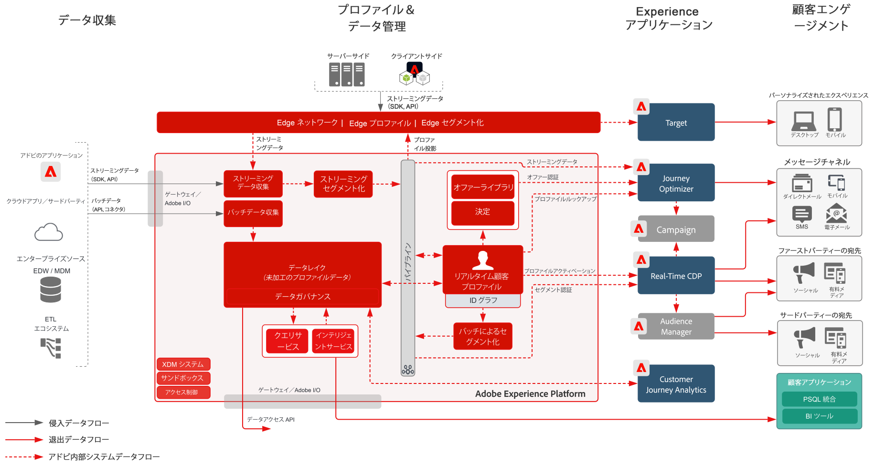

# Experience Cloud アプリケーションを使用したオーディエンスとプロファイルのアクティベーションブループリント

Experience Platform でプロファイルおよびオーディエンスを管理し、Experience Cloud アプリケーションを使用して共有します。Experience Platform でリッチな顧客セグメントおよびインサイトを構築および共有し、Experience Cloud アプリケーションを使用して共有します。

Experience Cloud アプリケーションを使用したアクティベーションは、[オンライン／オフラインオーディエンスアクティベーションブループリント](online-offline.md)と密接に連携しています。

## ユースケース

* Experience Cloud による顧客インタラクションチャネルをまたいでパーソナライズおよびターゲット設定します。
* Experience Platform と Experience Cloud アプリケーションの間でオーディエンスおよびプロファイルデータを共有します。

## アプリケーション

* Adobe Experience Platform
* [!UICONTROL Real-time Customer Data Platform]
* Experience Platform Activation
* Experience Cloud アプリケーション
   * Adobe Audience Manager
   * Adobe Target
   * Adobe Campaign
   * Journey Optimizer

## アーキテクチャ

[Experience Cloud アプリケーションとの Experience Platform 統合に関する追加のアーキテクチャ図については、Experience Platform およびアプリケーションアーキテクチャの節を参照してください。](https://experienceleague.adobe.com/docs/blueprints-learn/architecture/architecture-overview/platform-applications.html?lang=ja)

### Experience Cloud アプリケーションを使用したオーディエンスとプロファイルのアクティベーション

 

## ガードレール

[オーディエンスとプロファイルのアクティベーションの概要ページのガードレール](overview.md)を参照してください

## 関連ドキュメント

* [[!UICONTROL Real-time Customer Data Platform] 製品説明](https://helpx.adobe.com/jp/legal/product-descriptions/real-time-customer-data-platform.html)
* [プロファイルおよびセグメント化ガイドライン](https://experienceleague.adobe.com/docs/experience-platform/profile/guardrails.html?lang=ja)
* [セグメント化ドキュメント](https://experienceleague.adobe.com/docs/experience-platform/segmentation/api/streaming-segmentation.html?lang=ja)
* [宛先ドキュメント](https://experienceleague.adobe.com/docs/experience-platform/destinations/catalog/overview.html?lang=ja)

## 関連ビデオおよびチュートリアル

* [[!UICONTROL Real-time Customer Data Platform] の概要](https://experienceleague.adobe.com/docs/platform-learn/tutorials/application-services/rtcdp/understanding-the-real-time-customer-data-platform.html?lang=ja)
* [[!UICONTROL Real-time Customer Data Platform] のデモ](https://experienceleague.adobe.com/docs/platform-learn/tutorials/application-services/rtcdp/demo.html?lang=ja)
* [セグメントの作成](https://experienceleague.adobe.com/docs/platform-learn/tutorials/segments/create-segments.html?lang=ja)
