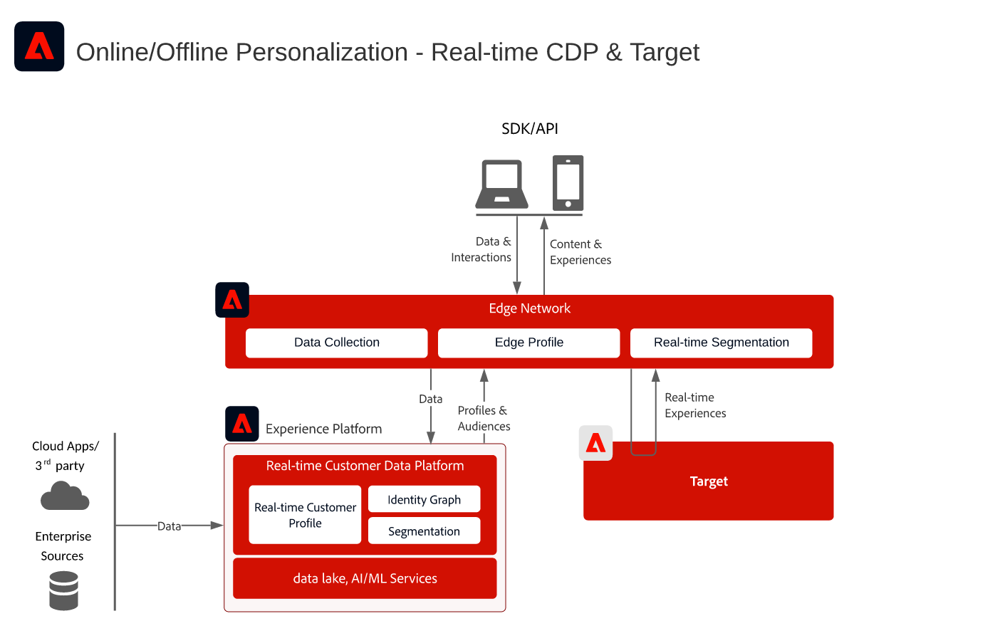
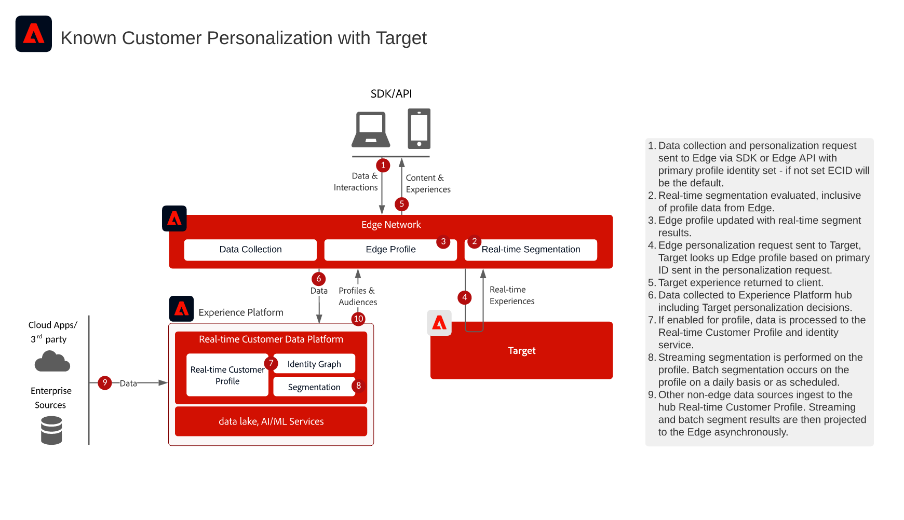
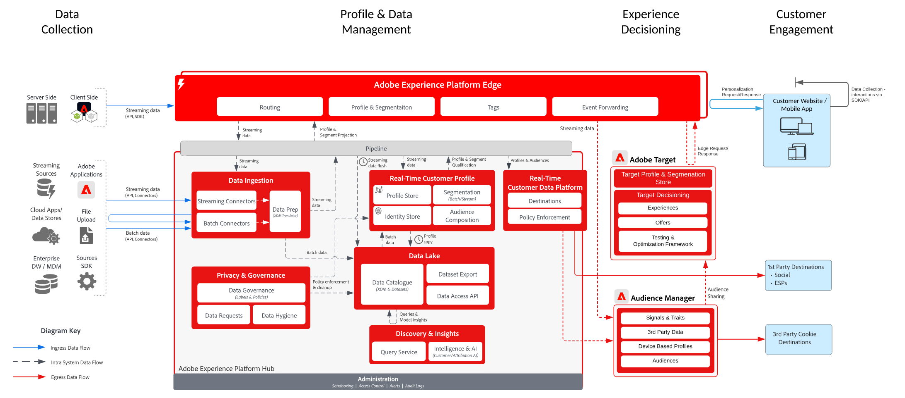

# Adobe Targetを使用した既知のCustomer Personalization

>[!TIP]
>このブループリントは、Personalizationの[ ユースケースパターン ](/help/blueprints/use-case-patterns/personalization/audience-sharing-with-target.md)としても利用できます。

## ユースケース

* 既知の顧客データを使用したオンラインパーソナライズ機能
* ランディングページの最適化
* トランザクション、ロイヤリティ、CRM データ、およびモデル化されたインサイトなどのオフラインデータに加えて、以前の製品／コンテンツ表示、製品／コンテンツの親和性、環境属性、および人口統計に基づいたパーソナライズ機能
* Adobe Targetを使用して、web サイトやモバイルアプリ上で、Adobe Real-Time CDPで定義されたオーディエンスを共有およびターゲティングできます

## アプリケーション

* [!UICONTROL Real-time Customer Data Platform]
* Adobe Target

### リファレンスドキュメント

* [Adobe Real-Time CDPのAdobe Target Connection](https://experienceleague.adobe.com/docs/experience-platform/destinations/catalog/personalization/adobe-target-connection.html)
* [Edge データストリーム設定](https://experienceleague.adobe.com/docs/experience-platform/edge/fundamentals/datastreams.html?lang=ja)

## 統合パターン

| 統合パターン | 機能 | 前提条件 |
|--------------------|------------|---------------|
| **Real-time Customer Data PlatformからTargetに共有されたEdgeのリアルタイム セグメント評価** | - Edge上で同じページまたは次のページのパーソナライゼーションをリアルタイムで評価します。  - ストリーミングまたはバッチ方式で評価されたすべてのセグメントも、Edge Networkに投影され、エッジセグメントの評価とパーソナライゼーションに含まれます。 | - Web/Mobile SDKを実装するか、Edge Network Server APIを実装する必要があります。  - TargetおよびExperience Platform拡張機能を有効にして、Experience Edgeでデータストリームを設定する必要があります。  - ターゲットの宛先は、Real-time Customer Data Platformの宛先で設定する必要があります。  - Target との統合には、Experience Platform インスタンスと同じ IMS Org が必要です。 |
| **Adobe Edgeを利用して、Adobe Real-Time CDPからAdobe Targetにオーディエンスをストリーミングおよびバッチで共有** | - Edge ネットワークを通じて、Real-time Customer Data Platform から Target へのストリーミングおよびバッチオーディエンスを共有します。  - リアルタイムで評価されるオーディエンスには、Web SDKとEdge Networkの実装が必要です。 | - Adobe TargetのWeb/Mobile SDKまたはEdge APIの実装は、ストリーミングおよびバッチ RTCDP オーディエンスをAdobe Targetと共有するために必要ではありませんが、リアルタイムのエッジセグメント評価を有効にするために必要です。  - AT.js を使用する場合、ECID ID 名前空間に対するプロファイル統合のみがサポートされます。  - Edgeでカスタム ID名前空間を検索するには、Web SDK/Edge APIのデプロイメントが必要です。各IDはID マップでIDとして設定する必要があります。  - ターゲットの宛先はReal-time Customer Data Platform Destinationsで設定する必要がありますが、RTCDPのデフォルトの実稼動サンドボックスのみがサポートされています。  - Target との統合には、Experience Platform インスタンスと同じ IMS Org が必要です。 |
| **Audience Sharing Service アプローチを使用して、Real-time Customer Data PlatformからTargetおよびAudience Managerへのストリーミングとバッチ オーディエンスの共有** |  – この統合パターンは、Audience Managerのサードパーティデータとオーディエンスからの追加のエンリッチメントが必要な場合に活用できます。 | - Web/Mobile SDKは、ストリーミングおよびバッチオーディエンスをTargetに共有するために必要ではありませんが、リアルタイムのエッジセグメント評価を有効にするために必要です。  - AT.js を使用する場合、ECID ID 名前空間に対するプロファイル統合のみがサポートされます。  - Edgeでカスタム ID名前空間を検索するには、Web SDK/Edge APIのデプロイメントが必要です。各IDはID マップでIDとして設定する必要があります。  - オーディエンス共有サービスを介したオーディエンス予測をプロビジョニングする必要があります。  - Target との統合には、Experience Platform インスタンスと同じ IMS Org が必要です。  - デフォルトの実稼動サンドボックスのオーディエンスのみが、オーディエンス共有コアサービスをサポートします。 |

## リアルタイム、ストリーミングおよびバッチオーディエンスの Adobe Target への共有

アーキテクチャ

シーケンスの詳細

概要アーキテクチャ

## 関連ドキュメント

### SDK ドキュメント

* [Experience Platform Web SDKのドキュメント](https://experienceleague.adobe.com/docs/experience-platform/edge/home.html?lang=ja)
* [Experience Platform Tags ドキュメント](https://experienceleague.adobe.com/docs/experience-platform/tags/home.html?lang=ja)
* [Experience Cloud ID サービスのドキュメント](https://experienceleague.adobe.com/docs/id-service/using/home.html?lang=ja)

### セグメント化ドキュメント

* [Experience Platformのセグメント化の概要](https://experienceleague.adobe.com/docs/experience-platform/segmentation/home.html?lang=ja)
* [リアルタイムセグメンテーション](https://experienceleague.adobe.com/docs/experience-platform/segmentation/ui/edge-segmentation.html?lang=ja)
* [ストリーミングセグメンテーション](https://experienceleague.adobe.com/docs/experience-platform/segmentation/api/streaming-segmentation.html?lang=ja)
* [Adobe Audience ManagerによるAdobe Analytics セグメント共有](https://experienceleague.adobe.com/docs/analytics/components/segmentation/segmentation-workflow/seg-publish.html?lang=ja)
* [結合ポリシー設定](https://experienceleague.adobe.com/docs/experience-platform/profile/merge-policies/ui-guide.html?lang=ja#create-a-merge-policy)

### チュートリアル

* [Real-Time CDPとAdobe Targetによる次のヒットのパーソナライゼーション](https://experienceleague.adobe.com/docs/platform-learn/tutorials/experience-cloud/next-hit-personalization.html?lang=ja)
