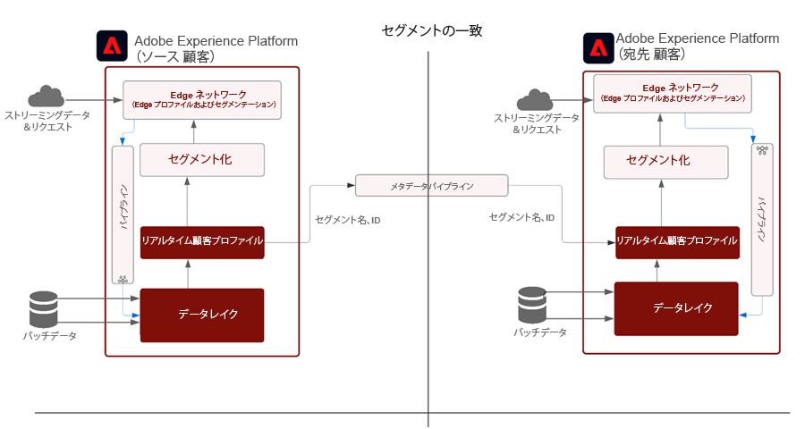
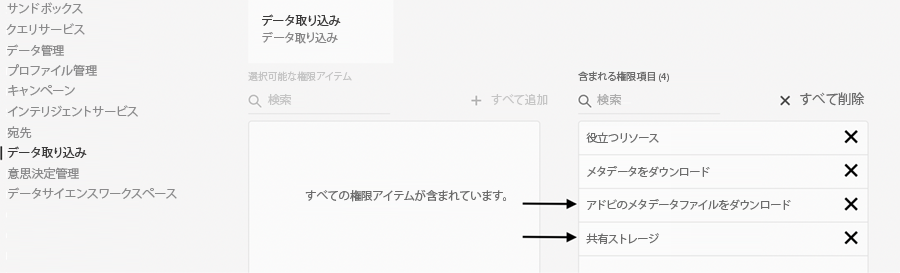
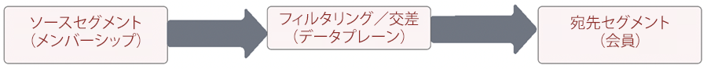
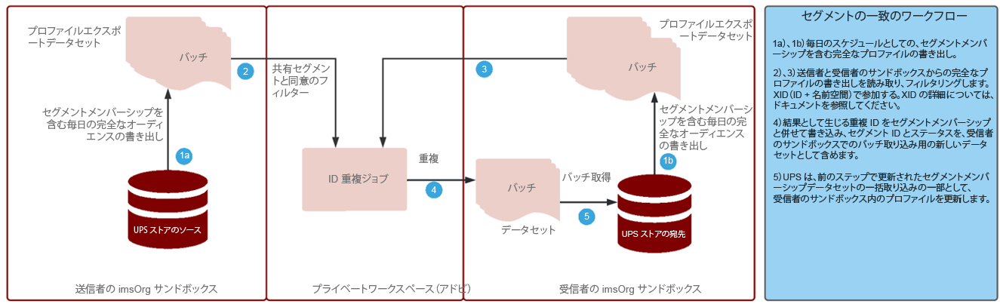

# セグメントの一致

セグメントマッチを使用すると、パートナーのブランドは各環境でオーディエンスをExperience Platformで共有できます。 ブランドの鍵は、消費者との直接の関係から収集したデータに基づいて顧客とつながりを持つことです。 ガバナンス、権限、環境設定の管理システムが改善され、マーケターは、主要パートナーと共にファーストパーティ認証済みオーディエンスをさらに強化できます。

[!UICONTROL セグメントの一致] は、Experience Platform(AEP) のお客様 ( _パートナー_) 共通の業界識別子に基づいて、セキュリティで保護され、管理され、プライバシーに優しい方法でセグメントデータを交換する場合に使用します。

このサービスを使用すると、お客様は、データベース全体を開示する必要なく、一致する ID を安全で中立的な方法で安全に識別できます。 パートナーは、重複する ID に対して指定された属性（セグメント名）のみを受け取るので、制御可能で同意に基づく方法で迅速かつ容易に共有できます。

[!UICONTROL セグメントの一致] は、AEP データガバナンスと同意フレームワークをバックボーンとして使用します。 B2C および B2P Real-time Customer Data Platformのすべてのお客様が利用できます。 の主な機能 [!UICONTROL [!UICONTROL セグメントの一致]] 次を含む：

* 重複する同意顧客のセグメント共有
* 推定一致量に関するインサイトの重複レポートを事前共有
* 完全に統合されたデータポリシーと権限の適用
* データ共有の同意フレームワークのバックボーン
* セグメントおよびパートナーを整理するためのデータフィード

## アプリケーション

ブランドと発行者：

「パブリッシャーのユースケース」は、サードパーティ Cookie とモバイル広告 ID データの廃止による最も大きな影響を受けます。 この使用例は、広告をビジネスモデルとして販売することに注力しているメディアおよびエンターテインメント業界に大きな影響を与えます。 [!UICONTROL セグメントの一致] は、大規模なファーストパーティオーディエンスを持つパブリッシャーが広告主と直接共同作業を行うための手段です。 広告主は、パブリッシャーと直接連携して、詳細なターゲティングや予測キャンペーンのために、パブリッシャーのプロパティで、一致したオーディエンスに対して広告を出すことができます。

### ブランドからブランドへ

コンシューマージャーニーは線形ではありません。 例えば、ある顧客が航空会社とクレジットカード会社に常連しているとします。 次を使用： [!UICONTROL セグメントの一致]を使用すると、航空会社とクレジットカード会社は、重複するオーディエンスを理解し、各会社の常連客に合わせてエクスペリエンスをパーソナライズするためのデータパートナーシップを作成できます。

### BU から BU

グローバルな多国籍企業は、独立して運用する事業部門間でのデータのコラボレーションに関して課題を抱えています。 プライバシーポリシーや獲得、BU をまたいだ権限の管理などが異なるので、データを単一のサンドボックスに組み合わせることはできない場合があります。

[!UICONTROL セグメントの一致] は、大規模な組織全体の異なるマーケティングチームがより効率的に共同作業を行い、引き続き独立して運営を行うのに役立ちます。

## アーキテクチャ



[!UICONTROL セグメントの一致] は、データを購入できるデータマーケットプレイスではありません。 代わりに、特定のパートナーとファーストパーティのデータを連携し、プライバシーと同意制御を使用して共同作業をおこなう AEP 機能です。 [!UICONTROL セグメントの一致] は、顧客との関係の改善とブランドの成長に取り組むうえで役立ちます。 既存のブランドやパートナー関係が存在する場合に便利です。 [!UICONTROL セグメントの一致] エクスペリエンスは管理が容易で拡張性が高く、管理者がオプトインで制御可能な方法でセグメントを共有できます。

[!UICONTROL セグメントの一致] 有効：

* セグメントメンバーシップデータを、ハッシュ化された電子メールや電話番号など、標準的なユーザーレベルの識別子を使用して組織間で安全に移植する
* 通知付きの UI とワークフローを共有するオーディエンス
* 事前共有された重複の予測
* セルフサービスパートナーの設定
* 選択した標準化された名前空間（ハッシュ化された電子メール、ハッシュ化された電話、ECID、IDFA、GAID）と重複しています
* データ共有の同意の実施
* 共有オーディエンスのライフサイクル管理
* 共有ワークフローのデータの適用
* 毎日のバッチ更新

[!UICONTROL セグメントの一致] では、相互に接続された顧客体験を作成できます。 サポートされる永続的な識別子は、ハッシュ化された電子メール、ハッシュ化された電話番号、および ECID、IDFA、GAID などの識別子です。 顧客は、強力なガバナンス、透明性を備え、広告およびマーケティング活動で使用する機能を失効させ、ブランドサンドボックス間でオーディエンスデータを一致および移動するフィードを構築できます

## 前提条件

の前提条件 [!UICONTROL セグメントの一致] 次の場合：

* RT-CDP アクティブライセンス
* サポートされる標準のハッシュ化された識別子は、SHA256 ハッシュ化された電子メール、ハッシュ化された電話、ECID、Apple IDFA および GAID です
* プライバシーフレームワークと同意戦略
* 顧客間でのデータ共有契約

## セキュリティ

### RBAC

この [!UICONTROL セグメントの一致] パートナー管理のフローは、RBAC で保護されます。 適切な権限を持つ個人のみが、パートナーを開始、承認、管理できます。 これは、製品プロファイルの「データ取得」セクションでおこなえます。 次の権限が必要です。



| 権限 | 説明 |
|---|---|
| **オーディエンス共有接続を管理** | この権限を使用すると、2 つの IMS 組織を接続してを有効にする、パートナーハンドシェイクプロセスを完了できます [!UICONTROL セグメントの一致] フロー。 |
| **オーディエンス共有を管理** | この権限を使用すると、フィード ( [!UICONTROL セグメントの一致]) とアクティブなパートナー ( 管理者ユーザーが **オーディエンス共有接続** アクセス )。 |

詳しくは、 [公式ドキュメント](https://experienceleague.adobe.com/docs/experience-platform/segmentation/ui/segment-match/overview.html?lang=en#understanding-segment-match-permissions) 権限の詳細を確認するには、を参照してください。

### 接続 ID

パートナー接続プロセスは、 **[!UICONTROL 接続 ID],** これは、特定の AEP サンドボックスにマッピングされる、ランダムに生成された識別子です。 この接続 ID は、パートナーサンドボックスを開始および管理するために必要です。 必要に応じて、接続 ID を再生成してパートナー接続を再設定することもできます。

### ガバナンス

データセットまたはデータ属性 *C11* 契約ラベルは次に対して制限されています： [!UICONTROL セグメントの一致] サービス。 これらの属性を使用するセグメントは、 [!UICONTROL セグメントの一致]. これにより、どのセグメントを使用できるか、使用できないかを制御できます [!UICONTROL セグメントの一致]. さらに、作成されたカスタムポリシーとマーケティングアクションも適用されます。 デフォルトでは、ポリシーは無効になっており、適用を有効にする必要があります。 電子メールマーケティングやオンサイト広告など、セグメントの共有時に選択される制限もパートナーと伝播および共有されます。

### 同意

の同意設定 [!UICONTROL セグメントの一致] は、次の方法で管理できます。

* 組織レベルで、オンボーディング中に、同意チェックのオプトアウトまたはオプトイン設定を使用する。

   この設定は、ユーザーデータを共有できるかどうかを決定します。 デフォルトでは、オプトアウトがに設定されており、AEP のお客様が既にデータ共有使用に必要な同意契約を締結していると仮定して、ユーザーデータを共有できることを示します。 この設定をオプトインに変更するには、Adobeのアカウントマネージャーに問い合わせて追加のチェックを入れ、AEP のお客様が明示的に同意を追跡するように強制します。

* を使用して、ID(idSpecific) に固有の share 属性を設定する [同意および環境設定フィールドグループ](https://experienceleague.adobe.com/docs/experience-platform/xdm/field-groups/profile/consents.html?lang=en).

   このフィールドグループは、同意と環境設定の情報を取り込むための、1 つのオブジェクトタイプフィールド（同意）を提供します。 [!UICONTROL セグメントの一致]デフォルトでは、明示的にオプトアウトされていないすべての ID が含まれます。例：

   ```
   "share": {
   `                `"val": "n"
   `     `}
   ```

   この設定は、Adobeのアカウントマネージャーに問い合わせて、明示的なオプトインを含む ID のみを含めるように変更できます。例：

   ```
   "share": {
   `                `"val": "y"
   `     `}
   ```

### アラート

アラートは、パートナー接続が開始されたとき、またはセグメントフィードがパートナーと共有されたときに生成されます。

## ワークフローを設定

パートナー接続を設定するワークフローは、前述のように RBAC を使用して管理されます。 適切な権限が設定されている場合、パートナーサンドボックスへの接続では、パートナーの組織内のそのサンドボックス/インスタンスの接続 ID を共有する必要があります。

送信パートナーから接続がリクエストされたら、安全で安全なパートナー設定をおこなうために、受信側で承認が必要です。 パートナー接続のハンドシェイクにより、2 つの組織間で契約が確実に存在し、Adobeが [!UICONTROL セグメントの一致] 組織に代わって処理します。 接続が承認され、アクティブ状態の場合、セグメントの共有プロセスはどちらかの側から開始できます。

### セグメントの共有

選択した識別子に一致が存在する場合にのみ、パートナーとのセグメント共有が発生します。 1 対多のパートナー関係がある場合があります。つまり、セグメントを複数のパートナーと共有できます。

パートナー接続の設定後にセグメントの共有を開始するには、送信側のパートナーがフィードを作成する必要があります。 次に、永続的な識別子と共に、セグメントデータを除外する必要があるマーケティングのユースケースまたはアクションを選択します。 その後、関連するセグメントをフィードに追加して共有できます。

このセグメント共有ワークフローの一環として、送信パートナーは、データが移動される前に、推定された重複を通じて価値の高いセグメントを見つけ出すことができます。

全体的なプロセスフローは次のとおりです。



これらの重複予測により、主要なインサイト、パートナーの発見、データを提供して、データのコラボレーション契約を結びます。 これらの重複予測指標を取得するために、サンドボックス全体で顧客データやセグメントデータが移動されることはありません。 Adobeが和集合操作と積集合操作を実行できる確率論的データ構造に、任意のサンドボックスで顧客が選択した、事前にハッシュ化された適用可能な ID が追加されます。 これらの操作は、 [!UICONTROL セグメントの一致] 実際の値を比較することなく、2 つの異なるサンドボックスから、id で構成される 2 つのデータ構造の推定積集合を取得できます

ID の重複プロセスは、 **日別フルプロファイルエクスポート** データセットを送信者サンドボックスと受信者サンドボックスの両方から取得し、共有セグメントに属する共通のプロファイルを識別します。 重複プロセスの詳細なプロセス・フローを次に示します。



送信パートナーからセグメント共有が完了すると、受信者は、共有されたセグメントフィードに関する通知を受け取ります。 受信者がセグメントメンバーシップのデータフローを開始するには、このセグメントフィードを受信者でプロファイルに対して有効にする必要があります。 セグメントメンバーシップは、受信者 IMS 組織の重複するプロファイルフラグメントに取り込まれ、追加の ID は送信者から受信者に転送されません。

共有セグメントは、 `AEPSegmentMatch` セクション **[!UICONTROL オーディエンス]** 」タブをクリックします。 **[!UICONTROL セグメントビルダー]** およびは、受信者サンドボックスでセグメントを作成する際に、オーディエンスを含めたり抑制したりするために使用できます。

日別の重複プロセスでは、送信者と受信者の間でセグメントメンバーシップが同期されます。 受信者は、受信したセグメントフィードのプロファイルを無効にして、セグメント共有プロセスを一時停止できます。

#### セグメント出口/入口

完全なプロファイル書き出しの一環として、プロファイルのセグメントメンバーシップの下の共有セグメント ID のステータスは、対応する値の 1 つ ( _実現_, _終了_&#x200B;または _既存_ 現在の状態を反映させる。

日別の ID 重複プロセス中に、対応する ID が受信者サンドボックスに存在する場合、共有セグメントのこれらのセグメントメンバーシップステータスは、取得のために受信者に送信されます。

#### セグメント失効

送信者からのセグメントの失効/削除は、オンデマンドのプロセスで、取り消された segment-ID を持つすべてのプロファイルのリストが受信者から取得されます。 セグメント ID は、これらの ID のセグメントメンバーシップから削除され、受信者で再取り込みされます。 このアクションは、既存のセグメントメンバーシップフラグメントを上書きし、そのセグメントのメンバーシップが削除されます。

## 詳細

* [セグメントの一致](https://experienceleague.adobe.com/docs/experience-platform/segmentation/ui/segment-match/overview.html?lang=en#)
* [権限](https://experienceleague.adobe.com/docs/experience-platform/access-control/home.html?lang=en)
* [トラブルシューティング](https://experienceleague.adobe.com/docs/experience-platform/segmentation/ui/segment-match/troubleshooting.html?lang=en)
* [XID](https://experienceleague.adobe.com/docs/experience-platform/identity/api/list-native-id.html?lang=en)
