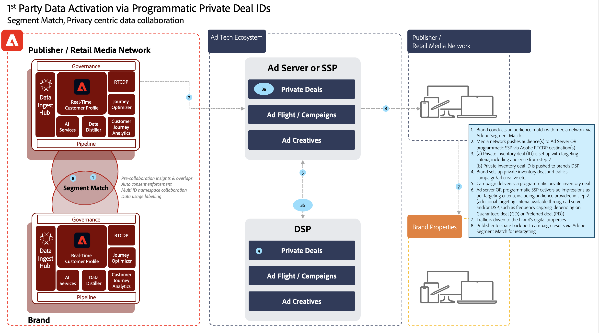

# セグメントの一致のブループリント

セグメントの一致を使用すると、パートナーのブランドは Experience Platform の各環境をまたいでオーディエンスを共有できます。ブランドの鍵は、顧客との直接の関係から収集したデータに基づいて顧客とつながりを持つことです。改善されたガバナンス、権限、環境設定の管理システムを使用すれば、マーケターは、主要パートナーと共にファーストパーティ認証済みオーディエンスをさらに強化することができます。

[!UICONTROL セグメントの一致]は、Experience Platform（AEP）の顧客（以降&#x200B;_パートナー_&#x200B;と記す）共通の業界識別子に基づいて、セキュアで、管理され、プライバシーに優しい方法でセグメントデータを交換することができるデータコラボレーションサービスです。

このサービスを使用すると、顧客はデータベース全体を開示する必要がなく、一致する ID を安全で中立的な方法でセキュアに識別することができます。パートナーは、重複する ID に対して指定された属性（セグメント名）のみを受け取るので、制御可能で同意に基づく方法で迅速かつ容易に共有することができます。

[!UICONTROL セグメントの一致]は、AEP データガバナンスと同意フレームワークをバックボーンとして使用します。B2C および B2P Real-time Customer Data Platform のすべての顧客が利用できます。[!UICONTROL [!UICONTROL セグメントの一致]]は、主な機能として以下のものを含みます：

* 重複する同意顧客のセグメント共有
* 推定一致量に関するインサイトの重複レポートを事前共有
* 完全に統合されたデータポリシーと権限の適用
* データ共有の同意フレームワークのバックボーン
* セグメントおよびパートナーを整理するためのデータフィード

## アプリケーション

ブランドと発行者：

「発行者のユースケース」は、サードパーティ Cookie とモバイル広告 ID データの廃止による最も大きな影響を受けます。このユースケースは、広告をビジネスモデルとして販売することに注力しているメディアおよびエンターテインメント業界に大きな影響を与えます。[!UICONTROL セグメントの一致]は、自社の広告主と直接コラボレーションしたいと考えている多数のファーストパーティオーディエンスを持つ発行者向けのパスです。広告主は発行者と直接連携して、詳細なターゲティングや予測キャンペーンのために、発行者のプロパティで、一致したオーディエンスに対して広告を出すことができます。

### ブランドからブランドへ

コンシューマージャーニーは決して線形になることはありません。例えば、ある顧客が航空会社とクレジットカード会社の常連であるとします。[!UICONTROL セグメントの一致]を使用すると、航空会社とクレジットカード会社は、重複するオーディエンスを理解し、各会社の常連客に合わせてエクスペリエンスをパーソナライズするためのデータパートナーシップを作成することができます。

### BU から BU へ

グローバルな多国籍企業は、独立して運用する事業部門間でのデータのコラボレーションに関して課題を抱えています。プライバシーポリシーや獲得、BU をまたいだ権限の管理などが異なるので、データを単一のサンドボックスに組み合わせることができない場合があります。

[!UICONTROL セグメントの一致]は、大規模な組織にまたがる様々なマーケティングチームが、独立した運用を継続しながら、より効率的に共同作業を行うのに役立ちます。

## アーキテクチャ

{zoomable="yes"}

[!UICONTROL セグメントの一致]は、データを購入することができるデータマーケットプレイスではありません。マーケットプレイスではない代わりに、特定のパートナーとファーストパーティのデータを連携し、プライバシーと同意制御を使用して共同作業を行う AEP 機能です。[!UICONTROL セグメントの一致]は、顧客との関係の改善とブランドの成長に取り組むうえで役立ちます。既存のブランドやパートナー関係が存在する場合に便利です。[!UICONTROL セグメントの一致]エクスペリエンスは管理が容易で拡張性が高く、管理者がオプトインで制御可能な方法でセグメントを共有することができます。

[!UICONTROL セグメントの一致]により、以下の内容が可能になります：

* ハッシュ化された電子メールや電話番号など、標準的なピープルレベルの識別子を使用して、メンバーシップデータをセグメント化し、組織間で安全に移植する
* 通知付きのオーディエンス共有 UI およびワークフロー
* 事前共有された重複の推定
* セルフサービスパートナーの設定
* 選択した標準化された名前空間（ハッシュ化された電子メール、ハッシュ化された電話、ECID、IDFA、GAID）で重複しています
* データ共有の同意の実施
* 共有オーディエンスのライフサイクル管理
* 共有ワークフローのデータの適用
* 毎日のバッチ更新

[!UICONTROL セグメントの一致]により、相互に接続された顧客体験を作成することができます。サポートされる永続的な識別子とは、ハッシュ化された電子メール、ハッシュ化された電話番号、および ECID、IDFA、GAID などの識別子です。顧客は、強力なガバナンス、透明性を備え、広告およびマーケティング活動で使用する機能を失効させ、ブランドサンドボックス間でオーディエンスデータを一致および移動するフィードを構築することができます

## 前提条件

[!UICONTROL セグメントの一致]には以下の前提条件があります：

* RT-CDP アクティブライセンス
* サポートされる標準のハッシュ化された識別子とは、SHA256 ハッシュ化された電子メール、ハッシュ化された電話、ECID、Apple IDFA および GAID です
* プライバシーフレームワークと同意戦略
* 顧客間でのデータ共有契約

## セキュリティ

### RBAC

パートナー管理をするこの[!UICONTROL セグメントの一致]フローは、RBAC で保証されます。適切な権限を持つ個人のみが、パートナーを開始、承認、管理することができます。これは「製品プロファイル」の「データ取得」セクションで行うことができます。以下の権限が必要です：

{zoomable="yes"}

| 権限 | 説明 |
|---|---|
| **オーディエンス共有接続を管理** | この権限により、2 つの IMS 組織を接続して[!UICONTROL セグメントの一致]フローを有効にするパートナーハンドシェイクプロセスを完了することができます。 |
| **オーディエンス共有を管理** | この権限により、アクティブなパートナー（**オーディエンス共有接続**&#x200B;アクセス権を持つ管理者ユーザーによって接続されたパートナー）とのフィード（[!UICONTROL セグメントの一致]に使用されるデータのパッケージ）を作成、編集、および公開することができます。 |

権限の詳細を確認するには、[公式ドキュメント](https://experienceleague.adobe.com/docs/experience-platform/segmentation/ui/segment-match/overview.html?lang=ja#understanding-segment-match-permissions)を参照してください。

### 接続 ID

パートナー接続プロセスは、特定の AEP サンドボックスにマッピングされる、ランダムに生成された識別子である&#x200B;**[!UICONTROL 接続 ID]、**&#x200B;によって管理されます。この接続 ID は、パートナーサンドボックスを開始および管理するために必要です。必要に応じて、接続 ID を再生成してパートナー接続を再設定することもできます。

### ガバナンス

*C11* 契約ラベルを持つすべてのデータセットやデータ属性は、[!UICONTROL セグメントの一致]サービスに対して制限されています。これらの属性を使用するセグメントは、[!UICONTROL セグメントの一致]に使用することができません。これにより、どのセグメントを[!UICONTROL セグメントの一致]に使用することができできるか、できないかを制御することができます。これに加えて、作成されたカスタムポリシーとマーケティングアクションも適用されます。デフォルトでは、ポリシーは無効になっており、適用するためにはこれを有効にする必要があります。電子メールマーケティングやオンサイト広告など、セグメントの共有時に選択される制限も伝達され、パートナーと共有されます。

### 同意

[!UICONTROL セグメントの一致]の同意設定は、次の方法で管理することができます：

* 組織レベルで、オンボーディング中に、同意チェックのオプトアウトまたはオプトイン設定を使用。

  この設定により、ユーザーデータを共有できるかどうかが決定されます。デフォルトでは、オプトアウトに設定されていますが、これは AEP の顧客が既にデータ共有使用に必要な同意契約を締結していると仮定して、ユーザーデータを共有できることを意味します。この設定は、アドビのアカウントマネージャーに連絡することでオプトインに変更することができ、AEP 顧客が明示的に同意を追跡することを強制するための追加のチェックを配置することができます。

* [同意および環境設定フィールドグループ](https://experienceleague.adobe.com/docs/experience-platform/xdm/field-groups/profile/consents.html?lang=ja)を使用して、ID（idSpecific）に固有の共有属性を設定する。

  このフィールドグループは、同意と環境設定の情報をキャプチャするための、単一のオブジェクト型フィールドである「同意」を提供します。デフォルトでは、[!UICONTROL セグメントの一致]には明示的にオプトアウトされていないすべての ID が含まれます。例：

  ```
  "share": {
  `                `"val": "n"
  `     `}
  ```

  この設定は、アドビのアカウントマネージャーに問い合わせて、明示的なオプトインを含む ID のみを含めるように変更することができます。例：

  ```
  "share": {
  `                `"val": "y"
  `     `}
  ```

### アラート

アラートは、パートナー接続が開始された場合、またはセグメントフィードがパートナーと共有された場合に生成されます。

## ワークフローを設定

パートナー接続を設定するワークフローは、前述のように RBAC を使用して管理されます。適切な権限が設定されている場合、パートナーサンドボックスへの接続には、パートナーの組織内のそのサンドボックス／インスタンスの接続 ID を共有する必要があります。

送信パートナーから接続がリクエストされた場合、安全でセキュアなパートナー設定を行うために、受信側での承認が必要になります。パートナー接続のハンドシェイクにより、2 つの組織間に合意が存在することが保証され、アドビが組織に代わって[!UICONTROL セグメントの一致]プロセスを促進することができるようになります。接続が承認され、アクティブ状態の場合、セグメントの共有プロセスはどちらの側からでも開始することができます。

### セグメントの共有

選択された識別子に一致が存在する場合にのみ、パートナーとのセグメントの共有が発生します。1 対多数のパートナー関係がある場合があります。これは、セグメントを複数のパートナーと共有することができることを意味します。

パートナー接続の設定後にセグメントの共有を開始するには、送信側のパートナーがフィードを作成する必要があります。次に、永続的な識別子と共に、セグメントデータを除外する必要があるマーケティングのユースケースやアクションを選択します。その後、関連するセグメントをフィードに追加して共有することができます。

このセグメント共有ワークフローの一環として、送信パートナーは、データが移動される前に、推定された重複を通じて価値の高いセグメントを見つけ出すことができます。

全体的なプロセスフローは次のとおりです。

{zoomable="yes"}

これらの重複の推定は、重要なインサイト、パートナーの発見、データコラボレーション契約を促進するためのデータを提供します。これらの重複の推定指標を取得するために、サンドボックス全体で顧客データやセグメントデータが移動されることはありません。任意のサンドボックス内で顧客が選択し、ハッシュ化された適用可能な ID は、確率論的データ構造に追加され、これによりアドビはそれらの間で和集合演算および交点演算を実行することができます。これらの演算により、[!UICONTROL セグメントの一致]は実際の値を比較することなく、2 つの異なるサンドボックスから、ID で構成される 2 つのデータ構造の推定交点を取得することができます

ID 重複プロセスは、送信側と受信側の両方のサンドボックスから&#x200B;**日別にフルプロファイル書き出し**&#x200B;されるデータセットに依存し、共有セグメントに属する共通のプロファイルを識別します。以下に重複プロセスの詳細なプロセスフローを示します。

{zoomable="yes"}

送信パートナーからセグメント共有が完了すると、受信者は、共有されたセグメントフィードに関する通知を受け取ります。受信者がセグメントメンバーシップのデータフローを開始するには、このセグメントフィードを受信者側でプロファイルに対して有効にする必要があります。セグメントメンバーシップのみが、受信者 IMS 組織の重複するプロファイルフラグメントに取り込まれ、追加の ID は送信者から受信者に転送されません。

共有セグメントは、**[!UICONTROL セグメントビルダー]**&#x200B;の&#x200B;**[!UICONTROL オーディエンス]**&#x200B;タブの`AEPSegmentMatch`セクションで利用することができ、受信者のサンドボックスでセグメントを構築する際にオーディエンスの包含や抑制に利用することができます。

日別の重複プロセスでは、送信者と受信者の間でセグメントメンバーシップが同期されます。受信者は、受信したセグメントフィードのプロファイルを無効にして、セグメント共有プロセスを一時停止することができます。

#### セグメント出口／入口

プロファイルのセグメントメンバーシップの下の共有セグメント ID のステータスは、完全なプロファイル書き出しの一環として、以下のうちの対応する値の 1 つ（_実現済_、_終了_&#x200B;または&#x200B;_既存_）を持ち、現在の状態を反映させます。

日別の ID 重複プロセス中に、対応する ID が受信者サンドボックスに存在する場合、共有セグメントのこれらのセグメントメンバーシップステータスは、取り込みのために受信者に送信されます。

#### セグメント失効

送信者からのセグメントの失効／削除は、オンデマンドのプロセスであり、取り消されたセグメント ID を持つすべてのプロファイルのリストが受信者から取得されます。セグメント ID は、これらの ID のセグメントメンバーシップから削除され、受信者側で再取り込みされます。このアクションは、既存のセグメントメンバーシップフラグメントを上書きし、そのセグメントのメンバーシップが削除されます。

## プログラム取引でのセグメント一致の使用

サードパーティ cookie やデバイス識別子に関する制限が厳しくなるにつれ、プログラム広告ではオーディエンスを構築しターゲットにする新しい方法を探しています。 「ユニバーサル ID」ソリューションの数は増えていますが、業界はまだ不安定で、同意された、スケーラブルな方法では、適用されるプライバシー上の懸念をバランスよく保ちながら、同じレベルのターゲティングを達成することができません。

Adobe Experience Platform Segment Match は、プライバシーを中心としたオーディエンスの共同作業で使用でき、広告主とパブリッシャーの間のプログラムによるプライベート取引を強化できます。 セグメントの一致を使用すると、次のことができます。

* **広告トラフィック** ワークフローと **オーディエンス** ワークフローを分割します。
* パートナーブランドが、同意が実施されたプロセス内で、ハッシュ化された電子メールやハッシュ化された電話番号などの永続的な識別子を使用して、相互に共有される同意した ID のオーディエンスメタデータを共有できるようにします。

### ユースケース

* プログラムによるプライベート取引を通じたファーストパーティオーディエンスのターゲティング。
* プログラムによるプライベート取引を介したファーストパーティオーディエンスの抑制。
* プログラムによるプライベート取引でシードされたファーストパーティオーディエンスから、類似オーディエンスをターゲティングする。

>[!BEGINSHADEBOX]

**ブランド（Luma）とメディアネットワーク（ACME）の間の次のワークフロー例について考えてみます。**

1. ブランド（Luma）は、Segment Match を介してメディアネットワーク（ACME）とオーディエンスマッチを行います。
2. ACME が、Adobe Real-Time CDP Destination （s）を介して、オーディエンスを広告サーバーまたはプログラムによる SSP にプッシュします。
3. ACME は、前の手順で確立したオーディエンスを含め、該当するターゲティング条件を使用してプライベート在庫取引（ID）を設定します。 その後、プライベート在庫取引 ID が Luma のDSPにプッシュされます。
4. Luma は、プライベート在庫取引とトラフィックキャンペーン/広告クリエイティブを設定します。
5. その後、キャンペーンはプログラムによるプライベート在庫取引を通じて配信します。
6. 次に、広告サーバーまたは SSP は、設定されたターゲティング条件を満たす広告インプレッションを配信する。 （フリークエンシーキャップなどの追加のターゲティング条件は、保証された契約と優先される契約のどちらが契約で確立されたかに応じて、アドサーバーまたはDSPを通じて使用できます）。
7. トラフィックは、Luma のブランドプロパティに誘導されます。
8. 次に、ACME は、リターゲティング用に Segment Match を介して、キャンペーン後のインサイトやオーディエンスを共有し直します。

>[!ENDSHADEBOX]



>[!IMPORTANT]
>
> 上記のソリューションは、プログラムによるプライベート取引を通じてファーストパーティデータを簡単にターゲットにする方法を提供しますが、実行する前には、次の例など、いくつかの考慮事項が存在する可能性があります（ただし、それに限定されません）。
>
>* 同意：この方法でデータを活用するために、ブランド、出版社、または小売メディアネットワークによる適用可能な同意収集。
>
>* ポリシーとライセンス契約：この方法でデータを活用およびアクティブ化するために、ブランド、出版社、または小売メディアネットワークが適用するあらゆるポリシー（プライバシーポリシー、サードパーティベンダー契約など）に準拠します。


## 詳細

* [セグメントの一致](https://experienceleague.adobe.com/docs/experience-platform/segmentation/ui/segment-match/overview.html?lang=ja#)
* [権限](https://experienceleague.adobe.com/docs/experience-platform/access-control/home.html?lang=ja)
* [トラブルシューティング](https://experienceleague.adobe.com/docs/experience-platform/segmentation/ui/segment-match/troubleshooting.html?lang=ja)
* [XID](https://experienceleague.adobe.com/docs/experience-platform/identity/api/list-native-id.html?lang=ja)
