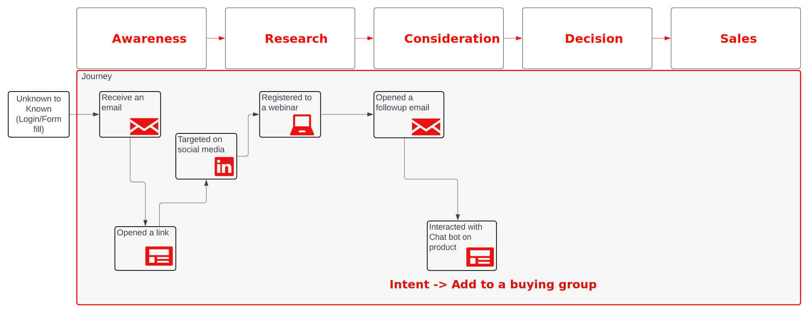
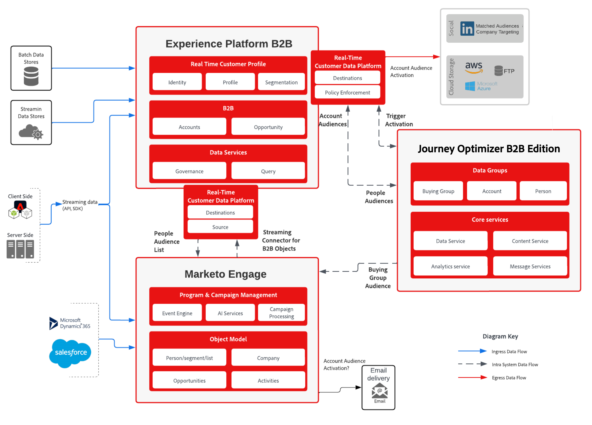

# 購買グループベースのマーケティングとジャーニー管理の設計図

>[!TIP]
>このブループリントは、[&#x200B; ユースケースパターン &#x200B;](/help/blueprints/use-case-patterns/b2b/buying-group-marketing.md)としてB2B Activation &amp; Marketingで利用することもできます。

現在、マーケティング部門は、営業部門に適格なリードを提供する上で、多くの課題に直面しています。 これらの課題のひとつは、組織内で適切な人材に対応することです。これは通常、労力と精度において明らかです。 _リードスコアリング_&#x200B;では、グループが狭すぎるため、適切なメンバーが揃っていない可能性があります。 _アカウントスコアリング_&#x200B;では、アカウントの全体像を把握した上で、適切な人物を特定するためにより多くの労力が必要です。

この課題では、**_購買グループ_**&#x200B;の概念が導入されます。 購買グループを活用すると、マーケターはアカウント内の適切なグループを見つけ、リードのクオリフィケーションとグループ内での役割の特定という観点から、これらの個人と協力することができます。

## 購買グループを使用してリードとアカウントを選定する方法

購買グループを作成し、そのグループを完成させるように努力することで、リードを絞り込むマーケティング活動の効果が高まり、販売機会につながります。 購買グループは、リードをソリューションのインテントにリンクされた役割テンプレートに一致させることが重要です。

購買グループの例としては、_Acme Corp Seeds Buying Group_&#x200B;があり、ソリューションの関心は&#x200B;_AI Driven Seeds_&#x200B;です。

購買グループとは、製品に関心を持つ、製品を購入する意向を示す、企業の従業員のグループを指します。 また、購買グループは複数のソリューションに対する関心を特定でき、個人は複数の購買グループに属します。

Journey Optimizer B2B editionが提供する強化されたB2B機能により、次の課題に対処できるようになりました。

* _顧客第一_&#x200B;のマーケティングキャンペーンがありません。
* MQL （マーケティングクオリファイドリード）からSQL （セールスクオリファイドリード）へのコンバージョン率が一貫性がなく、MQLを育成するためにイニシアチブとセールス部門の連携が必要
* _競合_ アカウントを特定してターゲットにする販売可能なメカニズムがありません。
* 収益とパイプラインの集中リスク。

次のKPIは、ユースケースの成功指標と一致しています。

* **認知度**: ターゲット顧客はあなたの広告を見て、以前よりも高い割合でweb サイトに誘導していますか？
* **エンゲージメント**: ターゲット顧客はweb サイトにアクセスし、コンテンツにエンゲージしていますか？
* **時間**：営業部門が商談に様々なツールから連絡先を検索して追加するのにどのくらいの時間がかかりますか？
* **コスト**：各プラットフォームの各リードにかかるコストは？

## ABM （アカウントベースドマーケティング

一般的なユースケースであり、この設計図では、アカウントベースドマーケティングの取り組みに焦点を当てます。 このユースケースでは、作成した購買グループが役割やソリューションへの関心に関連している場合に、リードが追加されるポイントを調査します。

ジャーニーを通じて個人をリードする際には、フォーム、CRM同期、LinkedInのアクティベーションなど、リード（購買グループのワークフロー）に関する詳細な情報を収集します。

リードがソリューションへの関心を明確に示すのは、ビジネスレンズによって定義されたビジネスイベントです。 この時点で、このリードが製品に本当に興味を持っていると確信しています。 Journey Optimizer B2B editionでは、リードはロールテンプレート（インフルエンサー、意思決定者、チャンピオン、スポンサーなど）でそのソリューションの購買グループと関連付けられます。

次の図が示すように、フォームまたはLinkedInのアクティベーションを通じて詳細を収集し、チャットボットとのやり取りが発生したときにソリューションのインテントを選定できます。

{zoomable="yes"}

購買グループの完了率が十分に高い場合は、SQLまたはSOLを通じてグループをセールス部門と共有し、アカウントのリードを完了済みのセールスに変換します。

## アカウント中心のソリューション

B2B リード管理は、アカウントとそのリードに重点を置いています。 テクニカルレイヤーは、これらの特性を表すデータをサポートするように設定されています。これは、アカウントセグメンテーションとジャーニー管理を成功させるための要件です。

### 要件定義

アカウントに特化したソリューションには、次のアプリケーションとサービスが必要です。

* Adobe Journey Optimizer B2B edition
* Adobe Real-Time Customer Data Platform （RTCDP） B2B edition
* Adobe Marketo Engage

>[!NOTE]
>
>Journey Optimizer B2B editionのライセンスには、次の項目を含める必要があります。
><ul><li>Experience Platform B2Bに接続されているJourney Optimizer B2B edition インスタンス</li><li>RTCDPに同期されたMarketo Engage インスタンス</li></ul>
>&gt; 
>&gt;既存のMarketo Engageのお客様の場合、既存のインスタンスへの接続が推奨されるアプローチです。
>&gt;  
>&gt; プロファイルの豊かさを強化するために、ソリューションで使用できる追加の拡張機能があります。
>&gt;<ul><li>RTCDPのその他のソースによるプロファイルの強化</li><li>Marketo EngageへのRTCDPの目的地</li></ul>

このソリューションを実装するには、_アカウント_&#x200B;と&#x200B;_購買グループ_&#x200B;のコンセプトと、それらがセールスリードの選定をどのように増幅および加速させるかについても明確に理解する必要があります。 この理解に基づいて、望ましい購買グループの完全性スコアも特定する必要があります。

### アーキテクチャ

{zoomable="yes"}

### データスキーマ

データドリブン型MAの導入では、スキーマを設計することが成功の鍵となります。 スキーマを設計する前に、[B2B名前空間とスキーマ &#x200B;](https://experienceleague.adobe.com/en/docs/experience-platform/sources/connectors/adobe-applications/marketo/marketo-namespaces)を確認し、新しい実装シナリオで新しいスキーマを生成するために使用できる自動生成ユーティリティについて理解していることを確認してください。

スキーマは、プロファイル内のリッチな関係をサポートするためにB2B データ要素で具体的に強化され、イベントとプロファイルをアカウントスキーマに関連付けるために`sourceKey`を通じてアカウントの視点を含めます。 スキーマとは、組織の要件と、収集およびプロファイル化されたデータを表したものです。 これらのニーズに対応するために、B2B スキーマは柔軟で、必要なB2B要素の拡張です。

組織のデータスキーマを設計する場合は、ERDの主要エンティティを上位レベルのエンティティで表してラベル付けすることをお勧めします。 （[RTCDP B2B スキーマのドキュメント &#x200B;](https://experienceleague.adobe.com/en/docs/experience-platform/xdm/tutorials/relationship-b2b)の最初の図を参照）。 このプロセスは、各スキーマで定義する必要があるデータ要素を理解するのに非常に役立ちます。

この段階では、エクスペリエンスイベントはまだジャーニーに影響を与えることができません。 Experience Event スキーマに加えて、ユーザーアクティビティに基づく主要な決定を表すプロパティをアカウントに追加することをお勧めします。 これらのプロパティは、ジャーニーデザイナーのパス要素の分割に使用されます。

>[!NOTE]
>
>現在、Journey Optimizer B2B editionでサポートされている唯一のリレーションシップは、`Person` エンティティの`personComponents[0].sourceAccountKey.sourceKey`属性を介した直接的なリレーションシップです。 今後の拡張は、B2b スキーマのアカウントと個人の関係オブジェクトに対応するように計画されています。

### Marketo Engage ソースコネクタ

アカウントデータ要素を強化するには、Marketo EngageとそのB2B データを使用して、RTCDPとJourney Optimizer B2B edition アカウントビューを強化します。 Marketo Engage Source コネクタを設定し、Marketo Engage データをRTCDP スキーマ属性にマッピングすると、データをMarketo EngageからRTCDPに流し込むことができ、指定されている場合はプロファイルに流すことができます。

コネクタ設定とスキーマへの必須フィールドマッピングについて詳しくは、[Marketo Engage コネクタのドキュメント &#x200B;](https://experienceleague.adobe.com/en/docs/experience-platform/sources/connectors/adobe-applications/marketo/marketo)を参照してください。

### ガードレール

Journey Optimizer B2B editionのガードレールについて詳しくは、[製品説明ページ &#x200B;](https://helpx.adobe.com/legal/product-descriptions/adobe-journey-optimizer-b2b.html)を参照してください。

実装関連のガードレール

* すべてのB2B オーディエンスのガードレールについては、[B2B AudienceおよびProfile Activation Blueprint](https://experienceleague.adobe.com/en/docs/blueprints-learn/architecture/b2b-activation/b2bactivation)に記載されており、Journey Optimizer B2B edition Successに直接移行されます。
* アカウントジャーニーでMarketo Engage チャネルを通じてアクティベーションが必要な場合、またはアカウントを強化するためにCRM Syncを使用する場合、[Marketo Engage関連のガードレール &#x200B;](https://helpx.adobe.com/legal/product-descriptions/adobe-marketo-engage---product-description.html#performance-guardrails)が関連します。

RTCDP ガードレールの詳細については、[Real-Time CDP ガードレールのドキュメント &#x200B;](https://experienceleague.adobe.com/en/docs/experience-platform/rtcdp/guardrails/overview)を参照してください。

### プロビジョニング

* すべてのインスタンスは同じIMS組織に存在する必要があります。
* 1つのJourney Optimizer サンドボックスにリンクできるB2B edition Experience Platform インスタンスは1つだけです。
* [Marketo Source ConnectorをReal-time Customer Data Platform](https://experienceleague.adobe.com/en/docs/experience-platform/sources/connectors/adobe-applications/marketo/marketo)に導入することを強くお勧めします。

## 実装

次の手順では、Journey Optimizer B2B edition インスタンスで購買グループを有効にするためのガイダンスを提供します。購買グループのロールテンプレートが見つからない場合は、アカウントベースの拡張をサポートするためのオーディエンスのアクティベーションを含めます。

### 前提条件のステップ

1. アカウントとリードのビジネスビューを表すXDM スキーマを定義します。

   最初のステップでは、B2Bのユースケースのニーズに適合し、バッチとリアルタイムの両方のデータソースをカバーするように設計されたエクスペリエンススキーマを定義し、作成します。 このデザインは、企業がアカウントや個人のエンティティをどのように考えているか、また、企業がサポートしたいユースケースを表している必要があります。 スキーマをB2B スキーマにするには、[RTCDP B2B スキーマ ドキュメント &#x200B;](https://experienceleague.adobe.com/en/docs/experience-platform/xdm/tutorials/relationship-b2b)で使用可能な構造に従う必要があります。

   便利な方法は、図からエンティティ名を取得し、同じ方法でラベルを付けることによって、スキーマ内のエンティティを特定することです。 一部のスキーマは、RTCDP B2Bで機能するために`sourceKey`などの特定のキーを必要とすることに注意してください。 短期的には、アカウントと個人の関係を通じた&#x200B;_多対多_&#x200B;の関係は、Journey Optimizer B2Bではサポートされていません。 最適な出発点として、アクセラレータースクリプトを使用します。

   * [RTCDP B2B スキーマ作成スクリプト &#x200B;](https://github.com/adobe/experience-platform-postman-samples/tree/master/Postman%20Collections/CDP%20Namespaces%20and%20Schemas%20Utility)を使用して、初期スキーマを生成します
   * 生成されたスキーマにユースケース固有のフィールドを追加して、組織のニーズに合わせてスキーマを完成させます。

   この段階では、Marketo EngageとRTCDP間の接続があり、アカウントセグメントのデータセットを入力するためのアカウントおよび人物データを受け入れるスキーマ構造が定義されています。 次のステップは、RTCDPをMarketo EngageおよびJourney Optimizer B2B editionと連携することです。

1. Marketo EngageのXDM構造へのマッピングなど、Marketo Engage コネクタを設定します。

   XDM構造とフィールドを配置した状態で、Marketo EngageとRTCDP B2Bのデータをデータセットに提供するコネクタを使用して、Marketo EngageとJourney Optimizerを接続します。 まず、Marketo EngageからRTCDP クラスへのフィールドのマッピングを整理します。 [connector ドキュメント &#x200B;](https://experienceleague.adobe.com/en/docs/experience-platform/sources/connectors/adobe-applications/marketo/marketo#field-mapping-from-marketo-engage-to-xdm)の情報を使用して、Marketo Engageの実装に含めるフィールドを特定します。

### 購買グループの設定

1. Journey Optimizer B2B editionまたはRTCDPでアカウントオーディエンスを作成します。

   顧客オーディエンスと参照ページの「すべてのオーディエンス→スケジュール」オプション→有効にして、アカウントオーディエンスを有効にします。 （これが機能しない場合は、アカウントオーディエンスを作成できるように、顧客プロファイルセグメントを作成する必要があります）。

   セグメントを作成するには、[&#x200B; アカウントオーディエンスのドキュメント &#x200B;](https://experienceleague.adobe.com/en/docs/journey-optimizer-b2b/user/account-audiences/account-audience-overview)の手順に従います。 アカウントオーディエンスのキーとして特定したデータフィールドでセグメントビルダーを使用することは、オーディエンスを定義する際の重要なアクティビティです。

   この段階では、アカウントがRTCDPを通じて重視すべきリードを把握し、購買グループの構成要素に活用できます。

1. 役割テンプレートを定義します。

   各購買グループで、対応するグループで個人が担う役割を表す役割を特定します。 例えば、_意思決定者_、_インフルエンサー_、_チャンピオン_&#x200B;を使用できます。 購買グループ内のこの役割の重みと条件も定義します。

   [役割テンプレートのドキュメント &#x200B;](https://experienceleague.adobe.com/en/docs/journey-optimizer-b2b/user/buying-groups/buying-groups-role-templates)では、このプロセスと特殊な条件の定義方法について説明しています。

1. ソリューションへの関心の定義：

   ソリューションへの関心とは、マーケティング活動や戦略において購買グループが注力していることを示す方法です。

   ソリューションの関心を定義するには、[&#x200B; ソリューションの関心ドキュメント &#x200B;](https://experienceleague.adobe.com/en/docs/journey-optimizer-b2b/user/buying-groups/solution-interests)の手順に従います。 購入グループを組織の販売イニシアチブにマッチングさせるために使用することに留意してください。

1. 購買グループを設定します。

   購買グループの構成要素の準備ができたら、ソリューションへの関心とアカウントオーディエンスの購買グループをターゲットに設定し、アカウントの適切なメンバーと役割テンプレートを完成させます。 この設定では、特定した役割テンプレートにソリューションへの関心を割り当て、その特定の製品のセールス成功に各役割に重みを付けます。

   購買グループを作成するには、[購買グループのドキュメント &#x200B;](https://experienceleague.adobe.com/en/docs/journey-optimizer-b2b/user/buying-groups/buying-groups-create)の手順に従います。

   この段階で、[&#x200B; ジャーニー](https://experienceleague.adobe.com/en/docs/journey-optimizer-b2b/user/account-journeys/journey-overview#get-started-with-a-journey)を作成し、アカウントオーディエンスと協力して購買グループを構築し、ソリューションの関心を満たす対象に絞り込む準備が整います。

### Audience Activation

オーディエンスのアクティベーションを通じて、購買グループの完全性を向上。

1. LinkedIn広告と一致するアカウントのオーディエンスを定義。

   メールやフォームへの入力に加え、Journey Optimizer B2B editionではLinkedInの広告機能を利用して、アカウントの幅を広げ、アカウントリードのスパンを拡大してマーケティング活動のリーチを広げることで、購買グループを完成させる取り組みをサポートできます。

   LinkedIn有料メディアを使用して、購買グループが完了していないアカウントやエンゲージメントが十分でないアカウントとコミュニケーションしたり、アカウントオーディエンスを拡大またはエンゲージしたりするには、[LinkedIn Account Matched Audiences機能](https://experienceleague.adobe.com/en/docs/journey-optimizer-b2b/user/account-audiences/linkedin-account-matched-audiences)を使用して、アカウントに一致するオーディエンスを通じてLinkedIn広告オーディエンスを生成します。

1. 購買グループ向けにオーディエンスをアクティベート。

>[!TIP]
>
>施策を成功させるためのヒント：
>
>* キャンペーンには、ROIを高めるために、欠けている役割を持つ購買グループに合わせる役割フィルターが必要です。
>* リードを獲得するには、リードをフォームに入力し（LinkedInまたはMarketo Engageのフォーム）、フォームが未入力の場合はリターゲティングします。
