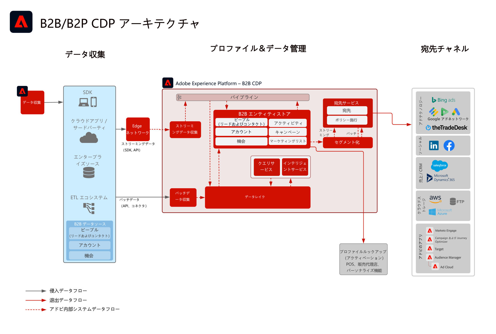

# B2B Audience および Profile アクティベーション

個々の顧客に関連付けられたアカウント、オポチュニティおよびリード情報を使用して、アクションにつながる B2B プロファイルを作成し、チャネルをまたいだパーソナライゼーションとターゲティングを改善します。

## ユースケース

* アカウント、商談、リードを含む B2B データに対して、複数のチャネルをまたいでターゲティングとパーソナライゼーションをおこなうための顧客のオーディエンスを作成します。
* ターゲティングとパーソナライゼーションのために、Experience Platform の宛先に対してオーディエンスをアクティブ化します。

## アプリケーション

* Real-time Customer Data Platform B2B エディション

## 統合パターン

* B2B データソース (Marketo、Salesforce など) -> Real-time Customer Data Platform B2B エディション -> 宛先の
様々な B2B データソースを使用して、アカウント、リード、オポチュニティおよび人々のデータを Real-time Customer Data Platform B2B エディションにマッピングできます。

## アーキテクチャ

 

## ガードレール

Marketo Engage 関連のガードレールおよび実装手順は、Marketo Engage がソースまたは宛先として使用されている場合にのみ該当します。

### 複数のインスタンスと IMS 組織のサポート：

以下に、Experience Platform および Marketo Engage のインスタンスのマッピングにおいてサポートされるパターンの概要を示します。

#### Experience Platform に対するデータソースとしての Marketo：

* 1 つの Marketo Engage インスタンスに対する複数の Experience Platform インスタンスがサポートされます。
* 多数の Marketo Engage インスタンスに対する複数の Experience Platform インスタンスは、サポートされていません。
* 多数の Marketo Engage インスタンスに対する 1 つの Experience Platform インスタンスは、サポートされていません。
* 1 つの Experience Platform インスタンスに対する 1 つの Marketo Engage インスタンスおよび複数のサンドボックスがサポートされます。

#### Experience Platform の宛先としての Marketo：

* 多数の Marketo Engage インスタンスに対する Experience Platform がサポートされます
* 1 つの Marketo Engage インスタンスに対する多数の Experience Platform インスタンスがサポートされます

#### Experience Platform のプロファイルとセグメント化のガードレール：

* Experience Platform のプロファイルとセグメント化のガードレールを参照してください - [プロファイルとセグメント化のガイドライン](https://experienceleague.adobe.com/docs/experience-platform/profile/guardrails.html?lang=ja)
* アカウント、リード、商談を含む B2B セグメントでは、複数エンティティの関係を使用するので、セグメント評価がバッチになります。ストリーミングのセグメント化は、ユーザーとイベントに限定されたセグメントに対してサポートされます。

#### Experience Platform - Marketo Engage ソースコネクタ：

* 履歴バックフィルの完了には、データの量に応じて、最大 7 日かかる場合があります。
* Marketo からの継続的なデータ更新や変更は、ストリーミング API を介して Experience Platform に送信されます。ストリーミング API は量に応じて、プロファイルに対して最大 5 分、データレイクに対して約 15 分の遅延が生じることがあります。

#### Experience Platform - Marketo 宛先コネクタ：

* Real-time Customer Data Platform から Marketo Engage へのストリーミングセグメントの共有には、最大 5 分かかる場合があります。
* バッチのセグメント化は、Experience Platform のセグメント化スケジュールに基づいて、1 日に 1 回共有されます。アカウント、リード、商談を含む B2B セグメントでは、複数エンティティの関係を使用するので、セグメントがバッチになります。

#### Marketo Engage ガードレール：

* Real-time Customer Data Platform オーディエンスが Marketo Engage の連絡先およびリードと一致するには、連絡先とリードが Marketo Engage に直接取り込まれ、定義されている必要があります。

#### 宛先ガードレール

* 宛先に関する具体的なガイダンスについては、宛先のドキュメントを参照してください。[宛先のガイドライン](https://experienceleague.adobe.com/docs/experience-platform/destinations/home.html?lang=ja)

## 実装手順

Real-time Customer Data Platform B2B エディションの実装と設定の方法に関するガイダンスについては、Real-time Customer Data Platform キュメントの B2B エディションを参照してください。[Real-time Customer Data Platform B2B エディション](https://experienceleague.adobe.com/docs/experience-platform/rtcdp/b2b-overview.html?lang=ja)

実装には、2 つのパターンが存在する可能性があります。Marketo Engage から B2B データとプロファイルを取り込む機能と、他の CRM データソースから B2B データを取り込む機能の両方です。

## 実装に関する考慮事項

ブループリントの主要な考慮事項と設定に関するガイダンス

* CRM 統合（Marketo 有/無）：
実装で Marketo Engage をソースとして使用し、Marketo Engage が CRM に接続される場合は、Experience Platform で Marketoソースコネクタを使用して CRM データを Experience Platform に取り込みます。追加のテーブルを取り込む必要がある場合は、Experience Platform ソースコネクタを使用します。実装で Marketo Engage をソースとして使用しない場合は、CRM ソース Experience Platform コネクタを使用して CRM ソースを AEP に直接接続します。
* Real-time Customer Data Platform B2B エディションのみからのリードの開始と育成は、お勧めしません。このユースケースでは、リード育成ツール (Marketo Engage など ) の使用をお勧めします。
* アクティブ化のためにオーディエンスを Marketo Engage にプッシュする AEP 用の Marketo Engage 宛先コネクタは、電子メールアドレスと ECID のみをプッシュします。連絡先がまだ存在しない場合、新規リードは作成されません。そのため、プロファイルとリードのデータを Marketo Engage に取り込む必要があります。

## 関連ドキュメント

* [Real-time Customer Data Platform B2B エディション](https://experienceleague.adobe.com/docs/experience-platform/rtcdp/b2b-overview.html?lang=ja)
* [Adobe Experience Platform](https://experienceleague.adobe.com/docs/experience-platform.html?lang=ja)
* [Marketo Engage](https://experienceleague.adobe.com/docs/marketo/using/home.html?lang=ja)
* [Adobe Experience Platform - Marketo ソースコネクタ](https://experienceleague.adobe.com/docs/experience-platform/sources/connectors/adobe-applications/marketo/marketo.html?lang=ja)
* [Adobe Experience Platform - Marketo 宛先コネクタ](https://experienceleague.adobe.com/docs/marketo/using/product-docs/core-marketo-concepts/smart-lists-and-static-lists/static-lists/push-an-adobe-experience-cloud-segment-to-a-marketo-static-list.html?lang=ja)