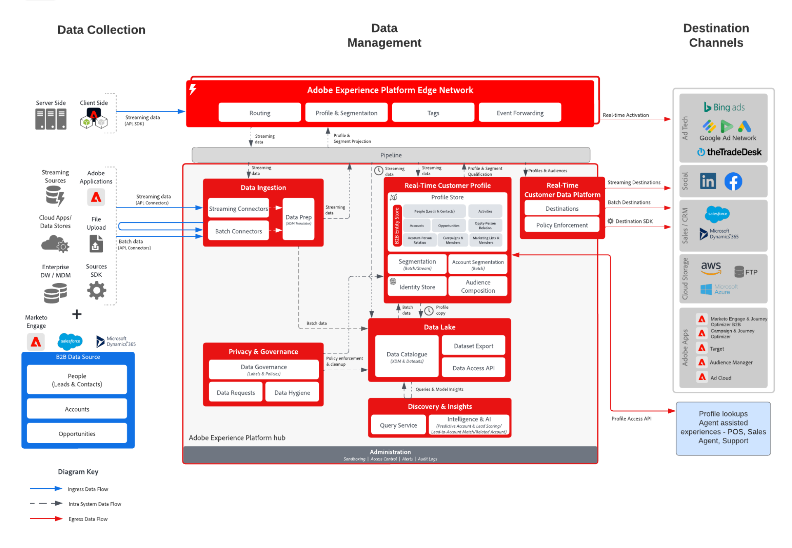

# B2B オーディエンスおよびプロファイルのアクティベーションブループリント

>[!TIP]
>このブループリントは、[ ユースケースパターン ](/help/blueprints/use-case-patterns/b2b/account-audience-activation.md)としてB2B Activation &amp; Marketingで利用することもできます。

個々の顧客に関連付けられたアカウント、オポチュニティおよびリード情報を使用して、アクションにつながる B2B プロファイルを作成し、チャネルをまたいだパーソナライゼーションとターゲティングを改善します。

## ユースケース

* アカウント、商談、リードを含む B2B データに対して、複数のチャネルをまたいでターゲティングとパーソナライゼーションをおこなうための顧客のオーディエンスを作成します。
* ターゲティングとパーソナライゼーションのために、Experience Platform の宛先に対してオーディエンスをアクティブ化します。
* アカウントのオーディエンス（企業リストなど）を作成し、LinkedInなどの配信先を通じてターゲティングします。この配信先では、企業のリストを入力として受け入れたり、クラウドストレージの宛先に書き出して、ターゲティングやセールスを実施します。

## アプリケーション

* Real-time Customer Data Platform B2B エディション

## 統合パターン

* B2B データソース（Marketo、Salesforceなど） -> Real-time Customer Data Platform B2B edition ->宛先
* さまざまなB2B データソースを使用して、アカウント、リード、商談、人物データをAdobe Real-Time CDPのB2B editionにマッピングできます。

## アーキテクチャ

## ガードレール

* Marketo Engage 関連のガードレールおよび実装手順は、Marketo Engage がソースまたは宛先として使用されている場合にのみ該当します。

* データモデル、サイズ、セグメント化の詳細とガードレールについては、[ デプロイメントガードレール ドキュメント ](../experience-platform/guardrails.md)を参照してください

### 複数のインスタンスと IMS 組織のサポート：

以下に、Experience Platform および Marketo Engage のインスタンスのマッピングにおいてサポートされるパターンの概要を示します。

#### Experience Platform に対するデータソースとしての Marketo：

* 1 つの Marketo Engage インスタンスに対する複数の Experience Platform インスタンスがサポートされます。
* 多数の Marketo Engage インスタンスに対する 1 つの Experience Platform インスタンスは、サポートされていません。
* 1 つの Experience Platform インスタンスに対する 1 つの Marketo Engage インスタンスおよび複数のサンドボックスがサポートされます。

#### Experience Platform の宛先としての Marketo：

* 多数の Marketo Engage インスタンスに対する Experience Platform がサポートされます
* 1 つの Marketo Engage インスタンスに対する多数の Experience Platform インスタンスがサポートされます

#### Experience Platform のプロファイルとセグメント化のガードレール：

* プロファイルとセグメント化のガードレールについては、Experience Platform の[プロファイルとセグメント化のガイドライン](https://experienceleague.adobe.com/docs/experience-platform/profile/guardrails.html?lang=ja)を参照してください
* アカウント、リード、商談を含む B2B セグメントでは、複数エンティティの関係を使用するので、セグメント評価がバッチになります。 ストリーミングのセグメント化は、ユーザーとイベントに限定されたセグメントに対してサポートされます。
* バッチ b2b セグメントをストリーミングセグメントまたはエッジセグメントへの入力として含め、ストリーミング b2b セグメントのユースケースをサポートします。 バッチセグメントメンバーシップは、最新の日次バッチセグメント化評価結果に基づいています。

#### Experience Platform - Marketo Engage ソースコネクタ：

* 履歴バックフィルの完了には、データの量に応じて、最大 7 日かかる場合があります。
* 進行中のデータ更新とMarketoからの変更は、ストリーミング APIを介してExperience Platformに送信されます。ストリーミング APIは、プロファイルに対して最大10分待ちでき、ボリュームに応じてデータレイクに最大60分かかる場合があります。

#### Experience Platform - Marketo 宛先コネクタ：

* Adobe Real-Time CDPからAdobe Marketo Engageにセグメントを共有するストリーミングでは、セグメントを評価してから最大15分かかることがあります。 アクティベーション前に既にセグメントに存在していたプロファイルを初めてバックフィルするには、最大で24時間かかることがあります。
* バッチのセグメント化は、Experience Platform のセグメント化スケジュールに基づいて、1 日に 1 回共有されます。 複数のエンティティ関係を使用するB2B セグメント、例えば、アカウントオブジェクトと商談オブジェクトでデータを使用するセグメントは、常にバッチモードで実行されます。

#### Marketo Engage ガードレール：

* Real-time Customer Data Platform オーディエンスが Marketo Engage の連絡先およびリードと一致するには、連絡先とリードが Marketo Engage に直接取り込まれ、定義されている必要があります。
* RTCDP Marketoの宛先は、セグメント内にあるがMarketoに存在しない顧客に対して、Marketoで新しいリードをオプションで作成できます。

#### 宛先ガードレール

* 宛先に関する具体的なガイダンスについては、宛先のドキュメントを参照してください。 [宛先ガードレール](https://experienceleague.adobe.com/docs/experience-platform/destinations/guardrails.html?lang=ja)

## 実装手順

Real-time Customer Data Platform B2B エディションの実装と設定の方法に関するガイダンスについては、Real-time Customer Data Platform キュメントの B2B エディションを参照してください。 [Real-time Customer Data Platform B2B エディション](https://experienceleague.adobe.com/docs/experience-platform/rtcdp/b2b-overview.html?lang=ja)

実装には、2 つのパターンが存在する可能性があります。 Marketo Engage から B2B データとプロファイルを取り込む機能と、他の CRM データソースから B2B データを取り込む機能の両方です。

## 実装に関する考慮事項

ブループリントの主要な考慮事項と設定に関するガイダンス

* MARKETOの有無によるCRM統合：
実装でMarketo Engageをソースとして使用し、Marketo EngageがCRMに接続されている場合、CRM データは同じ接続を通じて自動的にフローされ、Marketoを介して渡されない追加のCRM データオブジェクトがない限り、CRM データをPlatformに直接接続する必要がなくなります。 追加のテーブルを取り込む必要がある場合は、Experience Platform ソースコネクタを使用します。 実装でMarketo Engageをソースとして使用しない場合は、CRM ソースのExperience Platform コネクタを使用して、CRM ソースを直接Platformに接続します。
* オーディエンスをMarketo Engageにプッシュしてアクティブ化するPlatform用のMarketo Engage宛先コネクタは、一致するメールアドレスとECIDに基づいてオーディエンスメンバーを共有します。 取引先責任者がまだ存在しない場合は、新しいリードを作成するオプションがあります。 新しいリードを作成する場合、Real-time Customer Data Platformの最大50個のプロファイル属性（配列またはマップ属性ではない）を、Marketoの「人物」フィールドにマッピングできます。

## 関連ドキュメント

* [Adobe Real-Time CDPのB2B editionは](https://experienceleague.adobe.com/docs/experience-platform/rtcdp/b2b-overview.html?lang=ja)
* [Adobe Real-Time CDP B2B editionの導入方法](https://experienceleague.adobe.com/en/docs/experience-platform/rtcdp/intro/rtcdpb2b-intro/b2b-tutorial)
* [Adobe Real-Time CDP B2B editionのガードレール](https://experienceleague.adobe.com/en/docs/experience-platform/rtcdp/intro/rtcdpb2b-intro/b2b-guardrails)
* [Adobe Experience Platform](https://experienceleague.adobe.com/docs/experience-platform.html?lang=ja)
* [Marketo Engage](https://experienceleague.adobe.com/docs/marketo/using/home.html?lang=ja)
* [Adobe Experience Platform - Marketo Source Connector](https://experienceleague.adobe.com/docs/experience-platform/sources/connectors/adobe-applications/marketo/marketo.html?lang=ja)
* [Adobe Experience Platform - Marketo Destination Connector](https://experienceleague.adobe.com/docs/marketo/using/product-docs/core-marketo-concepts/smart-lists-and-static-lists/static-lists/push-an-adobe-experience-cloud-segment-to-a-marketo-static-list.html?lang=ja)
