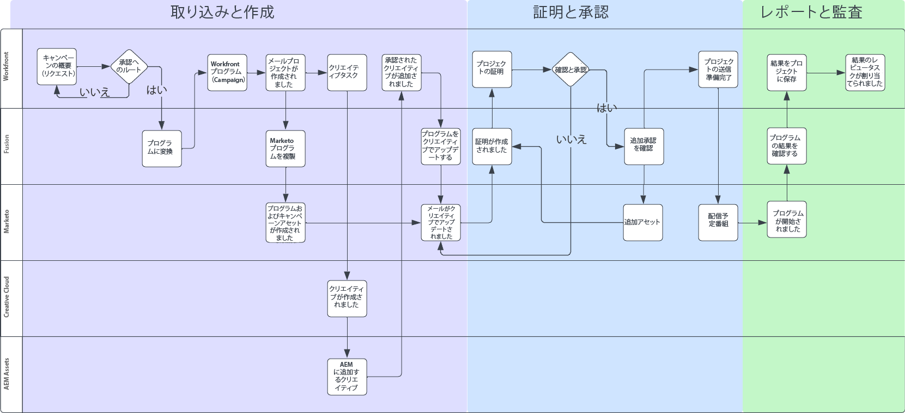
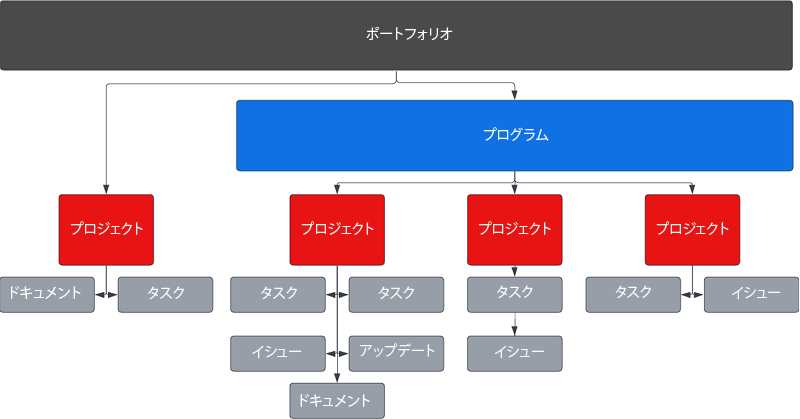
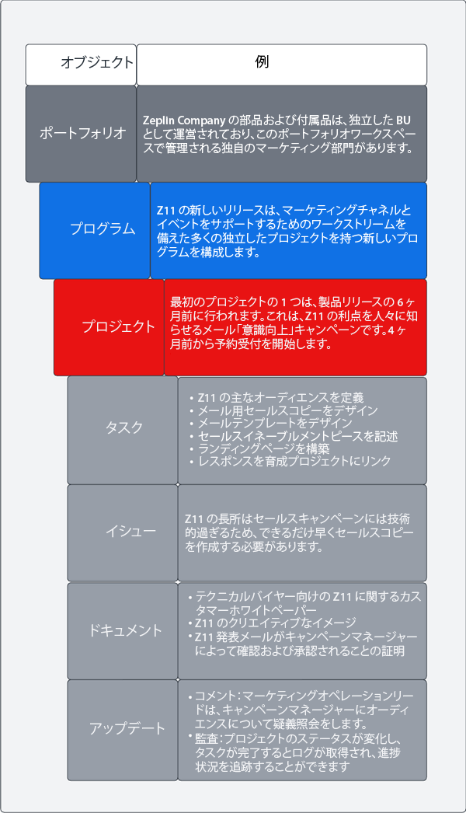
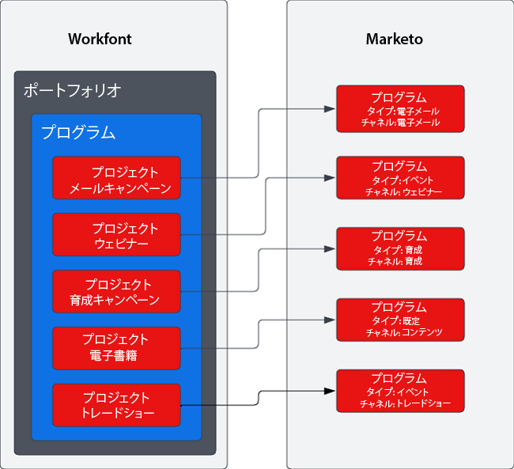

# 概要 {#overview}

## 最適化されたキャンペーンサプライチェーンにより、市場投入までの時間を短縮 {#achieving-faster-time-to-market-with-optimized-campaign-supply-chain}

マーケティングの仕事は、新しいチャネルと、コミュニケーションを毎日パーソナライズする方法の増加とともに成長し続けています。マーケティングチームは、世界中で変化するマーケティングの需要をサポートするために、自動化と進化を続ける方法を必要としています。

**「ROI は常に真の目標でした。収益は素晴らしいものですが、特に今日では犠牲を払ってまでして得る必要はありません。」- CMO、Business Services Industry**

収益を増やしながら高い ROI を達成している組織は、キャンペーン開発プロセスを合理化し、キャンペーンの実行速度を最適化し、マーケティング機能全体の監視を改善することでそれを実現しています。

組織が以下に説明する同様の目標を達成しようとしている場合、このドキュメントが役に立ちます。

* 機能横断的なマーケティング チームをサポートするためにキャンペーン オペレーションを拡張する
* 合理化されたキャンペーンリクエストプロセスにより、市場投入までの時間を短縮
* 記録システムを確立して、キャンペーン関係者全体の可視性を高める
* キャンペーンアセット（画像、メールコピー）の確認と承認

キャンペーンオペレーションチームには、マーケティングキャンペーンを効率的かつ効果的に計画および実行できるシステムが必要です。メール、ウェビナー、イベント、有料メディア、育成、またはコンテンツシンジケーションのいずれであっても、マーケティングチームは、キャンペーンの寄稿者、成果物、および実行を整理するための中心的なソリューションを必要としています。

マルチチャネルマーケティングアクティベーションシステム（Marketo Engage）をマーケティング計画および記録システム（Workfront）と統合することにより、キャンペーンの速度を上げ、関係者への可視性を高めることができます。

Workfront Fusion を使用すると、マーケティングオペレーションチームは、マーケティング概要をキャンペーンに変換する際に、手動で誤りが生じやすい手順を大幅に排除することができます。Workfront Fusion は、Workfront と Marketo Engage の間にすぐに使用できる統合レイヤーを提供し、システム間のワークフローを柔軟かつ効率的に開発できるようにします。統合を設定する方法と、ワークフローを自動化するために実行できるアクションについて詳しく学ぶことができます。詳細は[ここから](https://experienceleague.adobe.com/docs/workfront/using/adobe-workfront-fusion/fusion-apps-and-modules/marketo-modules.html?lang=ja){target=&quot;_blank&quot;}。

## キャンペーンの計画から実施まで - 自動化のユースケース {#campaign-planning-to-execution-automation-use-cases}

* Workfront の取り込みリクエストを通じて Marketo Engage でのキャンペーン作成を自動化し、マーケティングオペレーションチームをサポート
* Marketo Engageで作成されたメールとランディングページのドラフトを Workfront に共有して、部門をまたぐ関係者から最終確認と承認を得る
* キャンペーンの結果を Marketo Engage から Workfront に共有して、キャンペーン指標へのアクセスを民主化

以下に、メールブラストリクエストの場合の、キャンペーン開発プロセスのワークフロー図を示します。さらに、Workfront Fusion が Workfront と Marketo Engage の間で役割を果たし、キャンペーン開発サイクル全体でワークフローとプロセスの自動化を促進する方法を確認することができます。

キャンペーン開発プロセスのさまざまなフェーズにご注意ください。

1. 取り込みと作成：キャンペーンのリクエストが作成され、キャンペーンアセットがプログラムによって組み立てられます。

1. 証明と承認：キャンペーンが組み立てられたら、関係者はメールやランディングページなどのキャンペーンアセットを確認して承認します。

1. レポートと監査：キャンペーンの結果を Workfront に共有して、部門をまたぐ関係者への可視性を高めます。

>[!NOTE]
>
>上記の例では、Workfront が Marketo Engage プログラムのライフサイクル全体で、作業を管理および計画しています。とはいえ、Workfront の柔軟性は、マーケティングチームのすべての取り組みの管理にまで及ぶ可能性があります。これには、アカウントベースのマーケティング、マーケティングコンテンツのサプライチェーン、代理店の管理、デジタルおよびソーシャルキャンペーンの管理、セールスイネーブルメントプログラムが含まれます。

## Workfront でのマーケティングイニシアチブがどのように表現されるかを理解する {#understanding-how-marketing-initiatives-are-represented-in-workfront}

Adobe Workfront を使用すると、組織は作業を管理して、より効率的な実行を促進することができます。Workfront 内には、計画、リソース管理、およびさまざまなチーム間のコラボレーションのためのフレームワークを提供するオブジェクトの階層があります。

Workfront と Marketo Engage の関係を理解するには、ビジネスプロセスをこれらのオブジェクトにマッピングする方法を理解することが重要です。

### ポートフォリオ階層が定義されました {#portfolio-hierarchy-defined}

<table> 
  <tr> 
   <td><b>オブジェクト</b></td>
   <td><b>定義</b></td>
  </tr>
  <tr> 
   <td>ポートフォリオ</td>
   <td>Workfront のポートフォリオとプログラムを使用して、プロジェクトを整理することができます。プロジェクトの整理を通じて、類似したプロジェクトを比較し、リソースをどこに最も効果的に費やすかを判断することができます。  
   （例：ポートフォリオは、サービスや製品の販売に重点を置いた企業内のビジネス ユニット用に作成されます。）</td>
  </tr>
  <tr>
   <td>プログラム</td>
   <td>Workfront プログラムを使用して、プロジェクトを整理することができます。プロジェクトの整理を通じて、類似したプロジェクトを比較し、リソースをどこに最も効果的に費やすかを判断することができます。  
   （例：認知度を高め、新製品の発売に対する需要を促進するなど、高レベルの目標を伴うマーケティング戦略。）</td>
  </tr>
  <tr>
   <td>プロジェクト</td>
   <td>Workfront プロジェクトは、特定の目標、成果物、製品などを達成するために完了する必要がある作業項目の集まりです。  
   （例：メールブラスト、育成キャンペーン、ウェビナー、対面イベントなどのマーケティング戦術。メール、ディスプレイ広告、ランディングページ、ダウンロード可能なホワイトペーパーなど、すべて同じ結果をもたらす複数の戦術を含めることで、1 つのプロジェクトをより複雑にすることもできます。）</td>
  </tr>
  <tr>
   <td>タスク</td>
   <td>Workfront タスクは、プロジェクトまたはイニシアチブの一部となる予定作業項目です。タスクは、完了するためにユーザーまたはチームに割り当てられます。  
   （オーディエンスセグメントを構築したり、メールのドラフトを作成したりするタスクは、Marketo Engage メールプログラムを開発するプロジェクトに関連付けられたタスクである場合があります。）</td>
  </tr>
  <tr>
   <td>イシュー</td>
   <td>イシューは、Workfront の予定のない作業項目です。これは、プロジェクト中に発生するイシューか、リクエストキューを介して送信されるリクエストである可能性があります。  
   （例：メールのバナー画像のサイズが間違っているため、問題が報告されています。）</td>
  </tr>
  <tr>
   <td>ドキュメント</td>
   <td>Word ドキュメントやプレゼンテーションなど、従来のドキュメントを使用することができます。また、画像ファイルも使用することができます。Workfront では、ドキュメントや画像にコメントや注釈を付けることでアセットプルーフを作成し、チーム間のコラボレーションを可能にします。  
   （確認が必要なメールヘッダー画像など。）</td>
  </tr>
  <tr>
   <td>アップデート</td>
   <td>Workfront での作業を追跡し、共同作業を容易にするコメントと監査ログが含まれます。  
   （例：新しいイメージバージョンの監査ログ）。</td>
  </tr>
  </tbody>
</table>

## マーケティングイニシアチブの作業管理の例 {#marketing-initiative-work-management-example}

Workfront のポートフォリオ階層が実際の例でどのように機能しているかを見てみましょう。

Zeplin Company は、Z11 と呼ばれるコンパクトなユーティリティトラクターの付属品のアップデートバージョンをリリースしています。これは、耐久性とカスタマイズ性が向上しており、以前の Z10 モデルよりも優れています。これを使用して、マーケティング戦略を計画、開発、実行して、需要を促進し、ビジネスのトラクター部門からの新しいリリースの認知度を高める必要があります。このマーケティング戦略には、新しい顧客の認知度と既存の Z10 顧客の認知度の両方を高めるために、さまざまなマーケティング戦術を含める必要があります。

以下の階層は、このマーケティングキャンペーンの戦略、戦術、タスク、およびアセットが Workfront にどのようにマッピングされるかを示しています。

## Workfront を Marketo にマッピング {#mapping-workfront-to-marketo}

Workfront をマーケティングプランニングとプロジェクト編成のアップストリームシステムとして使用する場合、Marketo Engage と Workfront の間で情報を共有する方法を理解することが重要です。

新しいマーケティングイニシアチブの開発に合わせてこれらのシステムを連動させるには、Workfront のさまざまなレコードタイプが Marketo Engage のレコードタイプにどのようにマッピングされるかを理解することが重要です。

### Workfront プロジェクトを Marketo Engage プログラムにマッピング {#mapping-workfront-projects-to-marketo-engage-programs}

Workfront Fusion を統合レイヤーとして使用すると、Workfront のプロジェクトを Marketo Engage のプログラムにマッピングすることができます。たとえば上記の場合、Zeplin は新しい Zeplin モデルの認知度を高めたいと考えています。これにより、Workfront で新しいプログラムを作成し、プロジェクトとして表される複数のマーケティング戦術を格納します。戦術の 1 つは、Z10 モデルの既存の顧客に新しい Z11 モデルについて知らせる必要がある認識メールです。Workfront には、メール戦術を表すために作成されたプロジェクトがあり、この戦術にはオーディエンスの作成、メール画像のクリエイティブ化、Marketo Engage でのメールの組み立てに関連付けられた一連のタスクが含まれます。Workfront のプロジェクトは、システム間で情報を同期できるように、Marketo Engage のメールプログラムにマッピングすることができます。

以下に、プログラムに複数のプロジェクトを含める方法と、それらの Workfront プロジェクトを Marketo Engage のプログラムにマッピングする方法の例を示します。

Workfront プログラムに複数の Workfront プロジェクトを含める必要がある大規模なマーケティングイニシアチブを開始したい場合や、単一の Workfront プロジェクトを作成するだけでよいウェビナーまたはメールの 1 回限りのリクエストがある場合があります。ニーズが何であれ、Workfront、Workfront Fusion、Marketo Engage を使用すると、チームは柔軟にキャンペーン開発プロセスを計画から実行までシームレスに統合することができます。

### Workfront のタスクを Marketo Engage のアセットにマッピング {#mapping-workfront-tasks-to-marketo-engage-assets}

Workfront でキャンペーン開発プロセスをマッピングし始めると、どのタスクが Marketo Engage で行うべき作業に対応し、Workfront でどのように情報を取得するかを考えることもでき、キャンペーン開発のサプライチェーンにおける一貫性、効率、正確性をより高めることに役立ちます。

Workfront プロジェクトはテンプレート化できるため、特定のマーケティング戦術を実行するたびにプロセスを明確に定義することができます。たとえば、メールキャンペーンを実行する場合、組織で完了する必要がある一連の標準的なタスクがあります。これらのタスクには、関係者とのキックオフミーティング、クリエイティブアセットの取得、クリエイティブの承認、ターゲットユーザーの作成、メールの作成、メールの翻訳、メールの承認、メールキャンペーンの結果の関係者との共有が含まれます。

これらのタスクの一部は、Marketo Engage で実行される作業に直接マッピングすることができます。たとえば、Workfront のメール作成タスクをカスタマイズして、Marketo Engage に情報を渡してメールの組み立てを自動化するフィールドを含めることができます。これには件名、コピー、メール内の画像などが含まれます。

## 次の手順 {#next-steps}

Workfront と Marketo Engage がキャンペーン開発サプライチェーンの新たな効率性を引き出す方法について、基本的にご理解いただけたと思います。次に Workfront Fusion を使用して Marketo Engage と Workfront 間のワークフローとプロセスを自動化する方法について、以下のドキュメントとリソースを確認してください。

### Workfront Fusion、Workfront および Marketo Engage 統合の概要 {#getting-started-with-workfront-fusion}

* [取り込みと作成](/help/blueprints/b2b/campaign-supply-chain/intake-and-create.md){target=&quot;_blank&quot;} - Marketo Engage と Workfront を使用したキャンペーン開発の自動化

* 確認と承認（近日公開）

* レポートと監査（近日公開）

### Marketo Engage キャンペーン名と関連 URL の管理 {#managing-marketo-engage-campaign-names}

キャンペーンと URL の命名規則の標準化は、Marketo Engage で正確なプログラム管理を行うための重要な基盤であり、キャンペーンサプライ チェーン全体でより一貫したプロセスを促進するのに役立ちます。これを支援するツールをお探しの場合は、[アドビサクセスサービス](https://main--marketo-campaign-tools--dr-adobe.hlx.live/){target=&quot;_blank&quot;}が提供する無料のオープンソースツールをお試しください。このツールでは、Marketo Engage キャンペーンとその関連 URL を作成および管理するための一貫したアプローチを作成することが可能です。

### リソース {#resources}

* [Marketo Engage 用 Workfront Fusion](https://experienceleague.adobe.com/docs/workfront/using/adobe-workfront-fusion/fusion-apps-and-modules/marketo-modules.html?lang=ja){target=&quot;_blank&quot;}

* [Workfront 用 Workfront Fusion](https://experienceleague.adobe.com/docs/workfront/using/adobe-workfront-fusion/fusion-apps-and-modules/workfront-modules.html?lang=ja){target=&quot;_blank&quot;}
