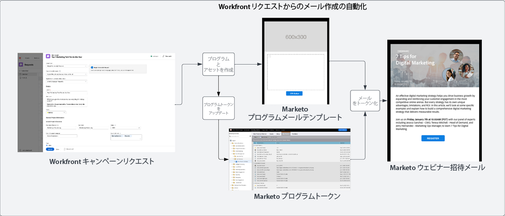
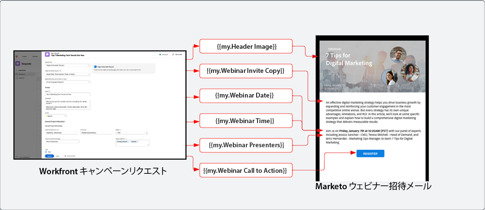
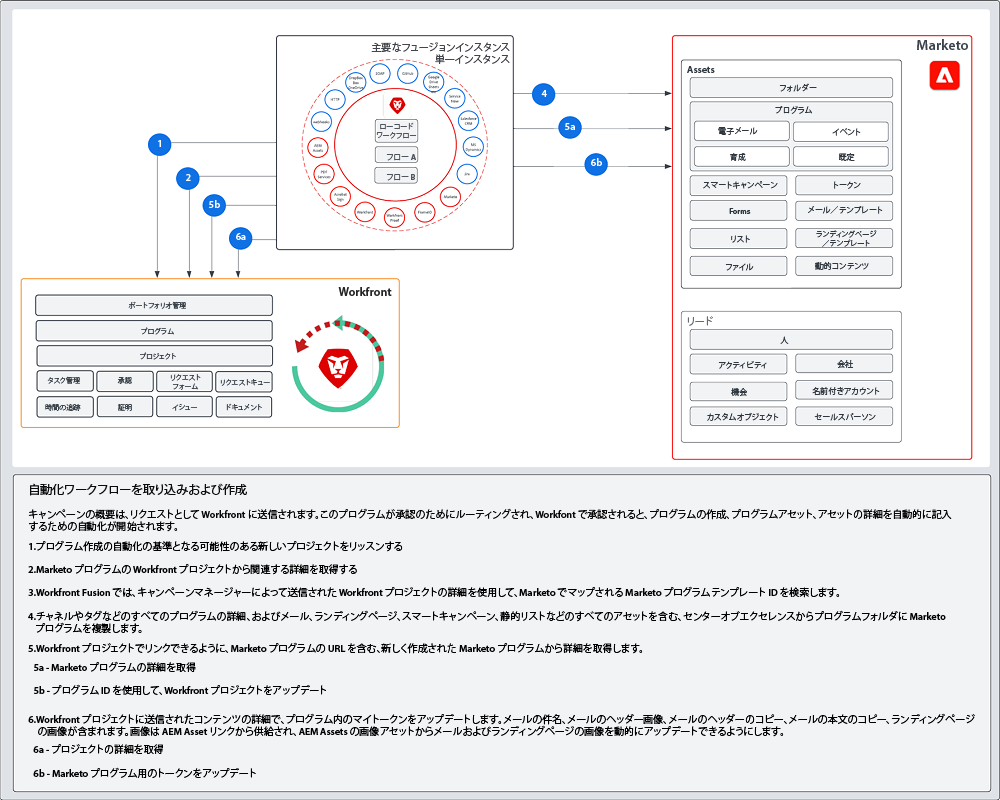

# 取り込みと作成のブループリント {#intake-and-create}

新しいキャンペーンを立ち上げるためにマーケティングオペレーションチームに寄せられる多数のマーケティングリクエストは、機能の高いチームに反復的なタスクの繰返しを強い、燃え尽き症候群やイノベーションの停滞を引き起こしてしまう可能性があります。

キャンペーンリクエストを送信するプロセスを確立し、よくリクエストされるマーケティングキャンペーンの作成を自動化することにより、キャンペーンの速度を上げ、エラーを減らし、リクエストをマーケティング業務の適切なメンバーにルーティングし、リソースの使用率を調整して改善し、マーケティング業務をより戦略的なタスクに集中させることができます。

Workfront と Marketo Engage を使用すると、システム間接続により、[Workfront リクエストフォーム](https://experienceleague.adobe.com/docs/workfront/using/administration-and-setup/customize/custom-forms/create-or-edit-a-custom-form.html?lang=ja){target="_blank"}から詳細を入力して Marketo Engage プログラムを作成し、件名、メールのコピー、画像、日付、時刻、イベント情報などの主要な変数を入力することができます。

この統合を実現するには、Workfront Fusion を使用します。これは Workfront と他のシステム間のワークフローを自動化できる作業自動化レイヤーです。

以下のワークフローは、キャンペーンマネージャーが Workfront リクエストフォームを使用して行うウェビナーのリクエストを示しています。続いて、リクエストで送信された詳細により、Marketo Engage でウェビナー用に作成されるプログラムとメールがトリガーされます。さらに、メールのコンテンツを入力するための詳細がリクエストフォームから取得されます。
さらに、リクエストフォームから詳細が取得され、メールのコンテンツが入力されます。

{zoomable="yes"}

>[!TIP]
>
>マーケティングキャンペーンの作業の整理に使用される Workfront の様々なタイプのオブジェクトと、Marketo Engage プログラムへのマッピング方法について詳しくは、[Marketo と Workfront の概要](/help/blueprints/b2b/marketo-engage-and-workfront-integration-blueprint/overview.md){target="_blank"}をご覧ください。

## 自動化のためのキャンペーン開発プロセスを準備 {#prepare-your-campaign-development-process-for-automation}

すべての優れたワークフロー自動化の背後には、チームや関係者が自動化から最大限の価値を得られるようにする定義済みのプロセスがあります。

**受け取るマーケティングリクエストのタイプについて**

メール、育成、ファーストパーティのウェビナー、イベントなど、どのような種類のマーケティング戦術を実行するかを考えてみましょう。サードパーティのウェビナーやディスプレイ広告も実施していますか。これらのリクエストはそれぞれ、リクエストフォームで特定の入力フィールドを必要とする場合があり、複製される Marketo Engage の様々なプログラムテンプレートにマッピングされるため、考慮する必要があります。

複数の地域でキャンペーンを実施しているかどうかも理解しておく必要があります。該当する場合、Workfront の 1 つのプロジェクトを考慮して、Marketo Engage で複数のプログラムを作成し、各プログラムが異なる言語サポートを表すようにします。

自動化された方法でリクエストを処理できるようにするには、受け取ることが予想されるマーケティングリクエストの種類を事前に把握しておくことが重要です。

**キャンペーンリクエストで取り込む必要がある情報について**

実行する様々な戦術ごとに、リクエストフォームで取得する必要がある重要な情報について考えてみましょう。以下に、Workfront フォームに取り込んで、キャンペーン開発の自動化に役立つ方法を示します。

<table> 
  <tr> 
   <td><b>マーケティング戦術</b></td>
   <td><b>取得する情報</b></td>
  </tr>
  <tr> 
   <td>メールブラスト</td>
   <td>・メールの件名 
・予定日 
・メールコピー 
・コールトゥアクション 
・画像 - AEM Assets の URL を直接参照して Marketo で使用 
・オーディエンス認定条件</td>
  </tr>
  <tr>
   <td>ウェビナー／イベント</td>
   <td>・イベント名 
・イベントの日付 
・イベントの時刻 
・イベントの都市 
・イベントの説明 
・ウェビナー録画ページ - PageURL OnDemand 
・講演者名 
・講演者の肩書 
・講演者の画像 
・必要なメール（招待、確認、リマインダー、フォローアップ） 
・メールヘッダーの画像 
・オーディエンス認定条件</td>
  </tr>
  <tr>
   <td>育成</td>
   <td>・メール数 
・メールコピー 
・メールヘッダー 
・コールトゥアクション 
・オーディエンス認定条件</td>
  </tr>
  </tbody>
</table>

>[!NOTE]
>
>現在、Marketo Engage では、スマートリストでトークンがサポートされていないため、プログラムによるオーディエンスの構築の自動化は制限されています。すなわち、ユーザーが Marketo Engage でオーディエンスを作成する必要があること、または、継続的に通信する事前定義されたオーディエンスがある場合は、自動化プロセス中に複製されるプログラムテンプレートの一部として構成済みのスマートリストを含めることがでるということです。

### センターオブエクセレンスを確立する {#establish-your-center-of-excellence}

プログラムの作成を自動化したい場合は、Marketo Engage にセンターオブエクセレンスが必要です。センターオブエクセレンスには、キャンペーン開発プロセスの迅速化と標準化に役立つテンプレート化されたプログラムとアセットが含まれています。例えば、メール、育成、対面イベント、ウェビナーなど、様々なキャンペーンのニーズに合わせたプログラムテンプレートがあるとします。さらに、様々な地域や異なる種類のメール通知に使用する複数のメールプログラムテンプレートが存在する場合があります。

Marketo Engage のプログラムテンプレートを使用してセンターオブエクセレンスを構築することは、キャンペーンの実行によりプログラム的なアプローチを採用するための最初のステップの 1 つであり、キャンペーンリクエストを自動化する基盤の役割を果たします。

再利用可能なプログラムテンプレートのセットを用意したら、このブループリントで概説されている自動化を使用して、取り組みをさらに拡大し、キャンペーン開発をより迅速に進めることができます。

独自のセンターオブエクセレンスの作成について詳しくは、[Marketo コミュニティ](https://nation.marketo.com/t5/product-blogs/marketo-master-class-center-of-excellence-with-chelsea-kiko/ba-p/243221){target="_blank"}のベストプラクティスを参照してください。

### トークンを使用してコンテンツを入力する {#use-tokens-to-populate-content}

Marketo Engage では、トークンを使用してコンテンツをキャンペーンアセットに入力することができます。例えば、センターオブエクセレンスからメールテンプレートを複製した後、Workfront Fusion は Workfront のキャンペーンリクエストから詳細を取得し、Marketo Engage プログラムのマイトークンに渡すことができます。その後、トークンの値をメールに直接継承して、メールを構築することができます。

{zoomable="yes"}

### AEM Assets から画像を入力 {#populate-images-from-aem-assets}

Marketo Engage トークンを AEM Assets のアセットへのリンクと組み合わせて利用することにより、メールとランディングページの開発をさらに自動化することができます。キャンペーンリクエスト担当者は、リクエストプロセスの一環として、AEM Assets から公開済みの画像リンクを送信することができます。その後、Workfront Fusion は、これらのリンクを取得し、Marketo Engage トークンを使用してメールの HTML に埋め込むことができます。

Workfront で送信された情報で Fusion がトークン値を更新できるように、Marketo Engage で、自身のプログラムとプログラムテンプレートを構築してマイトークンを利用する必要があることにご留意ください。

>[!NOTE]
>
>AEM Assets は、このワークフローをサポートする必要はありませんが、キャンペーン開発サプライチェーン全体でキャンペーンアセットを管理するための、より効率的なプロセスを可能にすることができます。

### すべてのプログラムリクエストタイプのルックアップライブラリを組み立てる {#assemble-a-lookup-library-for-all-program-request-types}

Workfront リクエストから新しい Marketo Engage プログラムの作成を自動化する場合、Workfront リクエストから情報を取得し、Marketo Engage で複製する必要がある正しいプログラムテンプレートを検索できるステップを Workfront Fusion の自動化に含めることが重要です。

これを行うには、Marketo Engage センターオブエクセレンスの様々なプログラムテンプレートすべてのリストを含むデーセットを Workfront Fusion に読み込みます。

プログラムテンプレート参照ライブラリに含める基本情報は、次のとおりです。

<table> 
  <tr> 
   <td><b>列</b></td>
   <td><b>説明</b></td>
  </tr>
  <tr> 
   <td>キャンペーンタイプ</td>
   <td>これには、メール、ウェビナー、育成、イベント、サードパーティのウェビナー、リストのインポートなどが該当します。キャンペーンタイプは、要求されている内容の読み取り可能な説明として機能します。</td>
  </tr>
  <tr> 
   <td>Workfront リクエストタイプ</td>
   <td>これは Workfront フォームで選択されたリクエストタイプであり、メール、ウェビナー、育成、またはイベントなどのキャンペーンタイプと同じである可能性があります。これは、Workfront フォームで選択した入力を、Marketo のプログラムテンプレートにマッピングするために使用します。</td>
  </tr>
  <tr> 
   <td>Workfront フォーム ID</td>
   <td>書き込みリクエストが Marketo Engage プログラムテンプレートにマッピングされていることを検証するために使用される Workfront リクエストフォームの一意の ID。</td>
  </tr>
  <tr> 
   <td>Marketo プログラム ID</td>
   <td>これは、実行中のリクエストにマッピングされる Marketo Engage 内のプログラムテンプレートの ID です。この情報を Workfront Fusion ですぐに利用できるようにすると、Fusion は Marketo Engage にリクエストを送信し、複製するプログラムを正確に知ることができます。</td>
  </tr>
  </tbody>
</table>

## 取り込みおよび作成の自動化フロー {#intake-and-create-automation-flow}

以下の例は、事前定義済みの [Workfront](https://experienceleague.adobe.com/docs/workfront/using/adobe-workfront-fusion/fusion-apps-and-modules/workfront-modules.html?lang=ja){target="_blank"} モジュールと [Marketo Engage](https://experienceleague.adobe.com/docs/workfront/using/adobe-workfront-fusion/fusion-apps-and-modules/marketo-modules.html?lang=ja){target="_blank"} モジュールを使用して Fusion でワークフローロジックを組み立て、自動化を高速化する方法を示しています。

## リソース {#resources}

* [Adobe Marketo Engage モジュール](https://experienceleague.adobe.com/docs/workfront/using/adobe-workfront-fusion/fusion-apps-and-modules/marketo-modules.html?lang=ja){target="_blank"}

* [Adobe Workfront モジュール](https://experienceleague.adobe.com/docs/workfront/using/adobe-workfront-fusion/fusion-apps-and-modules/workfront-modules.html?lang=ja){target="_blank"}

* [Marketo と Workfront の概要](/help/blueprints/b2b/marketo-engage-and-workfront-integration-blueprint/overview.md){target="_blank"}
