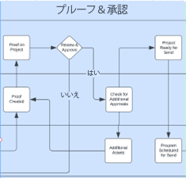
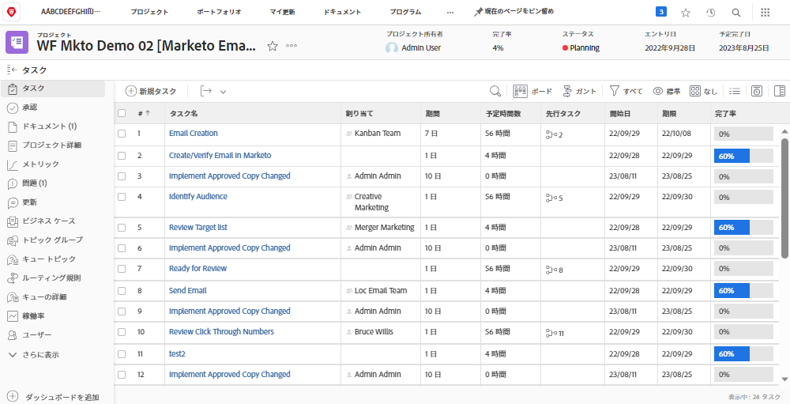
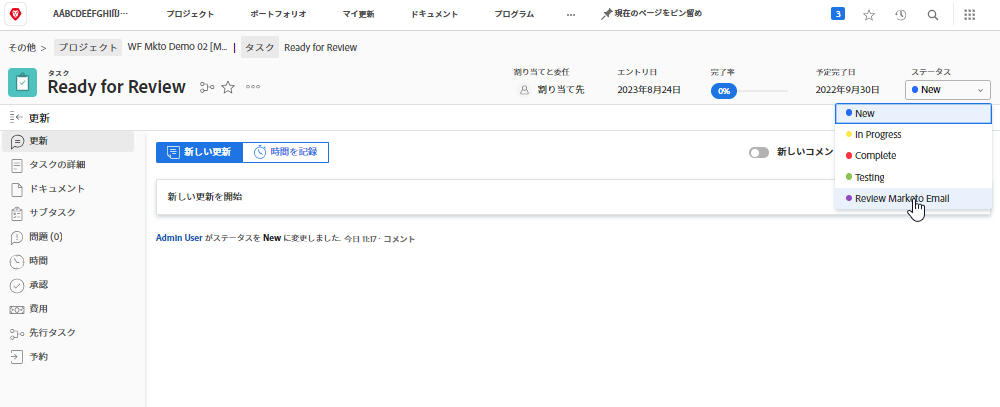
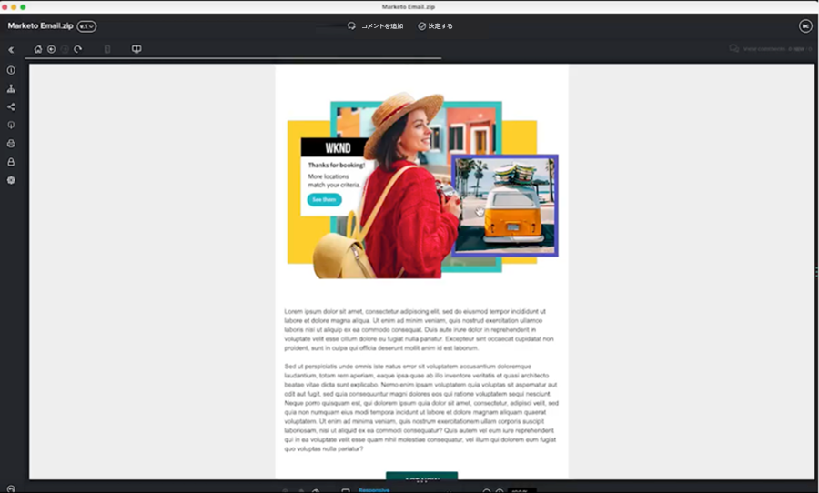

# ブループリントを確認して承認 {#review-and-approve-blueprint}

マーケティングアセットやキャンペーンがビジネスの期待や基準を満たすようにすることは、適切なコンテンツやメッセージを適切なオーディエンスに提供するだけでなく、広範囲にわたって提供できます。 また、組織は、新しいマーケティング活動に着手する際に、内部政策、業界規制、法的前提条件を遵守する責任も負います。 マーケティングチームは、レビューと承認の手順をキャンペーンの開発プロセスに組み込むことで、特に金融、医療、医薬品などの業界標準に従って、コンテンツとメッセージが正確かつコンプライアンスできるようにします。

WorkfrontとMarketo Engageを利用すれば、マーケティングチームは、正確でコンプライアンスに優れたメッセージを提供し、マーケティングのための緊密に連携したシステムを構築する機会が得られます。

## WorkfrontでのMarketo Engageに対する校正と高度な承認のロックを解除 {#unlock-proofing-and-advanced-approvals}

マーケティングキャンペーンの構築について考える際には、計画、構築、レビュー、フィードバック、承認、実行など、複数のシステムが関連する様々な手順をサポートしていることを考慮する必要があります。 WorkfrontとMarketo Engageを使用すると、チームは、新しいマーケティングキャンペーンの計画と開始のエンドツーエンドのプロセスを通じて、チームを引き継ぐのに必要なすべてのツールを使用できます。 さらに、チームはレビューと承認プロセスをさらに合理化し、正確性とコンプライアンスを最高水準に維持しながら、キャンペーンの開発速度を向上させることができます。

{zoomable=&quot;yes&quot;}

### WorkfrontとMarketo Engageの接続の使用例 {#use-cases-for-connecting-workfront-and-marketo-engage}

* Workfrontの注釈機能とMarketo Engage資産に対するコメント機能を利用することで、個別のフィードバックを排除し、一元化された場所でのコラボレーションを促進します。

* Workfrontの承認ワークフローからMarketo Engageでトリガーして、承認を一元化します。

* Workfrontの高度な承認機能とMarketo Engageアセットを利用して、マーケティングアセットの複雑な承認ワークフローをサポートし、合理化します。

* 複数の関係者がレビューするために、プログラムによってMarketoのアセットをWorkfrontに取り込むことで、マーケティングドラフトのアクセスを民主化します。

* WorkfrontでのMarketo Engageアセットのすべてのレビューと校正作業を一元化して、変更を追跡し、ペーパートレイルを作成します。

## 配達確認および承認ワークフローの計画 {#planning-your-proof-and-approval-workflow}

Marketo EngageとWorkfrontの間で配達確認と承認の統合を設定する前に、次の点を考慮してください。

* レビューおよび承認が必要なアセットは何ですか？
* 承認者になる必要があるのは誰ですか？
* マーケティングアセットを有効にする前に、複数の承認者が必要ですか？
* キャンペーンの開発プロセスのどの時点で、マーケティングアセットが組み立てられ、レビューの準備が整いますか？

これらの質問に回答すると、承認フローの外観と、Workfrontインスタンスの設定に関する考え方のベースラインを取得するのに役立ちます。

## Marketo EngageとWorkfrontの間での配達確認および承認ワークフローの作成 {#building-a-proof-and-approval-workflow}

WorkfrontとMarketo Engageの間で配達確認と承認のプロセスを合理化するには、Workfront Fusion を使用してこの 2 つのソリューションを統合します。 Workfront Fusion には、アクションをトリガーし、WorkfrontインスタンスとMarketo Engageインスタンスの間で情報を渡すためのワークフローインターフェイスが用意されています。

これをおこなうには、以下の手順を、統合されたレビューおよび承認エクスペリエンスのプロセスの一部として考えます。

1. 「レビュー準備完了」タスクを使用してWorkfrontプロジェクトを設定します。
1. Marketo Engageのステータスが変更されたWorkfrontと同期するようにタスクの電子メールをトリガーします。
1. Marketo Engageの E メールファイルを、Workfrontで再表示可能な配達確認に変換します。
1. Workfrontでの校正を使用して、コメントや注釈を使用して共同作業を行います。
1. 「Marketo Engage」でWorkfrontのトリガー配達確認アセットの承認を承認し、タスクを完了としてマークします。

### 「レビュー準備完了」タスクを使用したWorkfrontプロジェクトの設定 {#configure-a-workfront-project-with-a-ready-for-review-task}

用途 [プロジェクトテンプレート](https://experienceleague.adobe.com/docs/workfront/using/manage-work/projects/create-and-manage-project-templates/project-template-overview.html){target="_blank"} を使用して、組織内のプロジェクトに関連する繰り返し可能なプロセス、情報、設定のほとんどを取り込みます。 タスクの定義、トピックのキュー、カスタムフォームの作成、およびテンプレートへのドキュメントの添付を行うことができます。

Workfrontのプロジェクトテンプレートに、マーケティングキャンペーンの一部であるアセットを確認するためのタスクを含めます。 さらに、単一の承認または複数レベルの複雑な承認を処理する承認プロセスを追加できます。

新しい電子メールキャンペーンを開始する場合は、電子メールをレビューするタスクと、電子メールを送信する前に適切な関係者が電子メールを承認するための承認プロセスを含むプロジェクトテンプレートが必要です。

{zoomable=&quot;yes&quot;}

### Marketo Engageのメールをトリガーして、タスクのステータスを変更してWorkfrontに同期します {#trigger-your-marketo-engage-email-to-sync-to-workfront}

レビュープロセスの一環として、マーケティングチームによるレビューの準備が整ったら、Workfrontプロジェクトにメールを同期できるようにします。 そのためには、「レビュー準備完了」タスクを [タスクのステータス](https://experienceleague.adobe.com/docs/workfront/using/manage-work/projects/update-work-on-a-project/update-task-status.html){target="_blank"} これは、E メールがレビューの準備ができたことを示します。 この例では、「レビューMarketo電子メール」ステータスをタスクに追加しました。このステータスは、電子メールのドラフトを関係者がレビューする準備が整ったときに選択できます。

このステータスをWorkfrontプロジェクトに適用したら、Workfront Fusion シナリオを設定して、「レビュー準備完了」タスクをリッスンし、「Marketoメールのレビュー」に更新できます。 更新が完了すると、シナリオでは、Marketo EngageE メールをHTMLファイルとして取得し、zip 形式で圧縮して、そのコピーをWorkfrontプロジェクトドキュメントに保存してレビューすることができます。

{zoomable=&quot;yes&quot;}

### Marketo Engageの E メールをWorkfrontで再表示可能な配達確認に変換する {#convert-your-marketo-engage-email-to-reviewable-proof-in-workfront}

レビューの準備が完了し、「Marketo E メールのレビュー」ステータスに移動してMarketo EngageE メールをWorkfrontに保存したら、E メールをWorkfront Proof に変換するWorkfront Fusion シナリオを設定できます。

{zoomable=&quot;yes&quot;}

## 統合シナリオテンプレート {#fusion-scenario-templates}

独自のWorkfrontおよびMarketo Engageインスタンスでレビューおよび承認ワークフローの開発を合理化するため、統合の開始に役立つ Fusion テンプレートを構築しました。 これらのテンプレートを利用するには、Fusion のパブリックテンプレートセクションで「Marketo」を検索し、それらをインスタンスにダウンロードします。

### WorkfrontでMarketo Engageメールの下書きの配達確認を確認する {#review-an-email-proof-of-your-marketo-engage-email-draft-in-workfront}

以下の統合シナリオでは、レビューおよび承認フローの前半を順に説明します。このシナリオでは、E メールの下書きをMarketo Engageから取り出し、配達確認としてWorkfrontに保存できます。 Workfrontプロジェクトドキュメントに配達確認として保存すると、マーケティング関係者によるレビュー、コメント、レビュープロセスの一部としての注釈付けをおこなうことができます。

{zoomable=&quot;yes&quot;}

### Marketo Engage内のアセットの承認をトリガーにした、Workfrontでの電子メールの承認 {#approve-an-email-in-workfront-that-triggers-approval}

以下の統合シナリオを使用すると、Workfrontの配達確認が承認されたかどうかを検出し、その承認をMarketo Engageにルーティングして E メールの下書きを更新し、E メールがライブになり、Marketo Engageプログラムで使用できる状態にすることができます。

{zoomable=&quot;yes&quot;}

これら 2 つのシナリオを組み合わせて、Marketo EngageからWorkfrontの堅牢なレビューおよび承認ワークフローにマーケティングアセットを取り込み、承認をWorkfrontからMarketo Engageに戻す双方向のパスを作成できます。
