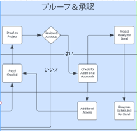
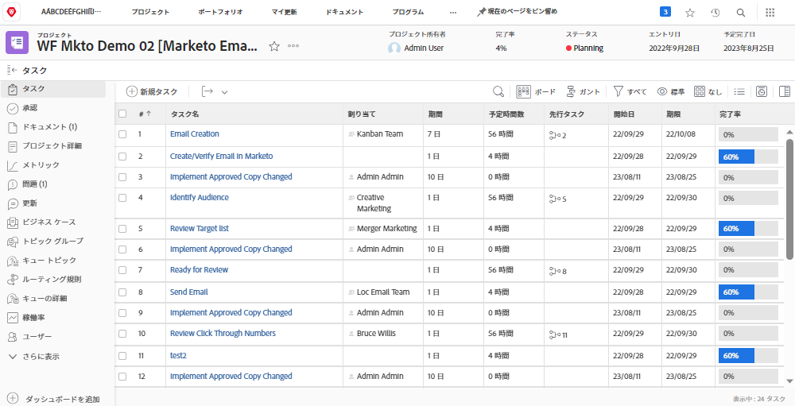
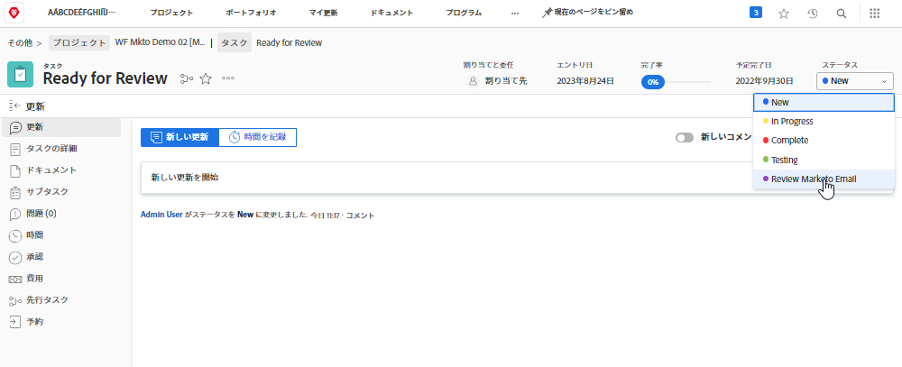
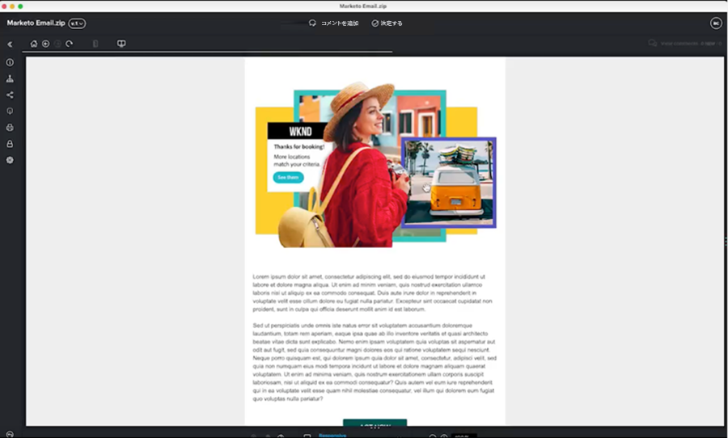

# レビューと承認のブループリント {#review-and-approve-blueprint}

>[!TIP]
>このブループリントは、[&#x200B; ユースケースパターン &#x200B;](/help/blueprints/use-case-patterns/b2b/campaign-review-and-approval.md)としてB2B Activation &amp; Marketingで利用することもできます。

マーケティングアセットやキャンペーンがビジネスの期待や基準を満たすようにすることは、適切なコンテンツやメッセージを的確なオーディエンスに提供するだけにとどまりません。 組織は、新しいマーケティング施策に着手する際に、内部ポリシー、業界の規制、さらには法律要件を遵守する責任も負います。 マーケティングチームは、レビューと承認のステップをキャンペーンの開発プロセスに組み込むことで、コンテンツとメッセージが正確であり、特に金融、ヘルスケア、医薬品といった業界標準を順守するようにします。

Workfront と Marketo Engage を利用すれば、マーケティングチームは、正確でコンプライアンスに優れたメッセージを提供し、マーケティングのための緊密に連携したシステムを構築する機会が得られます。

## Workfront を使用して Marketo Engage に対するプルーフと高度な承認を開放する {#unlock-proofing-and-advanced-approvals}

マーケティングキャンペーンの構築について考える際には、計画、構築、レビュー、フィードバック、承認、実行など、複数のシステムが関連する様々な手順をサポートすることを考慮する必要があります。 Workfront と Marketo Engage を使用すると、チームは、新しいマーケティングキャンペーンの計画からローンチまでのエンドツーエンドのプロセスを遂行するのに必要なツールをすべて使用できます。 さらに、レビューと承認プロセスの合理化を促進し、正確さとコンプライアンスを最高水準に維持しながら、キャンペーンの開発速度を向上させることができます。

### Marketo EngageとWorkfrontで実現したユースケースのレビューと承認 {#review-and-approve-use-cases-unlocked-with-marketo-engage-and-workfront}

* Marketo Engage のアセットに対する Workfront の注釈機能とコメント機能を利用することで、散在するフィードバックを排除し、一元化された場所での共同作業を促進します。

* Workfront の承認ワークフローから Marketo Engage で承認をトリガーして一元化します。

* Workfront の高度な承認機能と Marketo Engage のアセットを利用して、マーケティングアセットの複雑な承認ワークフローをサポートし、合理化します。

* 複数の関係者がレビューできるように、プログラムによって Marketo のアセットを Workfront に取り込み、マーケティングのドラフトへのアクセスを民主化します。

* Workfront での Marketo Engage のアセットのすべてのレビューとプルーフワークを一元化して、変更をトラックし、書面による記録を作成します。

## プルーフおよび承認ワークフローの計画 {#planning-your-proof-and-approval-workflow}

Marketo Engage と Workfront の間でプルーフと承認の統合を設定する前に、次の点を考慮します。

* レビューと承認が必要なアセットは何ですか？
* 承認者になる必要があるのは誰ですか？
* マーケティングアセットを公開する前に、複数の承認者が必要ですか？
* キャンペーンの開発プロセスのどの時点で、マーケティングアセットが組み立てられ、レビューの準備が整いますか？

これらの質問に回答すると、承認フローの大枠と、Workfront インスタンスの設定に関する考え方のベースラインを理解するのに役立ちます。

## Marketo Engage と Workfront 間のプルーフと承認ワークフローの作成 {#building-a-proof-and-approval-workflow}

Workfront と Marketo Engage 間でプルーフと承認プロセスを合理化するには、Workfront Fusion を使用してこの 2 つのソリューションを統合します。 Workfront Fusion には、アクションをトリガーし、Workfront インスタンスと Marketo Engage インスタンス間で情報を受け渡すためのワークフローインターフェイスが用意されています。

これを行うには、統合されたレビューと承認エクスペリエンスのプロセスの一部として、以下の手順を検討します。

1. レビュー準備タスクを使用して Workfront プロジェクトを設定します。
1. Marketo Engage メールをトリガーして、タスクステータスの変更とともに Workfront と同期します。
1. Marketo Engage のメールファイルを Workfront でレビュー可能なプルーフに変換します。
1. Workfrontの校正機能を使用して、コメントや注釈を通じて共同作業を行うことができます。
1. Workfront のプルーフを承認して Marketo Engage でのアセット承認をトリガーし、タスクを完了としてマークします。

### レビュー準備タスクを使用した Workfront プロジェクトを設定する {#configure-a-workfront-project-with-a-ready-for-review-task}

[&#x200B; プロジェクトテンプレート &#x200B;](https://experienceleague.adobe.com/docs/workfront/using/manage-work/projects/create-and-manage-project-templates/project-template-overview.html?lang=ja){target="_blank"}を使用して、組織内のプロジェクトに関連付けられている反復可能なプロセス、情報、設定のほとんどをキャプチャします。 タスクの定義、トピックのキュー、カスタムフォームの作成およびドキュメントの添付をテンプレートで行うことができます。

Workfront のプロジェクトテンプレートに、マーケティングキャンペーンの一部であるアセットのレビューを行うめのタスクを含めます。 さらに、単一の承認または複数レベルの複雑な承認を処理する承認プロセスを追加できます。

新しいメールキャンペーンを開始する場合は、メールをレビューするタスクと、メールを送信する前に適切な関係者がメールを承認するための承認プロセスを含むプロジェクトテンプレートが必要です。

{zoomable="yes"}

### Marketo Engage メールをトリガーして、タスクステータスの変更とともに Workfront と同期する {#trigger-your-marketo-engage-email-to-sync-to-workfront}

レビュープロセスの一環として、マーケティングチームによるレビューの準備が整ったら、Workfront プロジェクトにメールを同期するようにします。 これを行うには、電子メールをレビューする準備が整ったことを示す[&#x200B; タスクステータス &#x200B;](https://experienceleague.adobe.com/docs/workfront/using/manage-work/projects/update-work-on-a-project/update-task-status.html?lang=ja){target="_blank"}を持つ「レビュー準備完了」タスクを設定することをお勧めします。 この例では、「Marketo メールをレビュー」ステータスをタスクに追加しました。このステータスは、メールのドラフトを関係者がレビューする準備が整ったときに選択します。

このステータスを Workfront プロジェクトに適用したら、Workfront Fusion シナリオを設定して、レビュー準備タスクをリッスンし、「Marketo メールをレビュー」に更新します。 更新が完了すると、シナリオが実行されて、Marketo Engage メールを HTML ファイルとして取得し、zip 形式で圧縮して、そのコピーをレビュー用に Workfront プロジェクトドキュメントに保存します。

{zoomable="yes"}

### Marketo Engage のメールを Workfront でレビュー可能なプルーフに変換する {#convert-your-marketo-engage-email-to-reviewable-proof-in-workfront}

レビュー準備タスクが「Marketo メールをレビュー」ステータスに移動し、Marketo Engage メールが Workfront に保存されたら、メールを Workfront プルーフに変換する Workfront Fusion シナリオを設定できます。

### Workfrontの校正機能を使用して、コメントや注釈を通じて共同作業を行う {#use-workfront-proofing-to-collaborate}

[Workfrontのプルーフ &#x200B;](https://experienceleague.adobe.com/docs/workfront/using/review-and-approve-work/proofing/proofing-overview/proofing-basics.html){target="_blank"}機能により、マーケティング部門は、画像や電子メールなどの新しいアセットを取り込み、コメントや注釈を使用して共同作業を行うことができます。 プルーフの公開準備が整ったら、意思決定者はプルーフツールでアセットを承認できます。

{zoomable="yes"}

### Marketo EngageでWorkfront Proofとトリガーアセットの承認を行い、タスクを完了としてマークします {#approve-workfront-proof-and-trigger-asset-approval-in-marketo-engage}

Workfront Fusionは、メールが関係者によって承認されたことを検出し、Marketo Engageにリクエストを送信して、Marketo内のメールを承認します。

適切なチームメンバーによってレビューおよび承認されたメールをMarketo Engageで公開する準備が整いました。

## Fusion シナリオのテンプレート {#fusion-scenario-templates}

独自の Workfront および Marketo Engage インスタンスでレビューと承認ワークフローの開発を合理化するため、統合を開始するのに役立つ Fusion テンプレートを用意しました。 テンプレートを使用するには、Fusion の「公開テンプレート」セクションで「Marketo」を検索し、お使いのインスタンスにダウンロードします。

### Marketo Engage メールのドラフトのメールプルーフを Workfront で確認する {#review-an-email-proof-of-your-marketo-engage-email-draft-in-workfront}

以下の Fusion シナリオは、レビューと承認フローの前半の流れを示したものです。このシナリオでは、メールのドラフトを Marketo Engage から取得し、Workfront にプルーフとして保存します。 Workfront プロジェクトドキュメントにプルーフとして保存すると、レビュー、コメント、レビュープロセスの一環として、マーケティング関係者が注釈を付けることができます。

{zoomable="yes"}

### Workfront でメールを承認し、Marketo Engage にアセットの承認をトリガーする {#approve-an-email-in-workfront-that-triggers-approval}

以下の Fusion シナリオは、Workfront のプルーフが承認されたことを検出するのに使用できます。承認を Marketo Engage にルーティングするとメールのドラフトが更新され、メールが Marketo Engage プログラムで使用できるようになります。

{zoomable="yes"}

この 2 つのシナリオを組み合わせることで、Marketo Engage からマーケティングアセットを Workfront の堅牢なレビューと承認ワークフローに取り込み、Workfront から承認を Marketo Engage に戻す双方向のパスを作成できます。
