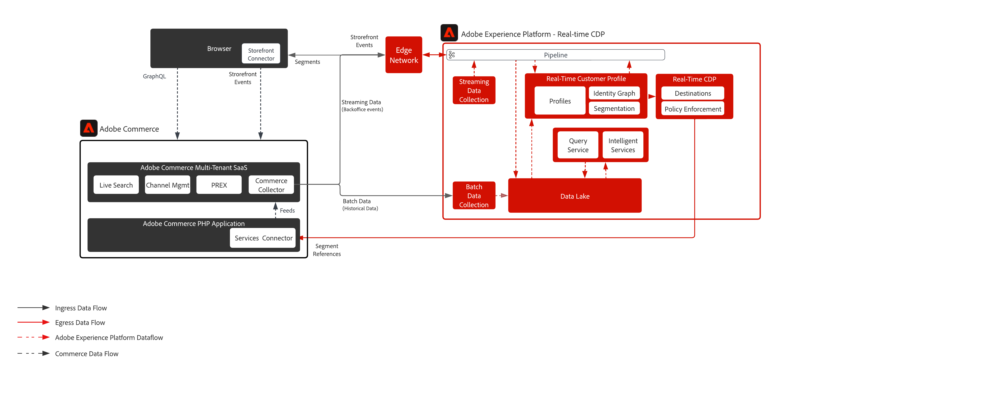

# Adobe Commerceと RTCDP

[!DNL Data Connection] 拡張機能は、Adobe Commerceのお客様がAdobe Experience Platformとシームレスに統合して顧客プロファイルを強化し、デジタルストアフロントやその他のチャネルでエクスペリエンスをパーソナライズするのに役立ちます。

## 有効な技術的機能

* ストアフロントデータ（買い物かごに追加、買い物かごの放棄など、クライアントサイドで生成される）が収集され、Adobe Experience Cloud製品に送信される。
* 任意のAdobe Experience Cloud商品に対するバックオフィス注文のステータス
* バックオフィスでの注文履歴をAdobe Experience Platformに送信できます
* RTCDP オーディエンスのAdobe Commerceへの共有とパーソナライズ

## 前提条件

[!DNL Data Connection] 拡張機能を使用するには、次の要件を満たす必要があります。

* Adobe Commerce 2.4.4 以降
* Adobe IDと組織 ID
* Adobe Experience Platform/RTCDP
* [Adobe クライアント データ レイヤー（ACDL） ](https://experienceleague.adobe.com/docs/experience-platform/tags/extensions/client/client-data-layer/overview.html)。 ACDL は、ストアフロントのイベントデータを収集するために必要です。

## オンボーディング手順

### Adobe CommerceからAdobe Experience Platformへのデータ収集

* [!DNL Data Connection] 拡張機能 ](https://experienceleague.adobe.com/docs/commerce-merchant-services/data-connection/fundamentals/install.html)[ インストールします。
* Adobeアカウントに [ ログイン ](https://helpx.adobe.com/manage-account/using/access-adobe-id-account.html) し、を表示して組織 ID を確認します。 組織 ID は、プロビジョニングされているExperience Cloud会社に関連付けられた ID です。 この ID は 24 文字の英数字から成る文字列の後に@AdobeOrg （必須）を付けたものです。
* Commerce固有のフィールドグループを使用した XDM スキーマの [ 作成または更新 ](https://experienceleague.adobe.com/docs/commerce-merchant-services/data-connection/fundamentals/update-xdm.html)。
* 作成または更新したスキーマに基づいて [ データセットを作成 ](https://experienceleague.adobe.com/docs/platform-learn/implement-mobile-sdk/experience-cloud/platform.html#create-a-dataset) します。 このデータセットには、送信するCommerce データが含まれます。
* [ データストリームを作成 ](https://experienceleague.adobe.com/docs/experience-platform/edge/datastreams/overview.html) し、Commerce固有のフィールドグループを含む XDM スキーマを選択します。
* [Commerce サービスに接続します ](https://experienceleague.adobe.com/docs/commerce-merchant-services/user-guides/integration-services/saas.html)。
* [Adobe Experience Platformに接続します ](https://experienceleague.adobe.com/docs/commerce-merchant-services/data-connection/fundamentals/connect-data.html)。

### オーディエンス共有のために、Adobe Experience PlatformからCommerceの宛先に接続します

Adobe Commerceの宛先に接続する手順は次のとおりです。

* [Adobe Experience Platform インターフェイス ](https://experience.adobe.com/platform/) で、宛先/ カタログに移動します。
* Personalizationを選択します。
* ハイライトするAdobe Commerceの宛先を選択し、「設定」を選択します。
* [ 宛先設定チュートリアル ](https://experienceleague.adobe.com/docs/experience-platform/destinations/ui/connect-destination.html) に示されている手順に従います。

## 標準データ

* Storefront （ブラウザー/アプリ）イベント
* バックオフィスイベント
* 注文履歴データ

サポートされているイベントの完全なリストについては、[Commerce Events を参照してください ](https://experienceleague.adobe.com/docs/commerce-merchant-services/data-connection/event-forwarding/events.html)

## アーキテクチャ

## 関連する実装ガイド

| ガイド | リンク |
|:----|:----|
| Platform コネクタ | [Adobe CommerceExperience Platformコネクタの概要 ](https://experienceleague.adobe.com/docs/commerce-merchant-services/data-connection/overview.html) |
| Commerce先 | [RTCDP でのAdobe Commerce接続 ](https://experienceleague.adobe.com/docs/experience-platform/destinations/catalog/personalization/adobe-commerce.html) |
| EdgePersonalization | [ エッジパーソナライゼーションの宛先に対するオーディエンスのアクティブ化 ](https://experienceleague.adobe.com/docs/experience-platform/destinations/ui/activate/activate-edge-personalization-destinations.html) |
