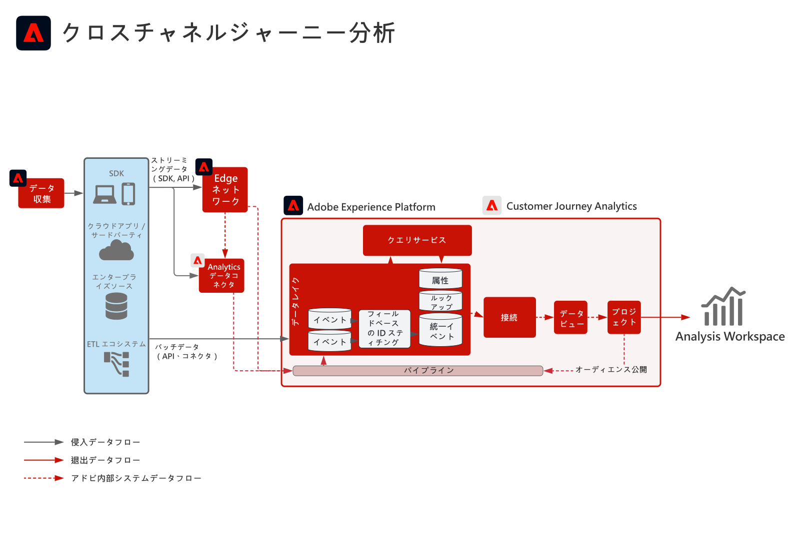

<!-- markdownlint-disable-next-line MD025 -->
# B2B Customer Journey Analytics ブループリント

Customer Journey Analytics B2B editionを使用すると、B2B 組織に関するアカウントベースのレポートと分析が可能になります。 ユーザー中心の B2C Analytics とは異なり、このブループリントではデータモデルの中心に **アカウント** を配置するので、複数の関係者、購入グループ、販売サイクルにわたる複雑な B2B 購入ジャーニーを分析できます。 [!DNL Customer Journey Analytics] を使用して、ジャーニーベースのインサイトとオーディエンス作成のために、行動データを B2B ディメンション（アカウント、機会、キャンペーン、マーケティングリスト）に統合します。

## アプリケーション

* Adobe[!DNL Customer Journey Analytics] （B2B edition）
* Adobe Experience Platform（B2B およびイベントデータ用）

## ユースケース

* **アカウントマーケティングの最適化** - アカウント内の購入グループ、パイプラインの進行、アップセル/クロスセルの機会に対するキャンペーン、チャネル、コンテンツ全体のマーケティング影響を分析します。
* **主要アカウントの成長** – 主要アカウント内の購入グループ全体にわたって価値の高いタッチポイントを特定して、マーケティングおよび販売行動を通知し、アカウントレベルで顧客の生涯価値を計算します。
* **製品価値の構築** – 製品リリースおよび使用状況が顧客満足度に与える影響をアカウントおよびユーザーレベルで測定して、機能を最適化し、開発に関する情報を提供します。
* **ユーザーベースの B2B 分析** - リードのスコアリング、エンゲージメント、ジャーニー分析のために、アカウントと商談のコンテキストを個々のユーザー行動と組み合わせます。

## 前提条件

* B2B edition[!DNL Customer Journey Analytics] 使用権限。
* Adobe Experience Platformの B2B および行動データ：B2B データセット（アカウント、オポチュニティ、人物、キャンペーン、マーケティングリスト、B2B アクティビティ）およびイベントデータ（web、モバイルまたはその他のチャネル）は、[CJA接続で使用でき &#x200B;](https://experienceleague.adobe.com/docs/analytics-platform/using/cja-connections/create-connection.html?lang=ja) す。
* [CJAの B2B 命名 &#x200B;](https://experienceleague.adobe.com/docs/analytics-platform/using/cja-dataviews/b2b.html)：接続用に設定された B2B 固有のデータビュー設定（アカウント ID、オポチュニティ ID、関連ディメンション）。

## アーキテクチャ

{zoomable="yes"}

Experience Platform（B2B およびイベントデータセット）からCJA接続を介して [!DNL Customer Journey Analytics] にデータが送られます。 B2B ディメンションはデータビューで公開されるので、分析とオーディエンスをアカウント、機会、人物のレベルで構築できます。

## ガードレール

* B2B editionの製品の制限および使用権限については、[Customer Journey Analytics B2B 製品の説明 &#x200B;](https://helpx.adobe.com/jp/legal/product-descriptions/customer-journey-analytics-b2b.html) を参照してください。
* Analytics Platform およびCJAの技術的制限については、[Analytics Platform ガードレール &#x200B;](https://experienceleague.adobe.com/ja/docs/analytics-platform/using/technotes/guardrails) を参照してください。
* CJAのデータ取り込みと接続の制限については、[Customer Journey Analyticsのデータ取り込みガードレール &#x200B;](https://experienceleague.adobe.com/docs/experience-platform/sources/connectors/adobe-applications/analytics.html?lang=ja#what-is-the-expected-latency-for-analytics-data-on-platform%3F) を参照してください。
* CJA オーディエンスを Real-time Customer Data Platform に公開する場合は、[Customer Journey Analytics オーディエンス共有ガードレール &#x200B;](https://experienceleague.adobe.com/docs/analytics-platform/using/cja-components/audiences/publish.html?lang=ja#latency) を参照してください。
* エンドツーエンドの待ち時間とプラットフォームガードレールについては、[&#x200B; デプロイメントガードレールのドキュメント &#x200B;](../experience-platform/guardrails.md) を参照してください。

## 実装手順

1. **B2B とイベントデータのExperience Platformへの取り込み** - [&#x200B; ソース &#x200B;](https://experienceleague.adobe.com/docs/experience-platform/sources/home.html?lang=ja) （[!DNL Marketo Engage]、CRM、その他の B2B コネクタなど）を使用して、アカウント、オポチュニティ、人物、キャンペーン、アクティビティのデータに加え、行動イベントを取り込みます。
2. **CJA接続の作成** — [&#x200B; 関連するExperience Platform データセットを追加 &#x200B;](https://experienceleague.adobe.com/docs/analytics-platform/using/cja-connections/create-connection.html?lang=ja) （B2B とイベント）をCustomer Journey Analytics接続に追加します。
3. **データビューでの B2B の設定** - [B2B の命名とキーディメンション &#x200B;](https://experienceleague.adobe.com/docs/analytics-platform/using/cja-dataviews/b2b.html) （アカウント ID、商談 ID など）を有効にします。 接続のデータビューで確認できます。
4. **アカウントベースの分析とオーディエンスの作成** - [CJA B2B のユースケースとレポートを使用 &#x200B;](https://experienceleague.adobe.com/docs/analytics-platform/using/cja-usecases/b2b.html?lang=ja) して、アカウントおよび商談レベルでレポート、分類、オーディエンスを作成します。オプションで、アクティベーション用に [Real-time CDP へのオーディエンスの公開 &#x200B;](https://experienceleague.adobe.com/docs/analytics-platform/using/cja-components/audiences/publish.html?lang=ja) を行います。

## 関連ドキュメント

### Customer Journey AnalyticsB2B edition

* [Customer Journey AnalyticsB2B edition](https://experienceleague.adobe.com/docs/analytics-platform/using/cja-overview/cja-b2b/cja-b2b-edition.html?lang=ja)
* [B2B のユースケース](https://experienceleague.adobe.com/docs/analytics-platform/using/cja-usecases/b2b.html?lang=ja)
* [B2B edition ユースケースの概要](https://experienceleague.adobe.com/docs/analytics-platform/using/cja-usecases/b2b/b2b-edition/use-cases-overview.html?lang=ja)
* [ユーザーベースの B2B プロジェクトの例](https://experienceleague.adobe.com/docs/analytics-platform/using/cja-usecases/b2b/example.html?lang=ja)

### 接続とデータビュー

* [接続の作成](https://experienceleague.adobe.com/docs/analytics-platform/using/cja-connections/create-connection.html?lang=ja)
* [B2B データ表示設定](https://experienceleague.adobe.com/docs/analytics-platform/using/cja-dataviews/b2b.html)

### オーディエンスとガードレール

* [CJA オーディエンスを Real-time CDP に公開](https://experienceleague.adobe.com/docs/analytics-platform/using/cja-components/audiences/publish.html?lang=ja)
* [Experience Platformとアプリケーションガードレール](../experience-platform/guardrails.md)
