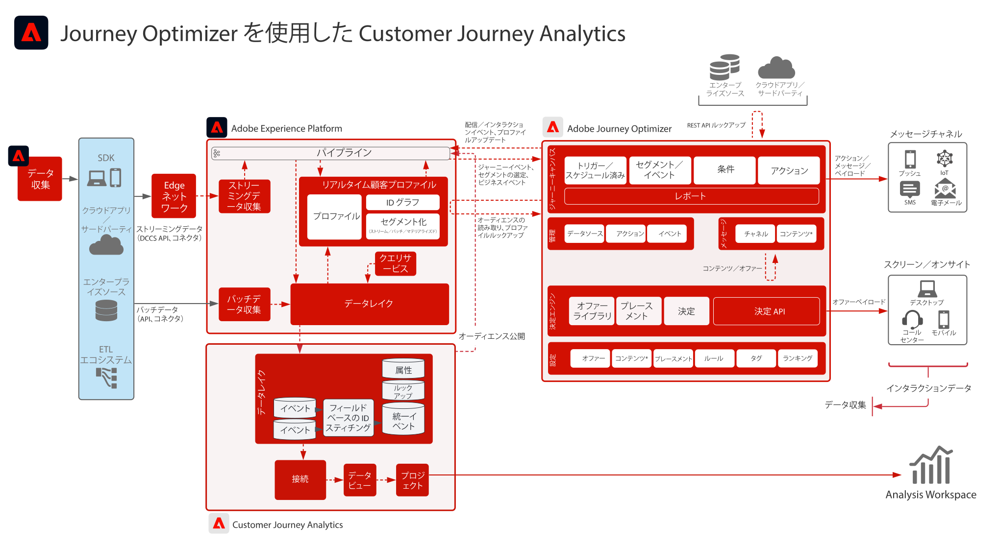

# Journey Optimizer ブループリントとのCustomer Journey Analytics

Journey Optimizer のデータは Experience Platform のデータレイクに共有され、Customer Journey Analytics 内で取り込み、分析およびレポート作成に使用することができます。ジャーニーの配信、インタラクション、および有効性を Customer Journey Analytics 内で分析およびレポートすることができます。

また、Customer Journey Analytics で作成されたオーディエンスは、Experience Platform のリアルタイム顧客プロファイルに公開し、Journey Optimizer でのジャーニー実行に使用することができます。

## 実装ガイド

Customer Journey Analytics 内での Journey Optimizer データの実装と設定に関するガイダンスについては、次のドキュメントを参照してください。[ドキュメント](https://experienceleague.adobe.com/docs/journey-optimizer/using/reporting/reports/sharing-overview.html?lang=ja)

## Journey Optimizer を使用した Customer Journey Analytics のためのアーキテクチャ

{zoomable="yes"}
