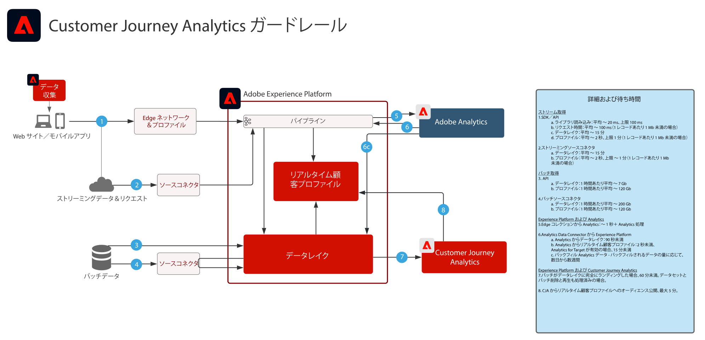

# Real-time Customer Data PlatformとのCustomer Journey Analytics

Customer Journey Analytics(CJA) で識別されたオーディエンスを作成し、Adobe Experience Platformのリアルタイム顧客プロファイルに公開して、顧客のターゲティングとパーソナライズを実現します。 Customer Journey Analyticsの詳細なフィルターおよび計算済みフィールドから、履歴データを使用する、またはより絞り込まれたオーディエンスを使用するオーディエンスの作成に最適です。

## Customer Journey AnalyticsAudience Publishing ガイド

Customer Journey AnalyticsからReal-time Customer Data Platformへのオーディエンスの公開に関する実装と設定に関するガイダンスについては、次のドキュメントを参照してください。 [ドキュメント](https://experienceleague.adobe.com/docs/analytics-platform/using/cja-components/audiences/publish.html)

## Customer Journey Analytics ブループリントのアーキテクチャ

## Customer Journey Analytics ブループリントのガードレール図

## 関連するブログ投稿

* [[!DNL Blueprint for Multi-Channel Orchestration in Adobe Experience Platform]](https://medium.com/adobetech/blueprint-for-multi-channel-orchestration-in-adobe-experience-platform-c68317e94184)
* [[!DNL Leveraging External Data Platforms in Adobe Experience Platform Journey Orchestration]](https://medium.com/adobetech/leveraging-external-data-platforms-in-adobe-experience-platform-journey-orchestration-54fc6134fe17)
* [[!DNL Event-Based Triggering on Adobe Experience Platform Orchestration Service using Apache Airflow]](https://medium.com/adobetech/event-based-triggering-on-adobe-experience-platform-orchestration-service-using-apache-airflow-8607b28251f1)
* [[!DNL Adobe Campaign Classic Integration with Journey Orchestration]](https://medium.com/adobetech/adobe-campaign-classic-integration-with-journey-orchestration-ae577653281)
* [[!DNL Demonstrating the Power of Adobe’s New Journey Orchestration Service to Build Personalized Omnichannel Experiences in Real-Time]](https://medium.com/adobetech/demonstrating-the-power-of-adobes-new-journey-orchestration-service-to-build-personalized-aa60d88cd34)
* [[!DNL Journey Orchestration in an Omnichannel World]](https://medium.com/adobetech/journey-orchestration-in-an-omnichannel-world-3a2d32d556d9)
