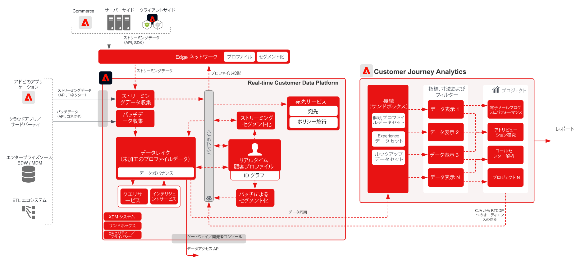

# Real-time Customer Data Platform を使用した Customer Journey Analytics

Customer Journey Analytics（CJA）で識別されたオーディエンスを作成し、Adobe Experience Platform のリアルタイム顧客プロファイルに公開して、顧客のターゲティングとパーソナライゼーションを実現します。Customer Journey Analytics の詳細なフィルターおよび計算済みフィールドから、履歴データの使用や、より絞り込まれたオーディエンスを使用てのオーディエンスの作成に最適です。

## Customer Journey Analytics オーディエンス公開ガイド

Customer Journey Analytics から Real-time Customer Data Platform へのオーディエンスの公開に関する実装と設定ガイダンスについては、次のドキュメントを参照してください。[ドキュメント](https://experienceleague.adobe.com/docs/analytics-platform/using/cja-components/audiences/publish.html?lang=ja)

## Customer Journey Analytics ブループリントのアーキテクチャ

## Customer Journey Analytics ブループリントのガードレール図

* 詳細なガードレールおよび終了から終了までの待ち時間については、 [デプロイメントガードレールドキュメント](../experience-platform/deployment/guardrails.md)

## よくある質問

* CJA が送信した RTCDP に対応するプロファイルが存在しない場合、新しいプロファイルが作成されますか。それとも、CJA からオーディエンスのみが記録され、既に存在するプロファイルがあるか。 はい、新しいプロファイルが作成されます。 その結果、RTCDP 実装が既知のお客様のみを対象とする場合は、既知の ID を持つプロファイルのみをフィルタリングするように CJA オーディエンスルールを記述する必要があります。 これにより、必要に応じて、匿名プロファイルから RTCDP プロファイル数が増加しなくなります。

* CJA は、オーディエンスデータをパイプラインイベントとして送信しますか、それともデータレイクにも送信されるフラットファイルですか。 CJA オーディエンスは、パイプラインを介して RTCDP プロファイルサービスにストリーミングされますが、データもデータセットとしてデータレイクに保存されます。

* CJA はどの ID を送信しますか。 CJA は、CJA の設定時に「ユーザー ID」として設定された ID を介して送信します。

* プライマリ ID として設定されるもの CJA をプライマリ「人」ID として設定した際にユーザーが選択した ID。

* ID サービスは CJA メッセージも処理しますか。 例えば、CJA は、オーディエンス共有を通じてプロファイル ID グラフに ID を追加できますか。 いいえ。ID サービスは CJA メッセージを処理しません。

## 関連するブログ投稿

* [[!DNL Blueprint for Multi-Channel Orchestration in Adobe Experience Platform]](https://medium.com/adobetech/blueprint-for-multi-channel-orchestration-in-adobe-experience-platform-c68317e94184)
* [[!DNL Leveraging External Data Platforms in Adobe Experience Platform Journey Orchestration]](https://medium.com/adobetech/leveraging-external-data-platforms-in-adobe-experience-platform-journey-orchestration-54fc6134fe17)
* [[!DNL Event-Based Triggering on Adobe Experience Platform Orchestration Service using Apache Airflow]](https://medium.com/adobetech/event-based-triggering-on-adobe-experience-platform-orchestration-service-using-apache-airflow-8607b28251f1)
* [[!DNL Adobe Campaign Classic Integration with Journey Orchestration]](https://medium.com/adobetech/adobe-campaign-classic-integration-with-journey-orchestration-ae577653281)
* [[!DNL Demonstrating the Power of Adobe’s New Journey Orchestration Service to Build Personalized Omnichannel Experiences in Real-Time]](https://medium.com/adobetech/demonstrating-the-power-of-adobes-new-journey-orchestration-service-to-build-personalized-aa60d88cd34)
* [[!DNL Journey Orchestration in an Omnichannel World]](https://medium.com/adobetech/journey-orchestration-in-an-omnichannel-world-3a2d32d556d9)
