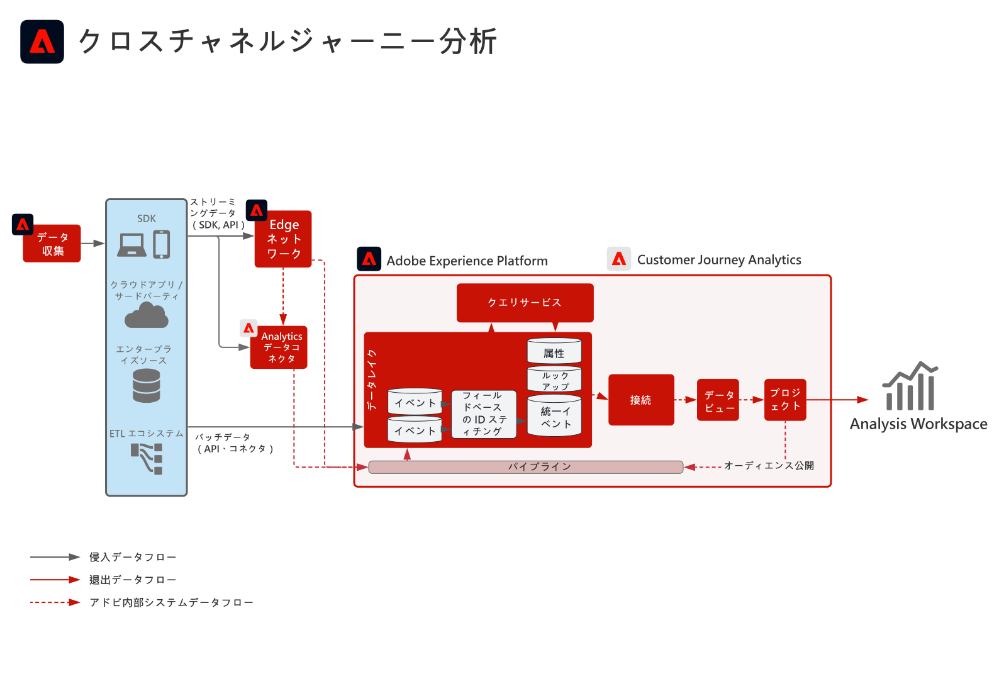

# クロスチャネルジャーニー分析ブループリント

Web、モバイルおよびオフラインの様々なプロパティからのデータを統合することで、複数のチャネルをまたいだ顧客行動を単一の統合されたビューに表示します。

## ユースケース

* デスクトップとモバイルをまたいで顧客インタラクションを分析して顧客行動を把握し、デジタルカスタマーエクスペリエンスを最適化するためにインサイトを抽出します。
* デジタルおよびオフラインチャネル（サポートとのやり取りや店舗での購入など）を含む、チャネルをまたいだ顧客インタラクションを分析し、カスタマージャーニーをより深く把握し、最適化します。 

## アプリケーション

* Adobe Experience Platform
* Customer Journey Analytics
* Adobe Analytics（オプション）

## 統合パターン

* Adobe Experience Platform → Customer Journey Analytics
* Adobe Analytics → Adobe Experience Platform → Customer Journey Analytics

## アーキテクチャ

## 実装手順

1. データを取り込むために[スキーマを作成](https://experienceleague.adobe.com/docs/platform-learn/tutorials/schemas/create-a-schema.html?lang=ja)します。
1. データを取り込むために[データセットを作成](https://experienceleague.adobe.com/docs/platform-learn/tutorials/data-ingestion/create-datasets-and-ingest-data.html?lang=ja)します。
1. Experience Platform に[データを取り込みます](https://experienceleague.adobe.com/?recommended=ExperiencePlatform-D-1-2020.1.dataingestion&amp;lang=ja)。
データは、Customer Journey Analytics で処理される前に、Platform に取り込まれる必要があります。
1. 結合で分析されるクロスチャネルイベントデータセットを分析して、共通の名前空間 ID を持つか、Customer Journey Analytics のフィールドベースのステッチ機能でキー更新されていることを確認します。 

   >[!NOTE]
   >
   >Customer Journey Analytics は、現在、Experience Platform プロファイルや ID サービスをステッチに使用していません。

1. 時系列のデータセットをまたいで共通キーを Customer Journey Analytics に取り込むために、カスタムデータ準備を実行するか、データに対するフィールドベースの ID ステッチを使用します。
1. イベントデータのフィールドに結合できるプライマリ ID をルックアップデータに提供します。ライセンスの行としてカウントされます。
1. イベントデータのプライマリ ID と同じプライマリ ID をプロファイルデータに設定します。
1. Experience Platform から Customer Journey Analytics への取り込みデータに対するデータ接続を設定します。データがデータレイクに入ったら、90 分以内に Customer Journey Analytics で処理されます。
1. 接続のデータビューを設定して、ビューに含める特定のディメンションおよび指標を選択します。また、属性および配分設定も、データビューで設定されます。これらの設定は、レポート時に計算されます。
1. Analysis Workspace 内でダッシュボードおよびレポートを設定するためのプロジェクトを作成します。

## 実装に関する考慮事項

### ID ステッチに関する考慮事項

* 結合される時系列データは、すべてのレコードに同じ ID 名前空間を持っている必要があります。
* 異なるデータセットを統合する結合プロセスでは、データセット間で共通のプライマリユーザー／エンティティキーが必要です。
* セカンダリキーベースの結合は、現在、サポートされていません。
* フィールドベースの ID ステッチプロセスを使用すると、以降の一時的な ID レコード（認証 ID など）に基づいて、行の ID をキー更新できます。これを使用すると、デバイスまたは cookie レベルではなくユーザーレベルで分析するために、異なるレコードを単一の ID に解決できます。
* ステッチは 1 週間に 1 回行われ、ステッチの後に繰り返されます。

## よくある質問

* Customer Journey Analytics のデータモデルは、ダウンストリームにどのような影響がありますか？

   同じ XDM フィールドのオブジェクトおよび属性は、Customer Journey Analytics の 1 つのディメンションに結合されます。様々なデータセットから同じ Customer Journey Analytics ディメンションに複数の属性を結合するために、データセットは、同じ XDM フィールドまたはスキーマを参照している必要があります。

## 関連ドキュメント

* [Customer Journey Analytics 製品説明](https://helpx.adobe.com/jp/legal/product-descriptions/customer-journey-analytics.html)
* [Customer Journey Analytics ドキュメント](https://experienceleague.adobe.com/docs/customer-journey-analytics.html?lang=ja)
* [Customer Journey Analytics チュートリアル](https://experienceleague.adobe.com/docs/customer-journey-analytics-learn/tutorials/overview.html?lang=ja)
