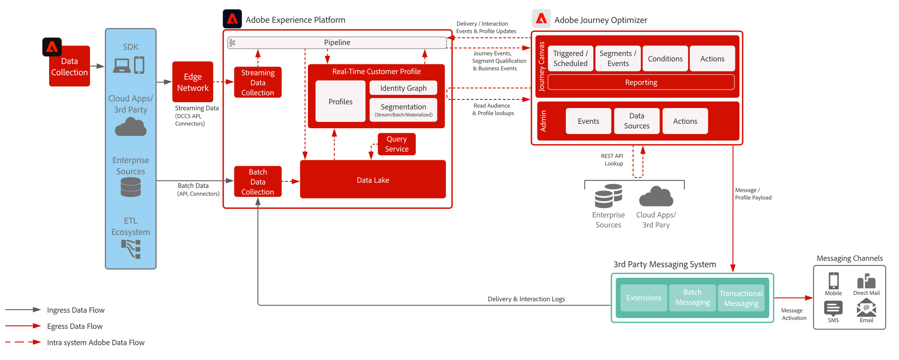

# サードパーティメッセージングのブループリント

Adobe Journey Optimizer をサードパーティのメッセージングシステムと併用して、パーソナライズされた通信を調整および送信する方法を示します。

 

## アーキテクチャ

 

## 前提条件

Adobe Experience Platform

* Journey Optimizer のデータソースを設定する前に、スキーマとデータセットをシステムに設定する必要があります
* エクスペリエンスイベントクラスベースのスキーマの場合、ルールベースのイベントではないイベントをトリガーする場合に、「オーケストレーション eventID」フィールドグループを追加します
* 個別のプロファイルクラスベースのスキーマの場合、「Profile test details」フィールドグループを追加して、Journey Optimizer で使用するテストプロファイルを読み込めるようにします

サードパーティメッセージングのアプリケーション

* トランザクションペイロードを送信するには REST API 呼び出しをサポートする必要があります

 

## ガードレール

[Journey Optimizer ガードレール製品リンク](https://experienceleague.adobe.com/docs/journeys/using/starting-with-journeys/limitations.html?lang=ja)

その他の Journey Optimizer ガードレール：

* キャッピングは、宛先システムが障害点で飽和しないようにするために、今日では API を通じて利用できます。これは、キャップを超過したメッセージが完全にドロップされ、まったく送信されないことを意味します。スロットリングは、サポートされていません。
   * 最大接続数：宛先が処理できる http/s 接続の最大数
   * 最大呼び出し数：periodInMs パラメーターで行われる呼び出しの最大数
   * periodInMs：ミリ秒単位の時間
* セグメントメンバーシップで開始されるジャーニーは、2 つのモードで操作できます。
   * バッチセグメント（24 時間ごとに更新）
   * ストリーミングセグメント（5 分未満での認定）
* バッチセグメント - 認定ユーザーの毎日のボリュームを確実に把握し、宛先システムがジャーニーごと、およびすべてのジャーニーのバーストスループットを処理するために必要です
* ストリーミングセグメント - ジャーニーごと、およびすべてのジャーニーの毎日のストリーミング認定ボリュームと共に、プロファイル認定の最初のバーストを処理するために必要です
* 意思決定管理はサポートされていません
* サードパーティシステムへのアウトバウンド統合
   * インフラはマルチテナントであるため、単一の静的 IP をサポートしていません（すべてのデータセンター IP を許可リストに含める必要があります）
   * カスタムアクションは POST メソッドと PUT メソッドのみ対応
   * 認証のサポート：トークン | パスワード | OAuth2
* Adobe Experience Platform や Journey Optimizer の個々のコンポーネントをパッケージ化して、様々なサンドボックス間で移動させることはできません。新しい環境に再実装する必要があります

 

サードパーティメッセージングのシステム

* トランザクション API 呼び出しでシステムがサポートできる負荷を理解する必要があります
   * 1 秒間に可能な呼び出し回数
   * 接続数
* API 呼び出しをおこなうために必要な認証を理解する必要があります
   * 認証タイプ：  トークン |パスワード | OAuth2 はJourney Optimizer 経由でサポートされます
   * 認証キャッシュの期間：トークンの有効期間はどれくらいですか？
* バッチ取り込みのみがサポートされている場合は、Amazon Kinesis や Azure Event Grid 1st などのクラウドストレージエンジンにストリーミングする必要があります
   * データは、これらのクラウドストレージエンジンのバッチ処理を行い、サードパーティに送り込むことができます
   * すべての必要なミドルウェアは、顧客またはサードパーティが提供する責任を負います

 

## 実装手順

### Adobe Experience Platform

#### スキーマ／データセット

1. 顧客提供データに基づき、Experience Platform で[個人プロファイル、エクスペリエンスイベントおよびマルチエンティティスキーマを設定します](https://experienceleague.adobe.com/?recommended=ExperiencePlatform-D-1-2021.1.xdm&amp;lang=ja)。
1. Experience Platform で取り込む[データセットを作成します。](https://experienceleague.adobe.com/docs/platform-learn/tutorials/data-ingestion/create-datasets-and-ingest-data.html?lang=ja)
1. ガバナンス用のデータセットに、Experience Platform で[データ使用ラベルを追加します。](https://experienceleague.adobe.com/docs/platform-learn/tutorials/data-governance/classify-data-using-governance-labels.html?lang=ja)
1. 宛先のガバナンスを実施する[ポリシーを作成します。](https://experienceleague.adobe.com/docs/platform-learn/tutorials/data-governance/create-data-usage-policies.html?lang=ja)

#### プロファイル／ID

1. [任意の顧客専用の名前空間を作成します。](https://experienceleague.adobe.com/docs/platform-learn/tutorials/identities/label-ingest-and-verify-identity-data.html?lang=ja)
1. [スキーマに ID を追加します](https://experienceleague.adobe.com/docs/platform-learn/tutorials/identities/label-ingest-and-verify-identity-data.html?lang=ja)。
1. [プロファイル用のスキーマおよびデータセットを有効にします](https://experienceleague.adobe.com/docs/platform-learn/tutorials/profiles/bring-data-into-the-real-time-customer-profile.html?lang=ja)。
1. [!UICONTROL リアルタイム顧客プロファイル]の様々な表示用に[結合ポリシーを設定](https://experienceleague.adobe.com/docs/platform-learn/tutorials/profiles/create-merge-policies.html?lang=ja)します（オプション）。
1. ジャーニー使用状況用のセグメントを作成します。

#### ソース／宛先

1. ストリーミング API およびソースコネクタを使用して、[Experience Platform にデータを取り込みます。](https://experienceleague.adobe.com/?recommended=ExperiencePlatform-D-1-2020.1.dataingestion&amp;lang=ja)

### Journey Optimizer

1. Experience Platform データソースを設定し、カスタマージャーニーの開始に使用する profileStreaming データの一部としてキャッシュするフィールドを決定します。このデータは、まず Journey Optimizer 内で設定され、オーケストレーション ID を取得する必要があります。このオーケストレーション ID は、取り込みに使用するためにデベロッパーに供給されます
1. 外部データソースを設定
1. サードパーティアプリケーションのカスタムアクションを設定

### モバイルプッシュ設定（オプションでサードパーティがトークンを収集する場合があります）

1. Experience Platform Mobile SDK を実装して、プッシュトークンとログイン情報を収集し、既知の顧客プロファイルに結び付けます
1. Adobe タグを活用し、次の拡張子を持つモバイルプロパティを作成します。
   * Adobe Journey Optimizer
   * Adobe Experience Platform Edge Network
   * IDEdge ネットワーク用
   * モバイルコア
1. モバイルアプリデプロイメント用と web デプロイメント用の専用のデータストリームがあることを確認
1. 詳しくは、[Adobe Journey Optimizer Mobile ガイド](https://developer.adobe.com/client-sdks/documentation/adobe-journey-optimizer/)を参照

 

## 関連ドキュメント

* [Experience Platform ドキュメント](https://experienceleague.adobe.com/docs/experience-platform.html?lang=ja)
* [Experience Platform タグドキュメント](https://experienceleague.adobe.com/docs/experience-platform/tags/home.html?lang=ja)
* [Experience Platform Mobile SDK ドキュメント](https://experienceleague.adobe.com/docs/mobile.html?lang=ja)
* [Journey Optimizer ドキュメント](https://experienceleague.adobe.com/docs/journey-optimizer/using/ajo-home.html?lang=ja)
* [Journey Optimizer 製品説明](https://helpx.adobe.com/jp/legal/product-descriptions/adobe-journey-optimizer.html)
