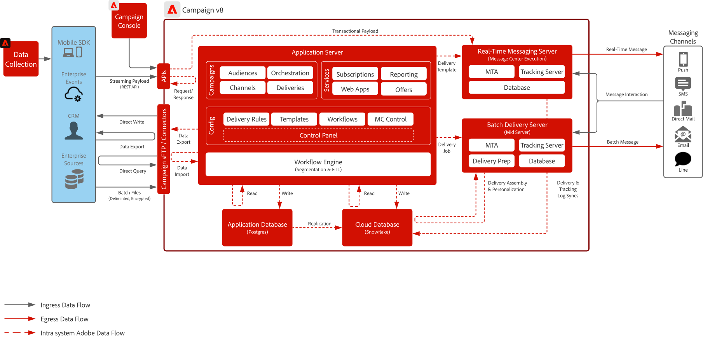
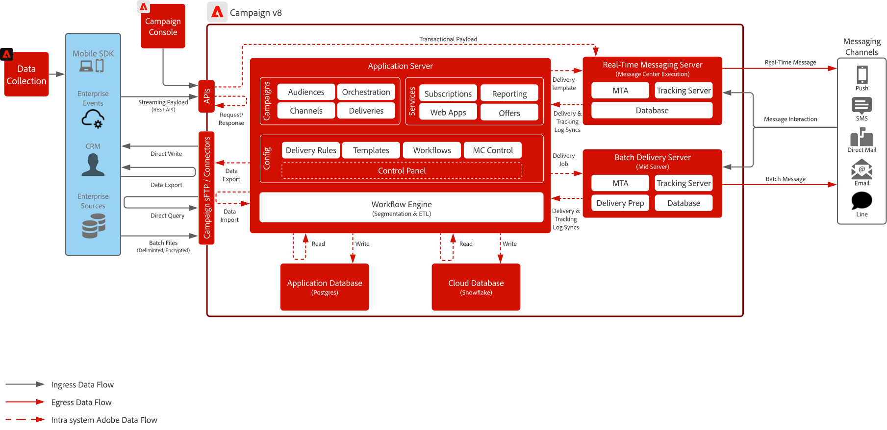

# Campaign v8 ブループリント

>[!TIP]
>このブループリントは、[&#x200B; ユースケースパターン &#x200B;](/help/blueprints/use-case-patterns/campaign-management-orchestration/campaign-v8-orchestration.md)として、「キャンペーン管理とオーケストレーション」でも利用できます。

Adobe Campaign v8は、電子メールやダイレクトメールなどの従来のマーケティングチャネル向けに設計された、次世代のキャンペーン管理プラットフォームです。 複雑なセグメンテーションやオーディエンスのターゲティングをサポートする強力なETL機能とデータ管理機能に加えて、マルチタッチでバッチ主導型のマーケティングプログラムを構築するための強力なオーケストレーションエンジンを提供します。

また、拡張性の高いリアルタイムのメッセージングサーバーも含まれており、パスワードリセット、注文確認、e レシートなどのトランザクションコミュニケーションを可能にし、外部システムから完全なペイロードを受け取って即座に配信します。

## ユースケース

>[!BEGINTABS]

>[!TAB  バッチキャンペーンの実行]

- 電子メール、SMS、ダイレクトメールをまたいで、大規模なスケジューリングされたマーケティングキャンペーンを設計、配信できます。
- 複雑なセグメンテーションとターゲティング機能を備えたプロモーションコンテンツ、ニュースレター、季節限定オファーに最適です。

>[!TAB  マルチタッチオーケストレーション ]

- 事前に定義されたマーケティングジャーニーを通じて顧客を導く、マルチステップのマルチチャネルプログラムを構築します。
- オーディエンスの再入力、条件付きロジック、時間ベースの移行をサポートしています。

>[!TAB  データ管理とETL]

- 様々なソースから顧客データを取り込み、変換、管理し、正確なターゲティングをサポートします。
- カスタムスキーマ、計算フィールド、オーディエンス定義の作成を有効にします。

>[!TAB  トランザクションメッセージ ]

- 外部システムによってトリガーされる、事前定義されたリアルタイムのメッセージ（パスワードのリセット、注文確認、電子メールの受信など）を送信します。
- IT システムからのペイロードを完全に受け入れ、すぐに配信できるスケーラブルなメッセージングサーバーを使用。

>[!ENDTABS]

 

## アーキテクチャ図

[Campaign v8 デプロイメントモデル &#x200B;](https://experienceleague.adobe.com/docs/campaign/campaign-v8/config/architecture/architecture.html#ac-deployment){target="_blank"}の詳細をご覧ください。

### Campaign Enterprise （FFDA）のデプロイメント

 

### Campaign v8 FDA デプロイメント

 

## 統合パターン

| シナリオ | 説明 | 技術的な考慮事項 |
| :-- | :--- | :--- |
| [[!DNL Real-time Customer Data Platform] とAdobe [!DNL Campaign]](rtcdp-and-campaign-v8.md) | Adobe Experience Platformとそのリアルタイム顧客プロファイルおよび一元化されたセグメンテーションツールをAdobe [!DNL Campaign]で利用して、パーソナライズされた会話を提供する方法を紹介します | <ul><li>クラウドストレージファイル交換とAdobe [!DNL Campaign]取り込みワークフローを使用して、[!DNL Real-Time CDP]からAdobe [!DNL Campaign]へのプロファイルとオーディエンスの共有 </li><li>お客様の会話からAdobe [!DNL Campaign]の[!DNL Real-Time CDP]に配信およびインタラクションデータを簡単に共有して、リアルタイムのお客様プロファイルを強化し、メッセージングキャンペーンに関するクロスチャネルのレポートを提供します</li></ul> |
| [[!DNL Journey Optimizer] とAdobe [!DNL Campaign]](ajo-and-campaign-v8.md) | Adobe Journey Optimizerを使用して、Real-Time Customer Profileを利用して1:1 エクスペリエンスを調整し、ネイティブのAdobe [!DNL Campaign] トランザクションメッセージシステムを活用してメッセージを送信する方法を示します | <ul><li>リアルタイムメッセージサーバーを介して 1 時間に最大 100 万件のメッセージを送信可能<li>[!DNL Journey Optimizer]からスロットリングは実行されないので、セールス前のエンタープライズアーキテクトによる技術的な検証を確実に行ってください</li><li>意思決定管理は、Campaign v8 へのペイロードではサポートされていません</li></ul> |

 

## 前提条件

このブループリントの前提条件は次のとおりです。

### アプリケーションサーバーおよびリアルタイムメッセージングサーバー

- [!DNL Campaign] v8 ソフトウェアを操作して使用するには、Adobe [!DNL Campaign] クライアント コンソールが必要です。 これは Windows ベースのクライアントで、標準のインターネットプロトコル（SOAP、HTTP など）を使用します。 ソフトウェアの配布、インストール、実行に必要な権限が組織で有効になっていることを確認します。

- IP アドレス許可リストへの登録：
   - クライアントコンソールへのアクセス中にすべてのユーザーが使用するIP範囲を特定します。
   - どのエンタープライズシステムがReal-Time Messaging Serverとの通信を許可されているかを識別し、リストに追加できる静的に割り当てられたIPまたは範囲を持っていることを確認します。
   - これは、Campaign コントロールパネルで設定および制御できます。
- sFTP キー管理：
   - SSH パブリックキーを Campaign で提供された sFTP で使用できるようにします。 これは、Campaign コントロールパネルで設定および制御できます。

### 電子メール

- メッセージ送信に使用するサブドメインを準備します。
- サブドメインは、Adobeに完全にデリゲートすることも（推奨）、CNAMEを使用してAdobe固有のDNS サーバー（カスタム）を指定することもできます。
- 配信品質を確保するには、各サブドメインにGoogle TXT レコードが必要です。

### モバイルプッシュ

- モバイルアプリのデプロイ、設定、構築を可能にするモバイル開発者を用意します。
- アドビは、メッセージペイロードをサーバーに送信するために必要な情報を FCM（Android）および APNS（iOS）から収集する SDK のみを提供しています。 モバイルアプリをコーディング、デプロイ、管理、デバッグする方法は、お客様の責任です。

### Webapps（オプション）

- Campaign ホストの購読解除ページとランディングページに追加のサブドメインをデリゲートできます。
- SSL証明書を強く推奨します。

 

## ガードレール

### アプリケーションサーバーのサイズ設定

- ストレージは最大2億人のプロファイルに拡張でき、最大1Bのプロファイルに拡張できる可能性があります。
- Adobe [!DNL Admin Console]経由のユーザーアクセスを設定および制御します。
- [!DNL Campaign]へのデータの読み込みは、バッチファイルを通じて行われる必要があります：
   - API データの読み込みのサポートは、主にデータベース内のプロファイルや単純なオブジェクトの管理（作成と更新）に使用します。 大量のデータの読み込みや、バッチ操作などの操作に向けたものではありません。
   - API を使用したカスタムアプリケーション目的でのデータ読み取りはサポートされていません
   - API を介して読み込まれたデータは、アプリケーションデータベースでステージングされ、1 時間ごとにクラウドデータベースにレプリケートされます
- API呼び出しの制限が適用されます。 詳しくは、[Adobe Campaignの製品説明](https://helpx.adobe.com/jp/legal/product-descriptions/adobe-campaign-managed-cloud-services.html){target="_blank"}を参照してください。

### バッチメッセージングサーバーのサイズ設定

- 1 時間あたり最大 2,000 万件のメッセージに対応可能

### リアルタイムメッセージングサーバーのサイズ設定

- 1 時間に最大 100 万件のメッセージを送信可能
- デフォルトでは、2 つのリアルタイムメッセージングサーバーがプロビジョニングされます。 最大 8 台のリアルタイムメッセージングサーバーを拡張可能

### SMS 設定

- Campaign には、SMS プロバイダーと統合される機能が用意されています。 このプロバイダーは、顧客によって調達され、SMS ベースのメッセージを送信するためのキャンペーンと統合されます。
- サポートは、SMPP プロトコルを介して行われます。
- 次の 3 種類の SMS があり、アドビがサポートします。
   - SMS MT （Mobile Terminated）: SMPP プロバイダーを介してAdobe [!DNL Campaign]から携帯電話に送信されるSMS。
   - SMS MO （モバイル送信済み）: SMPP プロバイダーを介してモバイルからAdobe [!DNL Campaign]に送信されるSMS。
   - SMS SR （ステータスレポート）またはDRまたはDLR （配信レシート）: SMSが正常に受信されたことを示す返品用レシートが、モバイルからAdobe [!DNL Campaign]にSMPP プロバイダーを通じて送信されます。 Adobe [!DNL Campaign]は、メッセージを配信できなかったことを示すSRを受け取ることもあります。多くの場合、エラーの説明が記載されています。

 

## 実装手順

[Adobe Campaign v8 の実装](https://experienceleague.adobe.com/docs/campaign/campaign-v8/implement/implement.html?lang=ja)の入門ガイドを参照してください。

## 関連ドキュメント

- [Campaign v8 ドキュメント](https://experienceleague.adobe.com/docs/campaign-v8.html?lang=ja)
- [Campaign v8製品説明](https://helpx.adobe.com/jp/legal/product-descriptions/adobe-campaign-managed-cloud-services.html)
- [Experience Platform Tags ドキュメント](https://experienceleague.adobe.com/docs/launch.html?lang=ja)
- [Experience Platform Mobile SDKのドキュメント](https://experienceleague.adobe.com/docs/mobile.html?lang=ja)