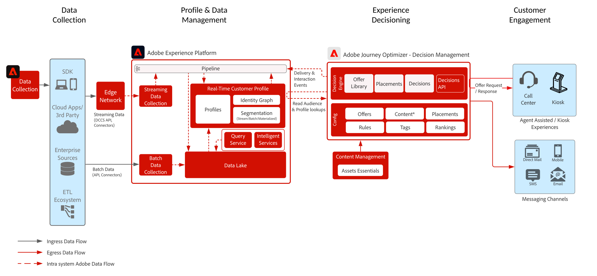

# Hub Blueprintによる意思決定管理

>[!TIP]
>このブループリントは、Personalizationの[ ユースケースパターン ](/help/blueprints/use-case-patterns/personalization/offer-decisioning.md)としても利用できます。

意思決定管理について詳しくは、製品ドキュメントの[こちら](https://experienceleague.adobe.com/docs/journey-optimizer/using/offer-decisioniong/get-started-decision/starting-offer-decisioning.html?lang=ja)と、意思決定管理の概要の[こちら](decision-management-overview.md)を参照してください。

アドビの意思決定管理は、Adobe Journey Optimizer の一部として提供されるサービスです。 このブループリントは、アプリケーションのユースケースと技術的機能の概要を示し、意思決定管理を構成する様々なアーキテクチャコンポーネントと考慮事項について詳しく説明します。

Journey Optimizer は、あらゆるタッチポイントにわたり、適切なタイミングで、顧客に最適なオファーとエクスペリエンスを提供するために使用されます。 意思決定管理により、マーケティングオファーの一元化されたライブラリと、Adobe Experience Platform が作成するリッチなリアルタイムプロファイルにルールと制約を適用する決定エンジンを使用して、パーソナライズが容易になり、適切なオファーを適切なタイミングで顧客に送信することができます。

意思決定管理は、2 つの方法のいずれかでデプロイすることができます。 1 つは、単一のデータセンターアーキテクチャである Adobe Experience Platform Hub を通じて行う方法です。 「ハブ」アプローチでは、オファーは、500 ミリ秒を超える待ち時間で実行、パーソナライズ、配信されます。 したがって、ハブアーキテクチャは、1 秒未満の待ち時間を必要としない顧客体験に最適です。例えば、コールセンターや対面でのやり取りなど、キオスクやエージェント支援エクスペリエンスに提供されるオファー判定が含まれます。 電子メールやアウトバウンドキャンペーンに挿入されるオファーも、ハブアプローチを利用します。

2つ目のアプローチは、エクスペリエンス [!DNL [!DNL Edge Network]]経由です。これは、グローバルに分散された地理的に配置されたインフラストラクチャで、高速なサブセカンドおよびミリ秒単位のエクスペリエンスを提供します。 レイテンシを最小限に抑えるために、消費者の地理的位置に最も近いエッジインフラストラクチャによって実行される最終消費者エクスペリエンス。 Edge 上の意思決定管理は、web やモバイルのインバウンドパーソナライズ機能リクエストなどのリアルタイムの顧客体験を提供するように設計されています。

このブループリントは、ハブでの意思決定管理の詳細をカバーします。

ハブの意思決定管理について詳しくは、[ハブの意思決定管理](decision-management-edge.md)ブループリントを参照してください。

## ハブでの意思決定管理のユースケース

* プロファイルコンテキストの待ち時間が厳格ではないストリーミングユースケース - 15分以上の待ち時間。
* キオスクおよびストアエクスペリエンスに関してパーソナライズされたオファー。
* コールセンターやセールスインタラクションなど、エージェントの支援によってパーソナライズされたオファー。
* 電子メール、SMS、モバイルプッシュ通知、またはその他のアウトバウンドインタラクションに含まれるオファー。
* 外部の ESP およびメッセージングシステムに、配信用のオファーを提供します。
* クロスチャネルのジャーニーの実行 - Adobe Journey Optimizer を通じて、web、モバイル、電子メールおよびその他のインタラクションチャネル間の一貫性を提供します。

>[!IMPORTANT]
>
>追加情報とコンテキストを得るためにプロファイルにアクセスする必要があるオファーとジャーニーのユースケースの場合。 データをハブ上のプロファイルに取り込む際の関連する遅延を考慮して、決定時にデータが使用可能であることを確認することが重要です。 コンテキストがストリーミングまたはプロファイルに取り込まれ、オファーまたはジャーニーがオファーの決定から数秒または数分以内にそのコンテキストを利用できる必要がある場合、これらのシナリオはEdgeのDecision Managementで最適に提供されます。

## アーキテクチャ

## ガードレール

* Journey Optimizer ガードレールに関しては、次の [Journey Optimizer ガードレール](https://experienceleague.adobe.com/docs/journey-optimizer/using/get-started/limitations.html?lang=ja)を参照してください。
* 意思決定管理ガードレールについては、次の[意思決定管理製品の説明](https://helpx.adobe.com/jp/legal/product-descriptions/offer-decisioning-app-service.html)を参照してください。

[ガードレールとエンドツーエンドのレイテンシーガイダンス](/help/blueprints/experience-platform/guardrails.md)

## 実装パターン

* [Adobe Journey Optimizer](https://experienceleague.adobe.com/docs/journey-optimizer/using/offer-decisioniong/get-started-decision/offers-e2e.html?lang=ja) との直接統合により、電子メール、SMS、アウトバウンドチャネルで実装。
* サーバー API ベースの意思決定管理の実装の場合、[判定 API](https://experienceleague.adobe.com/docs/journey-optimizer/using/offer-decisioniong/api-reference/offer-delivery/decisioning-vs-edge-apis.html?lang=ja) を使用します。
* メッセージ配信アプリケーションにオファーを一括で配信するバッチベースの判定を実装するには、 [バッチ判定 API](https://experienceleague.adobe.com/docs/journey-optimizer/using/offer-decisioniong/api-reference/offer-delivery/batch-decisioning-api.html?lang=ja) を使用します。
* Edge ベースのリアルタイムエクスペリエンスの場合は、[Edge ブループリントの意思決定管理](decision-management-edge.md)に記載されているWeb/モバイル SDKまたはEdge Decisioning APIを使用します

## 関連ドキュメント

* [Adobe Experience Platform](https://experienceleague.adobe.com/docs/experience-platform.html?lang=ja)
* [Adobe Journey Optimizer](https://experienceleague.adobe.com/docs/journey-optimizer.html?lang=ja)
* [Adobe Journey Optimizer 意思決定管理](https://experienceleague.adobe.com/docs/journey-optimizer/using/offer-decisioniong/get-started-decision/starting-offer-decisioning.html?lang=ja)
* [Adobe Journey Optimizerの製品説明](https://helpx.adobe.com/jp/legal/product-descriptions/adobe-journey-optimizer.html)
* [Adobe Decision Managementの製品説明](https://helpx.adobe.com/jp/legal/product-descriptions/offer-decisioning-app-service.html)
