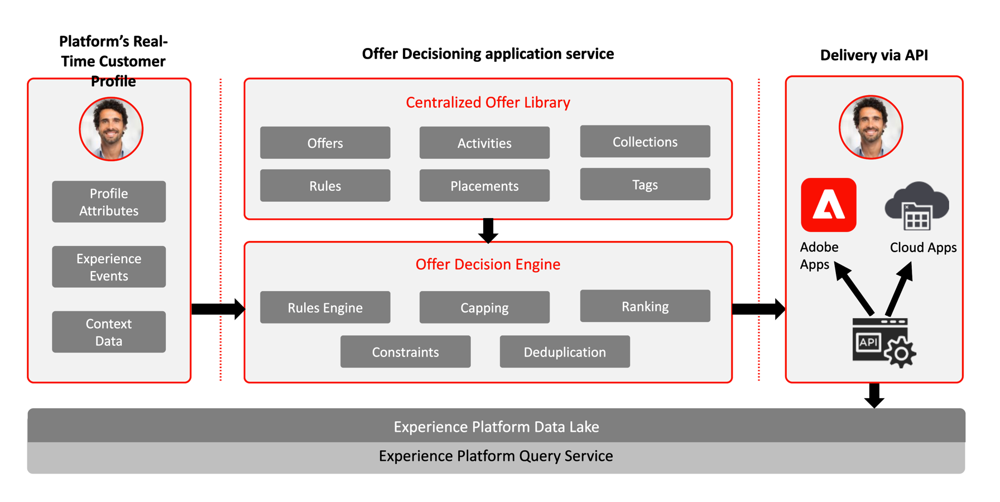

# Journey Optimizer – 意思決定管理ブループリント

[ 意思決定管理 ](https://experienceleague.adobe.com/docs/journey-optimizer/using/offer-decisioniong/get-started-decision/starting-offer-decisioning.html?lang=ja) については、次のドキュメントを参照してください。

意思決定管理に関連するガードレールについては、次のドキュメントを参照してください。 [ 意思決定管理ガードレール ](https://experienceleague.adobe.com/en/docs/journey-optimizer/using/get-started/guardrails#decision-management.html)

アドビの意思決定管理は、Adobe Journey Optimizer の一部として提供されるサービスです。このブループリントは、アプリケーションのユースケースと技術的機能の概要を示し、意思決定管理を構成する様々なアーキテクチャコンポーネントと考慮事項について詳しく説明します。

Journey Optimizer は、あらゆるタッチポイントにわたり、適切なタイミングで、顧客に最適なオファーとエクスペリエンスを提供するために使用されます。意思決定管理では、マーケティングオファーの一元化されたライブラリと、Adobe Experience Platformで作成されるリアルタイムプロファイルにルールと制約を適用する意思決定エンジンにより、パーソナライゼーションを簡単にします。 これにより、顧客に適切なオファーを適切なタイミングで簡単に送信できます。

意思決定管理機能は、次の 2 つの主要なコンポーネントで構成されます。

* 一元化オファーライブラリは、オファーを構成する様々な要素を作成および管理し、そのルールと制約を定義するインターフェイスです。
* オファー決定エンジンは、オファーを配信する適切な時間、顧客、チャネルを選択するために、Adobe Experience Platform のデータとリアルタイム顧客プロファイルおよびオファーライブラリを利用します。

意思決定管理は、エッジ上またはハブを介して、2 つの方法のいずれかでデプロイできます。これらのメソッドのそれぞれには、以下に示す各ブループリントで概要を説明するように、サービスを動作させるための特定のインターフェイスとプロトコルのセットがあります。追加の詳細は、[意思決定管理ドキュメント](https://experienceleague.adobe.com/docs/journey-optimizer/using/offer-decisioniong/api-reference/offer-delivery-api/decisioning-vs-edge-apis.html?lang=ja)でも入手することができます。

## ハブでの意思決定管理

1 つは、単一のデータセンターアーキテクチャである Adobe Experience Platform Hub を通じて行う方法です。ハブアーキテクチャは、低遅延や高スループットは要求しないが、顧客プロファイルを完全に把握する必要がある顧客体験に最適です。例えば、キオスクに対して提供されるオファー決定や、コールセンターや担当者とのやり取りなどのエージェント支援エクスペリエンスが挙げられます。 電子メール、SMS メッセージ、プッシュ通知やアウトバウンドキャンペーンに挿入されるオファーも、ハブアプローチを利用します。ハブでの意思決定管理について詳しくは、[ハブでの意思決定管理](decision-management-hub.md)ブループリントを参照してください。

* オファーの適格性は、すべての属性とエクスペリエンスイベントを含む、完全なリアルタイム顧客プロファイルに対して機能します。

### ハブでの意思決定管理のユースケース

* キオスクおよびストアエクスペリエンスに関してパーソナライズされたオファー。
* コールセンターやセールスインタラクションなど、エージェントの支援によってパーソナライズされたオファー。
* 電子メール、SMS、またはその他のアウトバウンドインタラクションに含まれるオファー。
* クロスチャネルのジャーニーの実行 - Adobe Journey Optimizer を通じて、web、モバイル、電子メールおよびその他のインタラクションチャネル間の一貫性を提供します。

### ハブでの意思決定管理に関する技術上の考慮事項

* オーディエンスメンバーシップ、属性、エクスペリエンスイベントを含む、完全なリアルタイム顧客プロファイルへのアクセス。

## エッジでの意思決定管理

2 番目のアプローチは、Experience [!DNL Edge Network] を介した方法です。これは、秒未満とミリ秒の高速なエクスペリエンスを提供するために世界中に分散した地理的に配置されたインフラストラクチャです。 レイテンシを最小限に抑えるために、消費者の地理的位置に最も近いエッジインフラストラクチャによって実行される最終消費者エクスペリエンス。Edge 上の意思決定管理は、web やモバイルのインバウンドパーソナライズ機能リクエストなどのリアルタイムの顧客体験を提供するように設計されています。ハブの意思決定管理について詳しくは、[ハブの意思決定管理](decision-management-edge.md)ブループリントを参照してください。

### エッジでの意思決定管理のユースケース

* Web またはモバイルインバウンドエクスペリエンスを使用したオンラインパーソナライズ機能。
* クロスチャネルのジャーニーの実行 - Adobe Journey Optimizer を通じて、web、モバイル、電子メールおよびその他のインタラクションチャネル間の一貫性を提供します。

### エッジに関する技術上の考慮事項に関する意思決定管理

* エッジの Real-time Profile にアクセスします。プロファイルで使用できるのは、エッジから推定されたオーディエンスとプロファイル属性のみです。

## 関連ドキュメント

* [Adobe Experience Platform](https://experienceleague.adobe.com/docs/experience-platform.html?lang=ja)
* [Adobe Journey Optimizer](https://experienceleague.adobe.com/docs/journey-optimizer.html?lang=ja)
* [Adobe Journey Optimizer 意思決定管理](https://experienceleague.adobe.com/docs/journey-optimizer/using/offer-decisioniong/get-started-decision/starting-offer-decisioning.html?lang=ja)
* [Journey Optimizer 製品説明](https://helpx.adobe.com/jp/legal/product-descriptions/adobe-journey-optimizer.html)
* [Adobe 意思決定管理製品の説明](https://helpx.adobe.com/jp/legal/product-descriptions/offer-decisioning-app-service.html)
