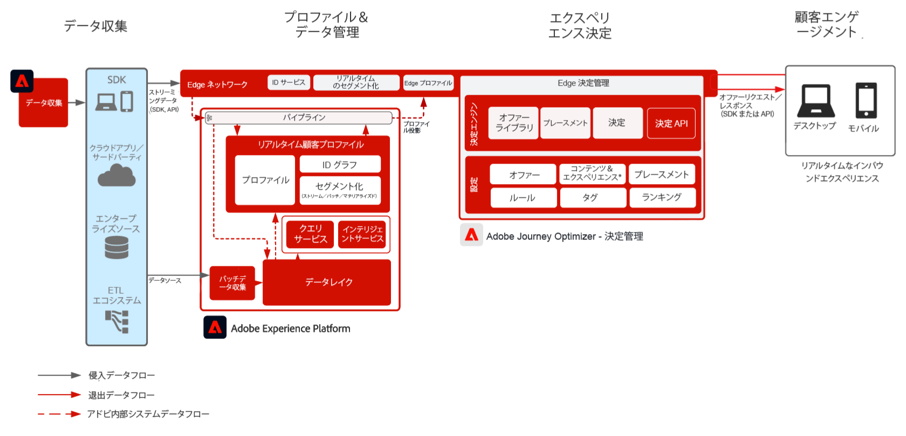
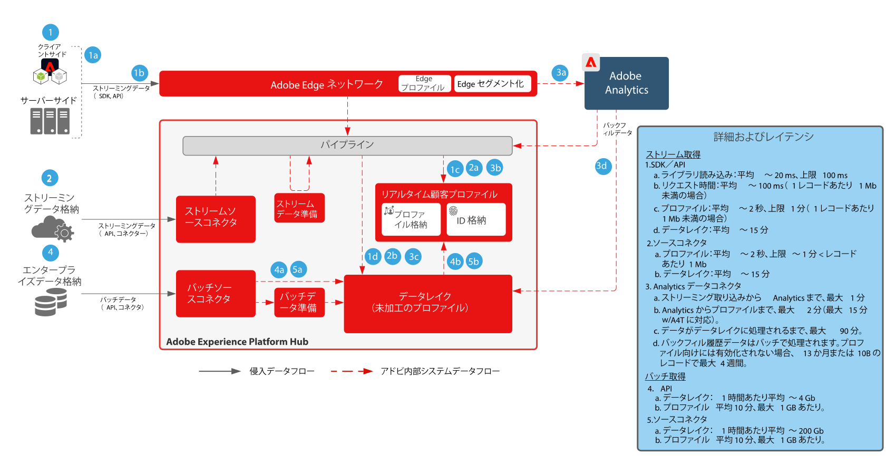
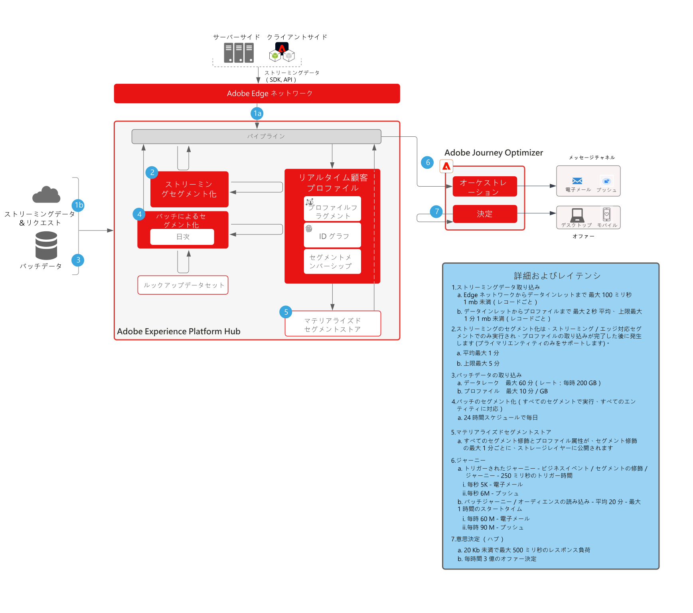

# Journey Optimizer - エッジでの意思決定管理

意思決定管理について詳しくは、製品ドキュメント[ここ](https://experienceleague.adobe.com/docs/journey-optimizer/using/offer-decisioniong/get-started-decision/starting-offer-decisioning.html?lang=ja)と、意思決定管理の概要[ここ](https://experienceleague.adobe.com/docs/blueprints-learn/architecture/customer-journeys/journey-optimizer/decision-management/decision-management-overview.html?lang=ja)を参照してください。

アドビの意思決定管理は、Adobe Journey Optimizer の一部として提供されるサービスです。このブループリントは、アプリケーションのユースケースと技術的機能の概要を示し、意思決定管理を構成する様々なアーキテクチャコンポーネントと考慮事項について詳しく説明します。

意思決定管理は、2 つの方法のいずれかでデプロイすることができます。1 つは、単一のデータセンターアーキテクチャである Adobe Experience Platform Hub を通じて行う方法です。「ハブ」アプローチでは、オファーは 2 回目の待ち時間で実行、パーソナライズ、配信されます。したがって、ハブアーキテクチャは、1 秒未満の待ち時間を必要としない顧客体験に最適です。例えば、コールセンターや対面でのやり取りなど、キオスクやエージェント支援エクスペリエンスに提供されるオファー判定が含まれます。

2 つ目のアプローチは、Experience Edge ネットワークを介したものです。Experience Edge ネットワークは、地理的にグローバルに分散されたインフラストラクチャで、1 秒未満および 1 ミリ秒の高速なエクスペリエンスを提供します。レイテンシを最小限に抑えるために、消費者の地理的位置に最も近いエッジインフラストラクチャによって実行される最終消費者エクスペリエンス。Edge 上の意思決定管理は、リアルタイムの顧客体験を提供するように設計されています。これには、Web やモバイルのインバウンドパーソナライズ機能リクエストなどのエクスペリエンスが含まれます。

このブループリントでは、Edge 上での意思決定管理の詳細を説明します。

ハブでの意思決定管理について詳しくは、[ハブでの意思決定管理](https://experienceleague.adobe.com/docs/blueprints-learn/architecture/customer-journeys/journey-optimizer/decision-management/decision-management-hub.html?lang=ja)ブループリントを参照してください。

## エッジでの意思決定管理のユースケース

* Web またはモバイルインバウンドエクスペリエンスを使用したオンラインパーソナライズ機能。
* クロスチャネルのジャーニーの実行 - Adobe Journey Optimizer を通じて、web、モバイル、電子メールおよびその他のインタラクションチャネル間の一貫性を提供します。

 

## アーキテクチャ

 

## 統合パターン

| 統合 | 説明 |
| :-- | :--- |
| [Adobe Target を使用した意思決定管理](https://experienceleague.adobe.com/docs/target/using/integrate/ajo/offer-decision.html?lang=ja) | 意思決定管理を Adobe Target と統合して、オファーを Target エクスペリエンスとしてテストおよび配信することができます。 |

## 前提条件

Adobe Experience Platform

* Journey Optimizer のデータソースを設定する前に、スキーマとデータセットをシステムに設定する必要があります。
* エクスペリエンスイベントクラスベースのスキーマの場合、ルールベースのイベントではないイベントをトリガーする場合に、「オーケストレーション eventID」フィールドグループを追加します。
* 個別のプロファイルクラスベースのスキーマの場合、「Profile test details」フィールドグループを追加して、Journey Optimizer で使用するテストプロファイルを読み込めるようにします

 

## ガードレール

* Journey Optimizer ガードレールに関しては、次の [Journey Optimizer ガードレール](https://experienceleague.adobe.com/docs/journey-optimizer/using/get-started/limitations.html?lang=ja)を参照してください。
* 意思決定管理ガードレールについては、次の[意思決定管理製品の説明](https://helpx.adobe.com/jp/legal/product-descriptions/offer-decisioning-app-service.html).を参照してください。
* 1 秒あたりのリクエスト数= 5000。
* 応答の待ち時間（250 ミリ秒未満）。
* エッジの Real-time Profile にアクセスします。プロファイルで使用できるのは、エッジから推定されたオーディエンスとプロファイル属性のみです。
* 初めてのエクスペリエンスでパーソナライズ機能が必要な場合は、フルプロファイルを利用できるので、ハブが最適です。初めてのエッジエクスペリエンスでは、エッジプロファイルがハブから同期する必要があります。したがって、エッジからの最初のエクスペリエンスには、以前にハブにアップロードされたプロファイルデータは含まれません。

### データ取り込みガードレール

 

### アクティベーションガードレール

 

## 実装パターン

* Web サイトやモバイルアプリケーションにデプロイするために Web または Mobile SDK を使用して、SDK がデプロイされた意思決定管理を実装します。
   * [Web／Mobile SDK ブループリント](https://experienceleague.adobe.com/docs/blueprints-learn/architecture/architecture-overview/deployment/websdk.html?lang=ja)
   * [WebSDK](https://experienceleague.adobe.com/docs/experience-platform/edge/personalization/offer-decisioning/offer-decisioning-overview.html?lang=ja)
   * [MobileSDK](https://aep-sdks.gitbook.io/docs/)

または

* API サーバーからサーバーへのベースの実装の場合は、Edge Network Service API を使用して、意思決定管理の直接サーバー間実装を行います。
   * [Edge Network Server API ](https://experienceleague.adobe.com/docs/journey-optimizer/using/offer-decisioniong/api-reference/offer-delivery/deliver-offers.html?lang=ja)

 

## 実装手順

### Adobe Experience Platform

#### スキーマ／データセット

1. 顧客提供データに基づき、Experience Platform で[個人プロファイル、エクスペリエンスイベントおよびマルチエンティティスキーマを設定します](https://experienceleague.adobe.com/?recommended=ExperiencePlatform-D-1-2021.1.xdm)。
1. Experience Platform で取り込む[データセットを作成します。](https://experienceleague.adobe.com/docs/platform-learn/tutorials/data-ingestion/create-datasets-and-ingest-data.html?lang=ja)
1. ガバナンス用のデータセットに、Experience Platform で[データ使用ラベルを追加します。](https://experienceleague.adobe.com/docs/platform-learn/tutorials/data-governance/classify-data-using-governance-labels.html?lang=ja)
1. 宛先のガバナンスを実施する[ポリシーを作成します。](https://experienceleague.adobe.com/docs/platform-learn/tutorials/data-governance/create-data-usage-policies.html?lang=ja)

#### プロファイル／ID

1. [任意の顧客専用の名前空間を作成します。](https://experienceleague.adobe.com/docs/platform-learn/tutorials/identities/label-ingest-and-verify-identity-data.html?lang=ja)
1. [スキーマに ID を追加します](https://experienceleague.adobe.com/docs/platform-learn/tutorials/identities/label-ingest-and-verify-identity-data.html?lang=ja)。
1. [プロファイル用のスキーマおよびデータセットを有効にします](https://experienceleague.adobe.com/docs/platform-learn/tutorials/profiles/bring-data-into-the-real-time-customer-profile.html?lang=ja)。
1. [!UICONTROL リアルタイム顧客プロファイル]の様々な表示用に[結合ポリシーを設定](https://experienceleague.adobe.com/docs/platform-learn/tutorials/profiles/create-merge-policies.html?lang=ja)します（オプション）。
1. ジャーニー使用状況用のセグメントを作成します。

#### ソース／宛先

1. ストリーミング API およびソースコネクタを使用して、[Experience Platform にデータを取り込みます。](https://experienceleague.adobe.com/?recommended=ExperiencePlatform-D-1-2020.1.dataingestion&amp;lang=ja)

## 関連ドキュメント

* [Adobe Experience Platform](https://experienceleague.adobe.com/docs/experience-platform.html?lang=ja)
* [Adobe Journey Optimizer](https://experienceleague.adobe.com/docs/journey-optimizer.html?lang=ja)
* [Adobe Journey Optimizer 意思決定管理](https://experienceleague.adobe.com/docs/journey-optimizer/using/offer-decisioniong/get-started-decision/starting-offer-decisioning.html?lang=ja)
* [Journey Optimizer 製品説明](https://helpx.adobe.com/jp/legal/product-descriptions/adobe-journey-optimizer.html)
* [Adobe 意思決定管理製品の説明](https://helpx.adobe.com/jp/legal/product-descriptions/offer-decisioning-app-service.html)
