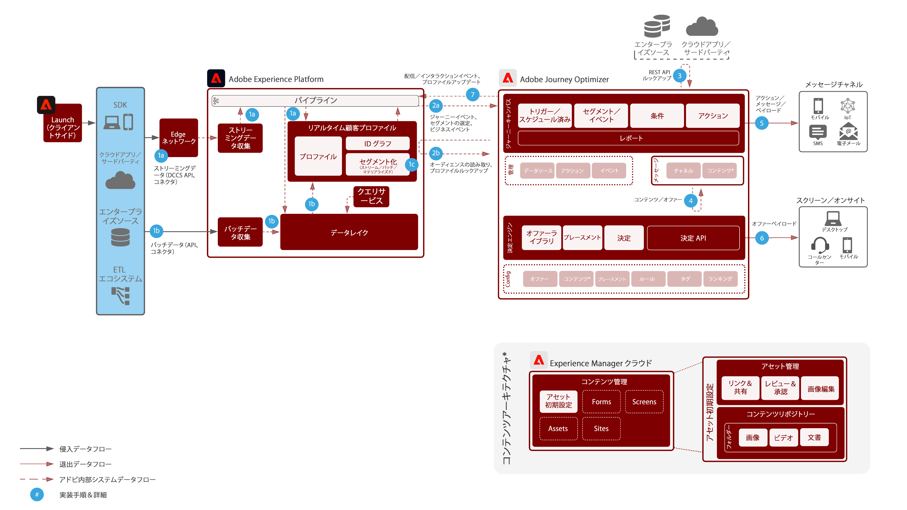

# Journey Optimizer

Adobe Journey Optimizer は、マーケティングチームが顧客行動にリアルタイムで反応し、顧客が場所を問わずにアクセスできることを目的に構築されたシステムです。データ管理機能が Adobe Experience Platform に移行したことで、マーケティングチームは、世界最高クラスのカスタマージャーニーと、パーソナライズされたやり取りを生み出すことに全力で取り組むことができます。このブループリントは、アプリケーションの技術的機能の概要を説明し、Adobe Journey Optimizer を構成する様々なアーキテクチャコンポーネントについて深く掘り下げます。

## ユースケース

* トリガーされるメッセージ
* 登録確認
* 買い物かごおよび申請フォームの破棄
* 場所でトリガーされるメッセージ

## アーキテクチャ

## 統合パターン

* Adobe Experience Platform -> Journey Optimizer

## 前提条件

1. 顧客は、有効な IMS 組織を持つ Experience Cloud のプロビジョニングが必要です
1. モバイルプッシュ

* 顧客は、モバイルデベロッパーを使用してアプリを作成できる必要があります
* Adobe Experience Platform Mobile SDK
* データ収集
   * モバイルタグのプロパティ
      * 拡張機能：
         * Adobe Journey Optimizer 拡張機能
         * Adobe Experience Platform Edge Network
         * ID
         * モバイルコア
         * プロファイル
   * アプリの設定
   * データストリーム
      * Experience Platform 向けに有効化
      * イベントデータセット - 一般的なモバイル行動の収集に使用
      * プロファイルデータセット - AJO プッシュプロファイルデータセット（異なるものは使用できません）

## ガードレール

* Journey Optimizer [LINK](https://experienceleague.adobe.com/docs/journeys/using/starting-with-journeys/limitations.html?lang=ja) のガードレールの詳細については、リンクを参照してください。
* バッチセグメント - 認定ユーザーの毎日のボリュームを確実に把握し、宛先システムがジャーニーごと、およびすべてのジャーニーのバーストスループットを処理するために必要です
* ストリーミングセグメント - ジャーニーごと、およびすべてのジャーニーの毎日のストリーミング認定ボリュームと共に、プロファイル認定の最初のバーストを処理するために必要です
* プロファイル更新アクティビティ - リアルタイム顧客プロファイルは、ジャーニー内からネイティブに更新できます。プロファイル格納への更新処理には、最大 1 分の遅延があります
* ビジネスイベント - JO システムへの外部呼び出しに基づいて、読み取りセグメントベースのジャーニーをトリガーして開始できます
* ネイティブでは、メッセージでの Offer Decisioning のみサポートします。ネイティブアクションによる将来的なサポート
* サポートされるチャネル：
   * 電子メール
   * プッシュ（FCM／APNS）
   * Rest API エンドポイント
* 1 秒あたり 5,000 件のイベントを処理し、水平方向にスケーリング（ウォレットは制限あり）
* A/B テストは、2 つの配信を使用して実行され、QS または CJA を使用して結果を決定します
* Litmus 統合 - 統合を活用するには、Litmus のアカウントが必要です

## 実装手順

### Adobe Experience Platform

#### スキーマ／データセット

1. 顧客提供データに基づき、Experience Platform で[個人プロファイル、エクスペリエンスイベントおよびマルチエンティティスキーマを設定します](https://experienceleague.adobe.com/?recommended=ExperiencePlatform-D-1-2021.1.xdm)。
1. broadLog、trackingLog、配信不能アドレスおよびプロファイル環境設定用に Adobe Campaign スキーマを作成します（オプション）。
1. Experience Platform で取り込む[データセットを作成します。](https://experienceleague.adobe.com/docs/platform-learn/tutorials/data-ingestion/create-datasets-and-ingest-data.html?lang=ja)
1. ガバナンス用のデータセットに、Experience Platform で[データ使用ラベルを追加します。](https://experienceleague.adobe.com/docs/platform-learn/tutorials/data-governance/classify-data-using-governance-labels.html?lang=ja)
1. 宛先のガバナンスを実施する[ポリシーを作成します。](https://experienceleague.adobe.com/docs/platform-learn/tutorials/data-governance/create-data-usage-policies.html?lang=ja)

#### プロファイル／ID

1. [任意の顧客専用の名前空間を作成します。](https://experienceleague.adobe.com/docs/platform-learn/tutorials/identities/label-ingest-and-verify-identity-data.html?lang=ja)
1. [スキーマに ID を追加します](https://experienceleague.adobe.com/docs/platform-learn/tutorials/identities/label-ingest-and-verify-identity-data.html)。
1. [プロファイル用のスキーマおよびデータセットを有効にします](https://experienceleague.adobe.com/docs/platform-learn/tutorials/profiles/bring-data-into-the-real-time-customer-profile.html?lang=ja)。
1. [!UICONTROL リアルタイム顧客プロファイル]の様々な表示用に[結合ポリシーを設定します](https://experienceleague.adobe.com/docs/platform-learn/tutorials/profiles/create-merge-policies.html?lang=ja)（オプション）。
1. キャンペーン使用状況用のセグメントを作成します。

#### ソース／宛先

1. ストリーミング API およびソースコネクタを使用して、[Experience Platform にデータを取り込みます](https://experienceleague.adobe.com/?recommended=ExperiencePlatform-D-1-2020.1.dataingestion&amp;lang=ja)。 1. Adobe Campaign で使用する [!DNL Azure] Blob ストレージ宛先を設定します。

#### モバイルアプリデプロイメント

1. Adobe Campaign Classic 用の Adobe Campaign SDK または Adobe Campaign Standard 用の Experience Platform SDK を実装します。Experience Platform Launch がある場合は、Adobe Campaign Classic または Adobe Campaign Standard 拡張と Experience Platform SDK を使用することをお勧めします。

### Journey Orchestration

1. カスタマージャーニーを開始するために使用されるストリーミングデータは、最初に Journey Optimizer 内で設定して、オーケストレーション ID を取得する必要があります。このオーケストレーション ID は、取り込みに使用するためにデベロッパーに供給されます。
1. 外部データソースを設定します。
1. カスタムアクションを設定します。

## 関連ドキュメント

* [Adobe Experience Platform ドキュメント](https://experienceleague.adobe.com/docs/experience-platform.html?lang=ja)
* [Journey Optimizer ドキュメント](https://experienceleague.adobe.com/docs/journey-optimizer/using/ajo-home.html?lang=ja)
* [Experience Platform Launch ドキュメント](https://experienceleague.adobe.com/docs/launch.html?lang=ja)
* [Experience Platform Mobile SDK ドキュメント](https://experienceleague.adobe.com/docs/mobile.html?lang=ja)
