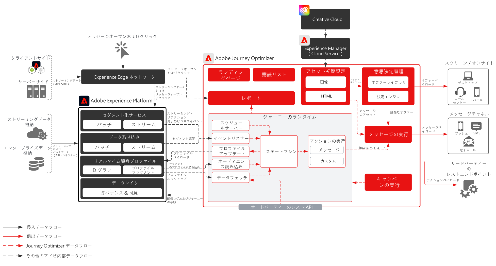

# Journey Optimizer

Adobe Journey Optimizer は、マーケティングチームが顧客行動にリアルタイムで反応し、顧客が場所を問わずにアクセスできることを目的に構築されたシステムです。データ管理機能が Adobe Experience Platform に移行したことで、マーケティングチームは、世界最高クラスのカスタマージャーニーと、パーソナライズされたやり取りを生み出すことに全力で取り組むことができます。このブループリントは、アプリケーションの技術的機能の概要を説明し、Adobe Journey Optimizer を構成する様々なアーキテクチャコンポーネントについて深く掘り下げます。

 

## ユースケース

* トリガーされるメッセージ
* 「ようこそ」と「登録」の確認
* 買い物かごおよび申請フォームの破棄
* 場所でトリガーされるメッセージ
* 競技場での体験
* 旅行と接客の、到着前および滞在のエクスペリエンス

 

## アーキテクチャ

 

## ブループリントのシナリオ

| シナリオ | 説明 | 機能 |
| :-- | :--- | :--- |
| [サードパーティのメッセージ](3rd-party-messaging.md) | Adobe Journey Optimizer をサードパーティのメッセージングシステムと共に使用して、パーソナライズされた通信を調整および送信する方法を示します | 顧客のブランドや企業とのインタラクションに応じて、1：1 のパーソナライズされたコミュニケーションを提供します  注意点： <ul><li>サードパーティシステムは、認証のためにベアラートークンをサポートする必要があります。</li><li>マルチテナントアーキテクチャが原因で静的 IP がサポートされません</li><li>1 秒あたりの API 呼び出しに関しては、サードパーティシステムのアーキテクチャの制約にご注意ください。顧客が Journey Optimizer からのボリュームをサポートするために、サードパーティベンダーから追加のボリュームを購入する必要が生じる場合があります</li><li>メッセージまたはペイロードの Offer Decisioning をサポートしていません</li></ul> |

 

## 統合パターン

| 統合 | 説明 | 機能 |
| :-- | :--- | :--- |
| [Journey Optimizer と Adobe Campaign](ajo-and-campaign.md) | Adobe Journey Optimizer を使用して、リアルタイム顧客プロファイルを利用して 1:1 エクスペリエンスの調整をおこない、ネイティブの Adobe Campaign トランザクションメッセージングシステムを活用してメッセージを送信する方法を示します | リアルタイム顧客プロファイルと Journey Optimizer の機能を活用し、瞬時のエクスペリエンスで調整しながら、Adobe Campaign のネイティブリアルタイムメッセージング機能を利用して、ラストマイルのコミュニケーションを実現します。  注意点： <ul><li>Campaign アプリケーションは、v7 ビルドが 21.1 より上か v8 のどちらかである必要があります</li><li>メッセージングスループット</li><ul><li>Campaign v7 - 1 時間あたり最大 50,000</li><li>Campaign v8 - 1 時間あたり最大 100,000</li><li>Campaign Standard - 1 時間あたり最大 50,000</li></ul><li>スロットルは実行されないので、ユースケースではエンタープライズアーキテクトによる技術的な検証が必要です</li><li>Campaign から送信されたメッセージの Offer Decisioning を利用するサポートはありません</li></ul> |

 

## 前提条件

Adobe Experience Platform

* Journey Optimizer のデータソースを設定する前に、スキーマとデータセットをシステムに設定する必要があります。
* エクスペリエンスイベントクラスベースのスキーマの場合、ルールベースのイベントではないイベントをトリガーする場合に、を追加します エクスペリエンスイベントクラスベースのスキーマでは、ルールベースのイベントではないイベントをトリガーさせたい場合は「オーケストレーションイベント ID」フィールドグループを追加します。
* 個別のプロファイルクラスベースのスキーマの場合、「Profile test details」フィールドグループを追加して、Journey Optimizer で使用するテストプロファイルを読み込めるようにします

電子メール

* メッセージ送信に使用するサブドメインの準備が整っている必要があります
* サブドメインは、アドビに完全にデリゲートすることも（推奨）、CNAME を使用してアドビ固有の DNS サーバー（カスタム）を指すこともできます
* Google TXT レコードは、配信品質を高めるために各サブドメインに必要

モバイルプッシュ

* 顧客は、モバイルデベロッパーを使用してアプリを作成できる必要があります
* Adobe Experience Platform Mobile SDK

 

## ガードレール

[Journey Optimizer ガードレール製品リンク](https://experienceleague.adobe.com/docs/journeys/using/starting-with-journeys/limitations.html?lang=ja)

上記のリンクには記載されていないことに注意してください。

* バッチセグメント - 認定ユーザーの毎日のボリュームを確実に把握し、宛先システムがジャーニーごと、およびすべてのジャーニーのバーストスループットを処理するために必要です
* ストリーミングセグメント - ジャーニーごと、およびすべてのジャーニーの毎日のストリーミング認定ボリュームと共に、プロファイル認定の最初のバーストを処理するために必要です
* メッセージでのみの Offer Decisioning をネイティブでサポート（カスタムアクションなし）
* サポートされるメッセージタイプ：
   * 電子メール
   * プッシュ（FCM／APNS）
   * カスタムアクション（Rest API を経由する）
* サードパーティシステムへのアウトバウンド統合
   * インフラはマルチテナントであるため、単一の静的 IP をサポートしていません（すべてのデータセンター IP を許可リストに含める必要があります）
   * カスタムアクションは POST メソッドと PUT メソッドのみ対応
   * ユーザー/パスまたは認証トークンを使用した認証
* Adobe Experience Platform や Journey Optimizer の個々のコンポーネントをパッケージ化して、様々なサンドボックス間で移動させることはできません。新しい環境に再実装する必要があります

### データ取り込みガードレール

 

### アクティベーションガードレール

 

## 実装手順

### Adobe Experience Platform

#### スキーマ／データセット

1. 顧客提供データに基づき、Experience Platform で[個人プロファイル、エクスペリエンスイベントおよびマルチエンティティスキーマを設定します](https://experienceleague.adobe.com/?recommended=ExperiencePlatform-D-1-2021.1.xdm)。
1. Experience Platform で取り込む[データセットを作成します。](https://experienceleague.adobe.com/docs/platform-learn/tutorials/data-ingestion/create-datasets-and-ingest-data.html?lang=ja)
1. ガバナンス用のデータセットに、Experience Platform で[データ使用ラベルを追加します。](https://experienceleague.adobe.com/docs/platform-learn/tutorials/data-governance/classify-data-using-governance-labels.html?lang=ja)
1. 宛先のガバナンスを実施する[ポリシーを作成します。](https://experienceleague.adobe.com/docs/platform-learn/tutorials/data-governance/create-data-usage-policies.html?lang=ja)

#### プロファイル／ID

1. [任意の顧客専用の名前空間を作成します。](https://experienceleague.adobe.com/docs/platform-learn/tutorials/identities/label-ingest-and-verify-identity-data.html?lang=ja)
1. [スキーマに ID を追加します](https://experienceleague.adobe.com/docs/platform-learn/tutorials/identities/label-ingest-and-verify-identity-data.html?lang=ja)。
1. [プロファイル用のスキーマおよびデータセットを有効にします](https://experienceleague.adobe.com/docs/platform-learn/tutorials/profiles/bring-data-into-the-real-time-customer-profile.html?lang=ja)。
1. [!UICONTROL リアルタイム顧客プロファイル]の様々な表示用に[結合ポリシーを設定](https://experienceleague.adobe.com/docs/platform-learn/tutorials/profiles/create-merge-policies.html?lang=ja)します（オプション）。
1. ジャーニー使用状況用のセグメントを作成します。

#### ソース／宛先

1. ストリーミング API およびソースコネクタを使用して、[Experience Platform にデータを取り込みます。](https://experienceleague.adobe.com/?recommended=ExperiencePlatform-D-1-2020.1.dataingestion&amp;lang=ja)

### Journey Optimizer

1. Experience Platform データソースを設定し、カスタマージャーニーの開始に使用する profileStreaming データの一部としてキャッシュするフィールドを決定します。このデータは、まず Journey Optimizer 内で設定され、オーケストレーションIDを取得する必要があります。このオーケストレーション ID は、取り込みに使用するためにデベロッパーに供給されます
1. 外部データソースを設定します。
1. カスタムアクションを設定します。

### モバイルプッシュ設定

1. Experience Platform Mobile SDK を実装して、プッシュトークンとログイン情報を収集し、既知の顧客プロファイルに結び付けます
1. Adobe タグを活用し、次の拡張子を持つモバイルプロパティを作成します。
1. Adobe Journey Optimizer
1. Adobe Experience Platform Edge Network
1. IDEdge ネットワーク用
1. モバイルコア
1. モバイルアプリデプロイメント用と Web デプロイメント用の専用のデータストリームがあることを確認
1. 詳しくは、 [Adobe Journey Optimizer Mobile ガイド](https://aep-sdks.gitbook.io/docs/using-mobile-extensions/adobe-journey-optimizer) を参照

## 関連ドキュメント

* [Experience Platform ドキュメント](https://experienceleague.adobe.com/docs/experience-platform.html?lang=ja)
* [Experience Platform タグドキュメント](https://experienceleague.adobe.com/docs/experience-platform/tags/home.html?lang=ja)
* [Experience Platform Mobile SDK ドキュメント](https://experienceleague.adobe.com/docs/mobile.html?lang=ja)
* [Journey Optimizer ドキュメント](https://experienceleague.adobe.com/docs/journey-optimizer/using/ajo-home.html?lang=ja)
* [Journey Optimizer 製品説明](https://helpx.adobe.com/jp/legal/product-descriptions/adobe-journey-optimizer.html)
