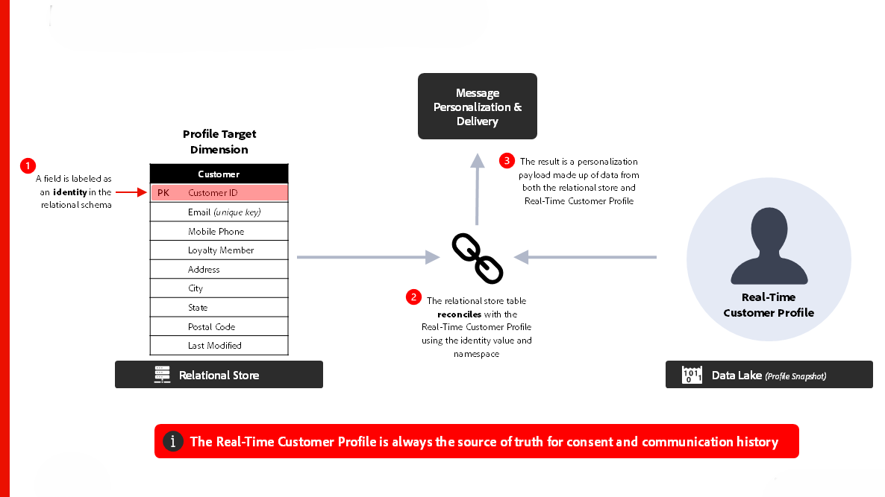

# [!DNL Journey Optimizer] - Campaign オーケストレーションのブループリント

AJO キャンペーンオーケストレーションを使用すると、マーケターは、メール、SMS、プッシュ、ダイレクトメールなどのアウトバウンドチャネルをまたいで、スケジュールされた、オーディエンスベースの複数手順のコミュニケーションを設計および実行できます。 リアルタイム顧客プロファイルのリアルタイムデータを使用して個々の顧客の行動に対応するAJOのジャーニーとは異なり、キャンペーンは、計画された間隔でオーディエンスをターゲットにするマーケティング活動を調整します。 キャンペーンとジャーニーを組み合わせることで補完的なアプローチが提供されます。キャンペーンはブランドエンゲージメント戦略を推進し、ジャーニーはパーソナライズされたレスポンシブなエクスペリエンスを提供します。

 

## アーキテクチャ

 

### メッセージ実行アーキテクチャ

 

### リレーショナルストア – データ取り込み遅延

 

## ジャーニーのアーキテクチャに関する考慮事項

- **データアーキテクチャ**:AJO Campaign Orchestration は、その下にあるリレーショナルデータベースを利用して、オーディエンスの構築とオーケストレーションを行います
- **オーディエンスポータル統合**：リアルタイム顧客プロファイル内でオーディエンスポータルとネイティブに統合し、既存のオーディエンスから読み取ることも、キャンペーンを作成する際に新しいオーディエンスをに保存することもできます
- **オンデマンドのオーディエンス作成**：緊急のマーケティングユースケースに対してオーディエンスをすぐに作成、評価および実行する
- **リアルタイム顧客プロファイル統合：同意** 通信履歴の情報源。パーソナライゼーションのための「skinny profile」デザインをサポート
- **マルチエンティティメッセージ送信：1 回の配信でプロファイルごとに複数のメッセージを送信する機能（例：予約ごとに 1 つのメッセージを顧客のメールアドレスに送信する）**
- **マルチエンティティのセグメント化**：リレーショナルストア内の任意のエンティティ（製品、在庫、計画など）からオーディエンスの作成を開始します。

 

## ガードレール

[&#x200B; 調整されたキャンペーンの製品リンク &#x200B;](https://experienceleague.adobe.com/ja/docs/journey-optimizer/using/campaigns/orchestrated-campaigns/guardrails)

[&#x200B; ガードレールとエンドツーエンドの待ち時間のガイダンス &#x200B;](https://experienceleague.adobe.com/docs/blueprints-learn/architecture/architecture-overview/deployment/guardrails)

 

## 関連ドキュメント

- [[!DNL Journey Optimizer]  調整されたキャンペーン &#x200B;](https://experienceleague.adobe.com/en/docs/journey-optimizer/using/campaigns/orchestrated-campaigns/orchestrated-campaigns-landing-page.html)
- [[!DNL Experience Platform]  ドキュメント &#x200B;](https://experienceleague.adobe.com/docs/experience-platform.html?lang=ja)
- [[!DNL Experience Platform]  タグのドキュメント &#x200B;](https://experienceleague.adobe.com/docs/experience-platform/tags/home.html?lang=ja)
- [[!DNL Experience Platform Mobile SDK]  ドキュメント &#x200B;](https://experienceleague.adobe.com/docs/mobile.html?lang=ja)
- [[!DNL Journey Optimizer]  ドキュメント &#x200B;](https://experienceleague.adobe.com/docs/journey-optimizer/using/ajo-home.html?lang=ja)
- [[!DNL Journey Optimizer]  製品の説明 &#x200B;](https://helpx.adobe.com/jp/legal/product-descriptions/adobe-journey-optimizer.html)