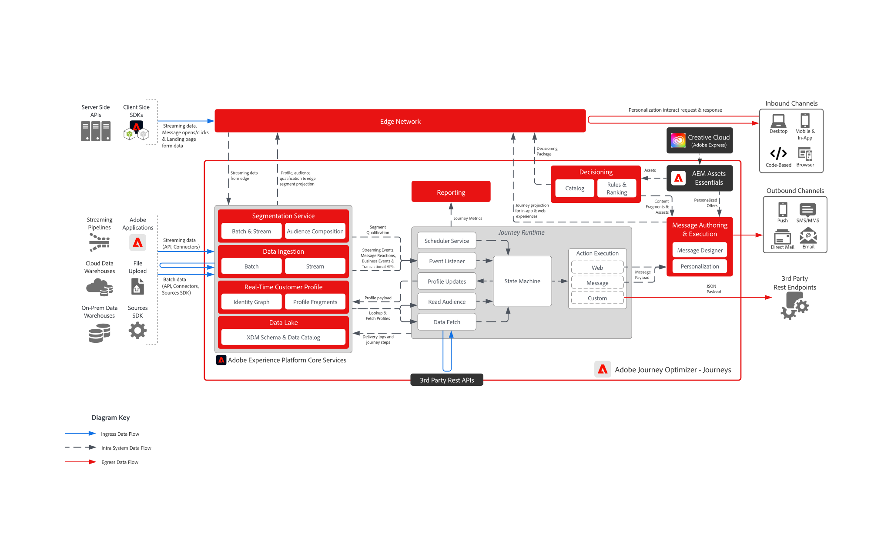

# [!DNL Journey Optimizer] - ジャーニーブループリント

Adobe Journey Optimizer ジャーニーは、個々の顧客の行動に基づいてパーソナライズされた複数のステップのエクスペリエンスを提供する、リアルタイムのイベント駆動型ワークフローです。 メール、SMS、プッシュ通知、アプリ内メッセージ、コードベースのエクスペリエンス、カスタム API ベースの統合など、様々なチャネルをサポートしており、ブランドは好みのタッチポイントでコンテキストに沿って顧客を引き付けることができます。

 

## アーキテクチャ

 

## ジャーニーのアーキテクチャに関する考慮事項

- **プロファイルの鮮度**:AJOのジャーニーは、顧客プロファイルのリアルタイム更新に依存しています。 Adobe Experience Platform（AEP）にフィードするデータソースが、プロファイルの精度を維持するために、低遅延の取り込みに対して設定されていることを確認します。
- **スケーラブルなイベント処理：** インフラストラクチャが大量のジャーニートリガーおよびメッセージ配信を処理できるようにします。
- **モジュール型統合：** AJOを外部システムと接続して動的なパーソナライゼーションを実現する API およびカスタムアクションを設計します。
- **ID 解決**：デバイスやチャネルをまたいで顧客 ID を正確に結び付けることが重要です。 ID の連携の誤りは、ジャーニーの破損やジャーニーの誤りを招く可能性があります。
- **セグメントの選定タイミング**：オーディエンスベースのジャーニーは、セグメントメンバーシップに依存します。 セグメントの評価頻度と、そのタイミングがジャーニーのエントリとパーソナライゼーションに与える影響を理解します。
- **ジャーニーエントリ条件**: プロファイルがジャーニーにエントリするには、特定の条件を満たす必要があります。 これらの条件は、意図しない除外や重複を避けるために慎重に設計する必要があります。
- **オーディエンスの評価と待ち時間**：オーディエンスを読み取りステップは、Adobe Experience Platform内のセグメント評価に依存しますが、リアルタイムで行われない場合があります。 オーディエンスの選定の遅延を回避し、タイムリーにパーソナライゼーションを行うために、評価頻度と待ち時間を認識したアーキテクトジャーニーを作成します。

 

## ガードレール

[[!DNL Journey Optimizer]  ガードレール製品リンク ](https://experienceleague.adobe.com/en/docs/journey-optimizer/using/get-started/guardrails.html)

[ ガードレールとエンドツーエンドの待ち時間のガイダンス ](https://experienceleague.adobe.com/docs/blueprints-learn/architecture/architecture-overview/deployment/guardrails.html)

 

## 関連ドキュメント

- [[!DNL Experience Platform]  ドキュメント ](https://experienceleague.adobe.com/docs/experience-platform.html?lang=ja)
- [[!DNL Experience Platform]  タグのドキュメント ](https://experienceleague.adobe.com/docs/experience-platform/tags/home.html?lang=ja)
- [[!DNL Experience Platform Mobile SDK]  ドキュメント ](https://experienceleague.adobe.com/docs/mobile.html)
- [[!DNL Journey Optimizer]  ドキュメント ](https://experienceleague.adobe.com/docs/journey-optimizer/using/ajo-home.html)
- [[!DNL Journey Optimizer]  製品の説明 ](https://helpx.adobe.com/jp/legal/product-descriptions/adobe-journey-optimizer.html)