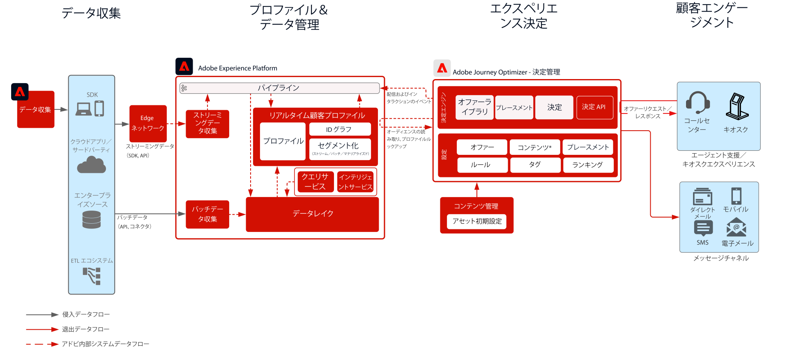

# Journey Optimizer — ハブのOffer decisioning

Adobe判定管理は、Adobe Journey Optimizerの一部として提供されるサービスです。 このブループリントは、アプリケーションの使用例と技術的機能の概要を示し、Offer decisioningを構成する様々なアーキテクチャコンポーネントと考慮事項について詳しく説明します。

判定管理は、2 つの方法のいずれかでデプロイできます。 1 つ目は、中央のデータセンターアーキテクチャであるAdobe Experience Platformハブを通じて行う方法です。 「ハブ」アプローチでは、オファーは、500 ミリ秒を超える待ち時間で実行、パーソナライズ、配信されます。 したがって、ハブアーキテクチャは、1 秒未満の待ち時間を要求しない顧客体験に最適です。例えば、コールセンターや人とのやり取りなど、キオスクやエージェントが支援するエクスペリエンスに提供するオファーの決定などです。 E メールやアウトバウンドキャンペーンに挿入されるオファーも、ハブアプローチを利用します。

2 つ目のアプローチは、Experience Edge ネットワークを介して行われます。Experience Edge ネットワークは、地理的にグローバルに分散されたインフラストラクチャで、2 秒および 1 ミリ秒の高速なエクスペリエンスを提供します。 待ち時間を最小限に抑えるために、消費者の地域に最も近いエッジインフラストラクチャによって実行されるエンドコンシューマーエクスペリエンス。 Edge 上の決定管理は、Web やモバイルのインバウンドパーソナライゼーションリクエストなどのリアルタイムのコンシューマーエクスペリエンスを提供するように設計されています。

このブループリントは、ハブでの決定管理の詳細をカバーします。

エッジでの決定管理について詳しくは、 [エッジでの決定管理](https://experienceleague.adobe.com/docs/blueprints-learn/architecture/customer-journeys/journey-optimizer/offer-decisioning/offers-edge.html?lang=en) ブループリント。

決定管理について詳しくは、製品ドキュメントを参照してください。 [ここ](https://experienceleague.adobe.com/docs/journey-optimizer/using/offer-decisioniong/get-started-decision/starting-offer-decisioning.html)

## ユースケース

* キオスクおよびストアエクスペリエンスでパーソナライズされたオファー。
* コールセンターやセールスインタラクションなど、エージェントの支援によってパーソナライズされたオファー。
* E メール、SMS、またはその他のアウトバウンドインタラクションに含まれるオファー。
* クロスチャネルのジャーニー実行 — Adobe Journey Optimizerを通じて、Web、モバイル、E メールおよびその他のインタラクションチャネル間の一貫性を提供します。

 

## アーキテクチャ

 

## 統合パターン

| 統合 | 説明 |
| :-- | :--- |
| [Adobe Targetとのoffer decisioning](https://experienceleague.adobe.com/docs/target/using/integrate/ajo/offer-decision.html) | offer decisioningをAdobe Targetと統合して、オファーを Target エクスペリエンスとしてテストおよび配信できます。 |

## 前提条件

Adobe Experience Platform

* Journey Optimizer のデータソースを設定する前に、スキーマとデータセットをシステムに設定する必要があります。
* エクスペリエンスイベントクラスベースのスキーマの場合、ルールベースのイベントではないイベントをトリガーする場合に、を追加します エクスペリエンスイベントクラスベースのスキーマでは、ルールベースのイベントではないイベントをトリガーさせたい場合は「オーケストレーションイベント ID」フィールドグループを追加します。
* 個別のプロファイルクラスベースのスキーマの場合、「Profile test details」フィールドグループを追加して、Journey Optimizer で使用するテストプロファイルを読み込めるようにします

 

## ガードレール

* Journey Optimizer Guardraul については、次を参照してください。 [Journey Optimizer Guardrails](https://experienceleague.adobe.com/docs/journey-optimizer/using/get-started/limitations.html)
* offer decisioningガードレールについては、次を参照してください。 [offer decisioning製品の説明](https://helpx.adobe.com/legal/product-descriptions/offer-decisioning-app-service.html).

### データ取り込みガードレール

 

### アクティベーションガードレール

 

## 実装パターン

* との直接統合により、E メール、SMS、アウトバウンドチャネルで実装。 [Adobe Journey Optimizer](https://experienceleague.adobe.com/docs/journey-optimizer/using/offer-decisioniong/get-started-decision/offers-e2e.html).
* サーバー API ベースのOffer decisioningの実装の場合、 [判定 API](https://experienceleague.adobe.com/docs/journey-optimizer/using/offer-decisioniong/api-reference/offer-delivery/decisioning-vs-edge-apis.html).
* メッセージ配信アプリケーションにオファーを一括で配信するバッチベースの決定を実装するには、 [バッチ判定 API](https://experienceleague.adobe.com/docs/journey-optimizer/using/offer-decisioniong/api-reference/offer-delivery/batch-decisioning-api.html).
* エッジベースのリアルタイムエクスペリエンスの場合は、Web/モバイル SDK または Edge Decisioning API を使用します ( [Edge ブループリントのoffer decisioning](https://experienceleague.adobe.com/docs/blueprints-learn/architecture/customer-journeys/journey-optimizer/offer-decisioning/offers-edge.html).
 

## 実装手順

### Adobe Experience Platform

#### スキーマ／データセット

1. 顧客提供データに基づき、Experience Platform で[個人プロファイル、エクスペリエンスイベントおよびマルチエンティティスキーマを設定します](https://experienceleague.adobe.com/?recommended=ExperiencePlatform-D-1-2021.1.xdm)。
1. Experience Platform で取り込む[データセットを作成します。](https://experienceleague.adobe.com/docs/platform-learn/tutorials/data-ingestion/create-datasets-and-ingest-data.html?lang=ja)
1. ガバナンス用のデータセットに、Experience Platform で[データ使用ラベルを追加します。](https://experienceleague.adobe.com/docs/platform-learn/tutorials/data-governance/classify-data-using-governance-labels.html?lang=ja)
1. 宛先のガバナンスを実施する[ポリシーを作成します。](https://experienceleague.adobe.com/docs/platform-learn/tutorials/data-governance/create-data-usage-policies.html?lang=ja)

#### プロファイル／ID

1. [任意の顧客専用の名前空間を作成します。](https://experienceleague.adobe.com/docs/platform-learn/tutorials/identities/label-ingest-and-verify-identity-data.html?lang=ja)
1. [スキーマに ID を追加します](https://experienceleague.adobe.com/docs/platform-learn/tutorials/identities/label-ingest-and-verify-identity-data.html)。
1. [プロファイル用のスキーマおよびデータセットを有効にします](https://experienceleague.adobe.com/docs/platform-learn/tutorials/profiles/bring-data-into-the-real-time-customer-profile.html?lang=ja)。
1. [!UICONTROL リアルタイム顧客プロファイル]の様々な表示用に[結合ポリシーを設定](https://experienceleague.adobe.com/docs/platform-learn/tutorials/profiles/create-merge-policies.html?lang=ja)します（オプション）。
1. ジャーニー使用状況用のセグメントを作成します。

#### ソース／宛先

1. ストリーミング API およびソースコネクタを使用して、[Experience Platform にデータを取り込みます。](https://experienceleague.adobe.com/?recommended=ExperiencePlatform-D-1-2020.1.dataingestion&amp;lang=ja)

## 関連ドキュメント

* [Adobe Experience Platform](https://experienceleague.adobe.com/docs/experience-platform.html)
* [Adobe Journey Optimizer](https://experienceleague.adobe.com/docs/journey-optimizer.html)
* [Adobe Journey Optimizer Decision Management](https://experienceleague.adobe.com/docs/journey-optimizer/using/offer-decisioniong/get-started-decision/starting-offer-decisioning.html)
* [Adobe Journey Optimizer Product Description](https://helpx.adobe.com/legal/product-descriptions/adobe-journey-optimizer.html)
* [AdobeOffer decisioningの製品説明](https://helpx.adobe.com/legal/product-descriptions/offer-decisioning-app-service.html)
