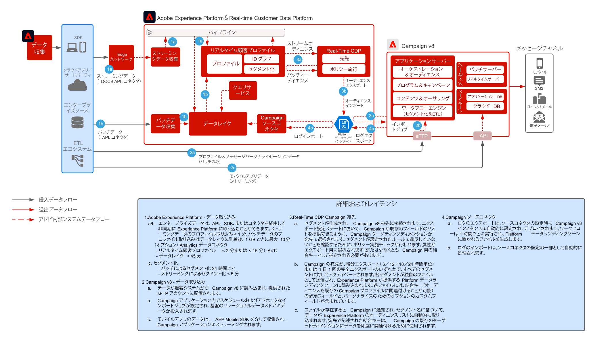

# Real-Time CDPとAdobe Campaign v8 の統合パターン

Adobe Experience Platform とそのリアルタイム顧客プロファイル、および一元化されたセグメント化ツールを Adobe Campaign と併用して、パーソナライズされた会話を提供する方法を紹介します。

 

## アプリケーション

* Adobe Experience PlatformReal-Time CDP
* Adobe Campaign v8

 

## アーキテクチャ

 

## 前提条件

* 顧客は、有効な IMS 組織を持つ Experience Cloud のプロビジョニングが必要です
* Adobe Experience Platformと Campaign を同じ IMS Org で 1 回のログイン URL 用にプロビジョニングすることをお勧めします
* 顧客は Campaign の V8 インスタンスをプロビジョニングする必要がある
* お客様は、RTCDP、ソース、宛先に対する資格を持ち、アクセス権を持っている必要があります。
* Adobe Campaign製品コンテキストが存在する必要があります

 

## 実装手順

Campaign v8 ソースコネクタをAdobe Experience Platformに設定し、Real-time Customer Data Platform宛先コネクタを Campaign v8 に設定する方法については、次のドキュメントを参照してください。
[Campaign と AEP コネクタ](https://experienceleague.adobe.com/docs/campaign/campaign-v8/connect/ac-aep.html?lang=en)

## ガードレール

### Adobe Campaign

* Campaign ソースコネクタのドキュメントを参照してください。 [キャンペーンソースコネクタ](https://experienceleague.adobe.com/docs/experience-platform/sources/ui-tutorials/create/adobe-applications/campaign.html?lang=en)
* Adobe Campaign の単一の組織単位デプロイメントのみをサポートします
* Adobe Campaign は、すべてのアクティブなプロファイルに関する信頼できるソースです。つまり、プロファイルは Adobe Campaign に存在する必要があるため、Experience Platform セグメントに基づいた新しいプロファイルを作成しないでください。

### Experience PlatformReal-time Customer Data Platformセグメント共有

* 「 RTCDP キャンペーンの宛先コネクタ」を参照してください。 [RTCDP キャンペーン接続](https://experienceleague.adobe.com/docs/experience-platform/destinations/catalog/email-marketing/adobe-campaign-managed-services.html)
* 50 セグメントに制限することをお勧めします
* AEP からのセグメントメンバーシップ適合は、バッチ（1 日に 1 回）とストリーミング（5 分程度）の両方で、セグメント評価スケジュールに基づいて待ち時間になります。
* アクティベーションの待ち時間は 3 時間以上です
* アクティベーションには、結合スキーマ属性のみを使用できます（配列／マップ／エクスペリエンスイベントはサポートされません）
* セグメントあたり 20 個以下の属性にすることを推奨します
* セグメントメンバーシップが「実現」された全プロファイルの、セグメントごとに 1 つのファイル、またはセグメントメンバーシップがファイルの属性として追加されている場合、「実現」したプロファイルと「終了」したプロファイルの両方
* 増分およびフルセグメント書き出しがサポートされます
* ファイルの暗号化はサポートされません
* 「 AEP のプロファイルとデータ取り込みガードレール」を参照してください。 [リンク](https://experienceleague.adobe.com/docs/experience-platform/profile/guardrails.html?lang=ja)