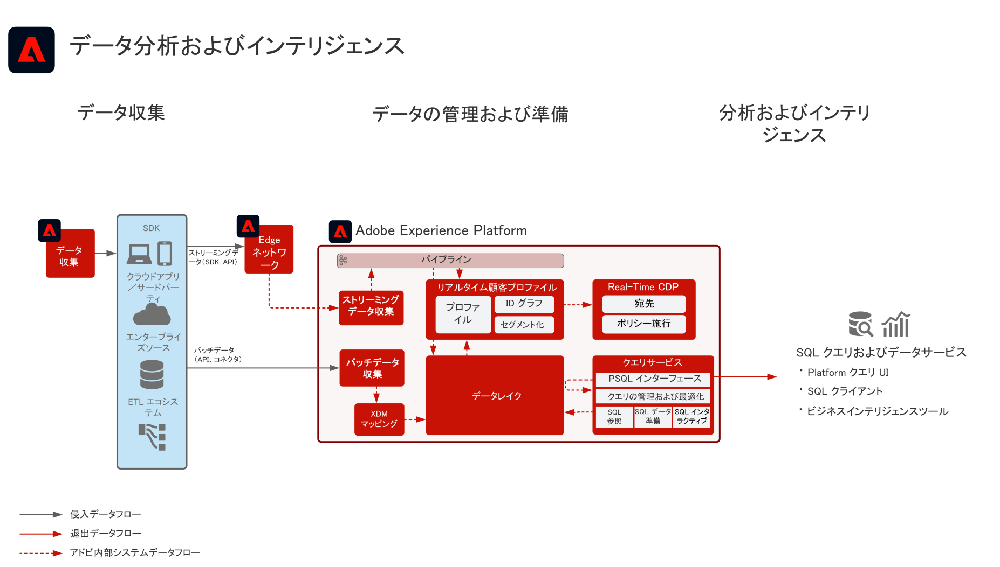

# データ分析とインテリジェンスブループリント

データ分析とインテリジェンスは、Adobe Experience Platform 内の機能で構成され、データレイクに存在するデータの調査クエリおよび分析を実行します。

Experience Platform の[!UICONTROL クエリサービス]を使用すると、データに対して SQL クエリを実行できます。[!UICONTROL Data Science Workspace] を使用すると、データに対して、データ調査、データサイエンスおよび機械学習のワークロードを実行できます。

また、Experience Platform を使用すると、サードパーティ SQL クライアント、インターフェイスおよびビジネスインテリジェンス（BI）ツールとの接続が可能になり、[!DNL PostgreSQL] プロトコルを使用して、Experience Platform 内で直接データへの接続やアクセス、クエリを実行できます。

ブループリントの詳細に記載されているように、クエリタイムアウトや、クエリ結果に含まれるデータ量に対して、特定のガードレールが適用されます。

## ユースケース

* インタラクティブクエリとデータの集計
* 調査および検証用に取り込まれたデータに対する行および列アクセス
* ビジネスインテリジェンスツールを使用したデータのダッシュボード表示およびビジュアライゼーション

## アプリケーション

* Adobe Experience Platform

## アーキテクチャ

## ガードレール

ベストプラクティスとガードレールについての詳細は、クエリサービス製品ドキュメントを参照してください。[クエリサービスガイダンス](https://experienceleague.adobe.com/docs/experience-platform/query/best-practices/writing-queries.html?lang=ja#best-practices)

## 実装手順

1. データを取り込むために[スキーマを作成](https://experienceleague.adobe.com/docs/platform-learn/tutorials/schemas/create-a-schema.html?lang=ja)します。
1. データを取り込むために[データセットを作成](https://experienceleague.adobe.com/docs/platform-learn/tutorials/data-ingestion/create-datasets-and-ingest-data.html?lang=ja)します。
1. Experience Platform に[データを取り込みます](https://experienceleague.adobe.com/?recommended=ExperiencePlatform-D-1-2020.1.dataingestion&amp;lang=ja)。
1. 生のアクセスおよびクエリ用にデータが[!UICONTROL クエリサービス]および [!UICONTROL Data Science Workspace] で使用できることを確認します。
1. ビジュアライゼーション、データクエリおよび調査用に、ビジネスインテリジェンスツールおよび SQL クライアントを[!UICONTROL クエリサービス]に接続します。

## 関連ドキュメント

* [Adobe Experience Platform インテリジェンス製品説明](https://helpx.adobe.com/jp/legal/product-descriptions/adobe-experience-platform-intelligence---product-description.html)
* [[!UICONTROL クエリサービス]ドキュメント](https://experienceleague.adobe.com/docs/experience-platform/query/home.html?lang=ja)
