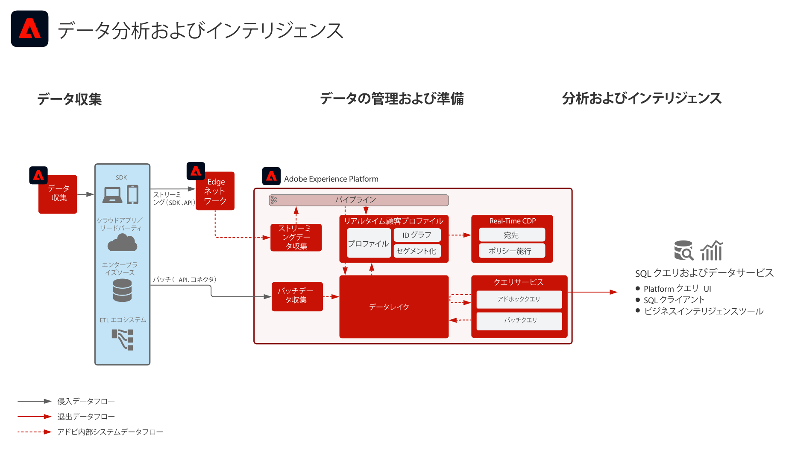

# データ分析とインテリジェンスブループリント

データ分析とインテリジェンスは、Adobe Experience Platform 内の機能で構成され、データレイクに存在するデータの調査クエリおよび分析を実行します。

Experience Platform の[!UICONTROL クエリサービス]を使用すると、データに対して SQL クエリを実行できます。

Experience Platform を使用すると、サードパーティ SQL クライアント、インターフェイスおよびビジネスインテリジェンス（BI）ツールとの接続が可能になり、[!DNL PostgreSQL] プロトコルを使用して、Experience Platform 内で直接データへの接続やアクセス、クエリを実行することができます。

## ユースケース

* インタラクティブクエリとデータの集計
* 調査および検証用に取り込まれたデータに対する行および列アクセス
* ビジネスインテリジェンスツールを使用したデータのダッシュボード表示およびビジュアライゼーション

クエリサービスのその他の一般的な使用例については、[クエリサービスのユースケース](https://experienceleague.adobe.com/docs/experience-platform/query/use-cases/abandoned-browse.html?lang=ja)で概要を説明します

## アプリケーション

* Adobe Experience Platform

## アーキテクチャ

## ガードレール

ベストプラクティスとガードレールについての詳細は、クエリサービス製品ドキュメントを参照してください。[クエリサービスガイダンス](https://experienceleague.adobe.com/docs/experience-platform/query/guardrails.html?lang=ja)

## 実装手順

1. データを取り込むために[スキーマを作成](https://experienceleague.adobe.com/?recommended=ExperiencePlatform-D-1-2021.1.xdm)します。
1. データを取り込むために[データセットを作成](https://experienceleague.adobe.com/docs/platform-learn/tutorials/data-ingestion/create-datasets-and-ingest-data.html?lang=ja)します。
1. Experience Platform に[データを取り込みます](https://experienceleague.adobe.com/?recommended=ExperiencePlatform-D-1-2020.1.dataingestion&amp;lang=ja)。
1. データが[[!UICONTROL クエリサービス]](https://experienceleague.adobe.com/docs/platform-learn/tutorials/queries/explore-data.html?lang=ja)で使用可能であることを確認します。
1. [ビジュアライゼーション、データクエリおよび調査用に、ビジネスインテリジェンスツールおよび SQL クライアントを[!UICONTROL クエリサービス]](https://experienceleague.adobe.com/docs/experience-platform/query/clients/overview.html?lang=ja)に接続します。

## 関連ドキュメント

* [Adobe Experience Platform インテリジェンス製品説明](https://helpx.adobe.com/jp/legal/product-descriptions/adobe-experience-platform-intelligence---product-description.html)
* [[!UICONTROL クエリサービス]ドキュメント](https://experienceleague.adobe.com/docs/experience-platform/query/home.html?lang=ja)
