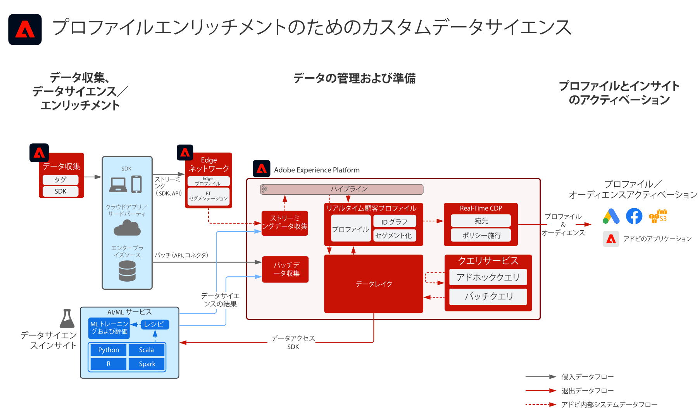

# プロファイルエンリッチメントのためのカスタムデータサイエンスブループリント

プロファイルエンリッチメントのためのカスタムデータサイエンスブループリントは、Adobe Experience Platform のデータが [!UICONTROL Data Science Workspace] でどのように使用され、機械学習のインサイトを提供するモデルをトレーニング、デプロイ、スコアリングするかを説明します。モデルは、[!UICONTROL リアルタイム顧客プロファイル]に対して有効なデータセットに直接出力でき、顧客プロファイルをさらに強化することができます。インサイトは、パーソナライゼーション向けにアクション化できます。機械学習インサイトの例には、ライフタイム値、スコアリング、製品およびカテゴリの親和性、コンバージョン傾向、チャーン傾向が含まれます。

## ユースケース

* Experience Platform の顧客データからインサイトを抽出してパターンを見つけます。このデータからモデルをトレーニングおよびスコアリングします。
* より詳細なパーソナライズ機能と最適化されたジャーニーのために、[!UICONTROL リアルタイム顧客プロファイル]をモデル主導のインサイトおよび属性でエンリッチメントします。
* 顧客のライフタイムバリュー、コンバージョン傾向やチャーン傾向、製品およびコンテンツの親和性、エンゲージメントスコアなどの顧客インサイトを判別するためのモデルをトレーニングおよびスコアリングします。

## アーキテクチャ

## 実装手順

1. データを取り込むために[スキーマを作成](https://experienceleague.adobe.com/docs/platform-learn/tutorials/schemas/create-a-schema.html?lang=ja)します。
1. データを取り込むために[データセットを作成](https://experienceleague.adobe.com/docs/platform-learn/tutorials/data-ingestion/create-datasets-and-ingest-data.html?lang=ja)します。
1. Experience Platform に[データを取り込みます](https://experienceleague.adobe.com/?recommended=ExperiencePlatform-D-1-2020.1.dataingestion&amp;lang=ja)。
1. DSW ノートブックを作成します。
1. 言語を選択します。Python と PySpark をサポートしています。
1. ノートブックでモデルを作成します。
1. モデルをトレーニングします。
1. モデルをスコアリングして、ターゲットデータを使用した予測を生成します。
1. モデル結果を[!UICONTROL リアルタイム顧客プロファイル]にプッシュする場合は、プロファイル用のモデル結果データセットを有効にします。

## 関連ドキュメント

* [Adobe Experience Platform インテリジェンス製品説明](https://helpx.adobe.com/jp/legal/product-descriptions/adobe-experience-platform-intelligence---product-description.html)
* [[!UICONTROL Data Science Workspace] ドキュメント](https://experienceleague.adobe.com/docs/experience-platform/data-science-workspace/home.html?lang=ja)
* [[!UICONTROL Data Science Workspace] チュートリアル](https://experienceleague.adobe.com/docs/platform-learn/tutorials/data-science-workspace/understanding-data-science-workspace.html?lang=ja)

## 関連するブログ投稿

* [[!DNL Simplifying the Data Science Lifecycle with Adobe Platform Experience]](https://medium.com/adobetech/simplifying-the-data-science-lifecycle-with-adobe-platform-experience-8ea4f056d82f)
* [[!DNL Content and Commerce AI: Personalizing Your Interactions with Customers Through Content Intelligence]](https://medium.com/adobetech/content-and-commerce-ai-personalizing-your-interactions-with-customers-through-content-intelligence-dc182601deab)
* [[!DNL Gaining a Deeper Understanding of Churn Using Data Science Workspace]](https://medium.com/adobetech/gaining-a-deeper-understanding-of-churn-using-data-science-workspace-18a2190e0cf3)
* [[!DNL Understanding Data Science In Adobe Experience Platform]](https://medium.com/adobetech/understanding-data-science-in-adobe-experience-platform-5bce5a17b42)
* [[!DNL An Introductory Look at Exploratory Data Analysis on Adobe Experience Platform]](https://medium.com/adobetech/an-introductory-look-at-exploratory-data-analysis-on-adobe-experience-platform-1bfce7501d9a)
* [[!DNL Cutting Across Adobe Experience Products with Machine Learning to Elevated User Experience]](https://medium.com/adobetech/cutting-across-adobe-experience-products-with-machine-learning-to-elevated-user-experience-7c85000510d1)
* [[!DNL Modeling XDM Data for Data Science at Scale on Adobe Experience Platform]](https://medium.com/adobetech/modeling-xdm-data-for-data-science-at-scale-on-adobe-experience-platform-222bb2a6dbf7)
* [[!DNL Segmentation.AI: Automated Audience-Clustering-as-a-Service in Adobe Experience Platform]](https://medium.com/adobetech/segmentation-ai-automated-audience-clustering-as-a-service-in-adobe-experience-platform-261f4099462c)
* [[!DNL Reimagining Jupyter Notebooks for Enterprise Scale]](https://medium.com/adobetech/reimagining-jupyter-notebooks-for-enterprise-scale-8bc6340d504a)
* [[!DNL Accelerate Intelligent Insights with Adobe Experience Platform Data Science Workspace]](https://medium.com/adobetech/accelerate-intelligent-insights-with-adobe-experience-platform-data-science-workspace-89538bacbbea)
* [[!DNL A Preview of Time Series Forecasting with Adobe Experience Platform]](https://medium.com/adobetech/preview-of-time-series-forecasting-with-adobe-experience-platform-38a2fc778e89)
* [[!DNL Cutting Across Adobe Experience Products with Machine Learning to Elevated User Experience]](https://medium.com/adobetech/cutting-across-adobe-experience-products-with-machine-learning-to-elevated-user-experience-7c85000510d1)
