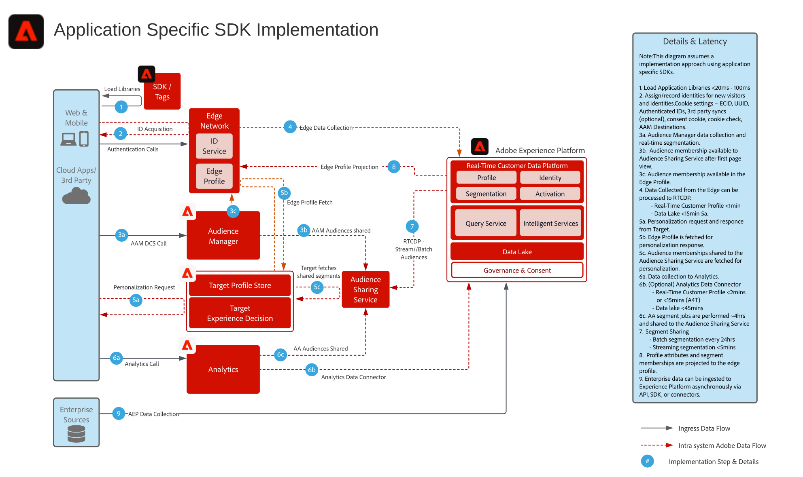

# アプリケーション固有の SDK デプロイメントアーキテクチャ図

以下のアーキテクチャ図は、実装にアプリケーション固有の SDK を使用した統合パスとデータ収集を示しています。

## リファレンスドキュメント

* [Experience Platform Web/Mobile SDKの概要](https://experienceleague.adobe.com/docs/experience-platform/edge/home.html?lang=ja)
* [Web SDK を使用した Adobe Experience Cloud 実装のチュートリアル](https://experienceleague.adobe.com/docs/platform-learn/implement-web-sdk/overview.html?lang=ja)
* [モバイルアプリでのAdobe Experience Cloudの実装チュートリアル](https://experienceleague.adobe.com/docs/platform-learn/implement-mobile-sdk/overview.html?lang=ja)
