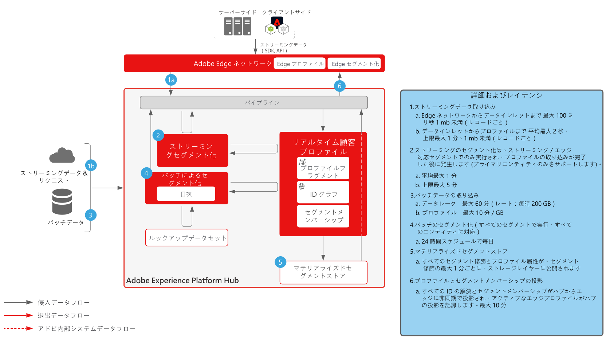
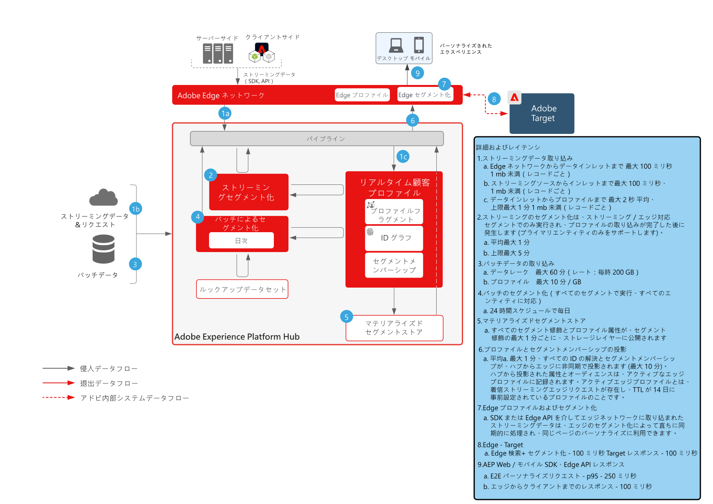

# ガードレール

ガードレールは、データとシステムの使用状況、パフォーマンスの最適化、Adobe Experience Platform およびアプリケーションでのエラーや予期しない結果の回避に関するガイダンスを提供する、推奨されるしきい値です。ガードレールは、顧客のアーキテクチャと使用例のパフォーマンス最適化を促進するために、システムの制約とパフォーマンスの期待を反映させることを目的としています。ガードレールは、サービスレベル契約にはなりません。製品固有のサービスレベル契約について詳しくは、以下にリンクされている製品の説明ドキュメントを参照してください。

## Adobe Experience Platform およびアプリケーション用のガードレール

[データ取り込みガードレール](https://experienceleague.adobe.com/docs/experience-platform/ingestion/guardrails.html?lang=ja)

[Edge Network API ガードレール](https://experienceleague.adobe.com/docs/experience-platform/edge-network-server-api/guardrails.html?lang=ja)

[リアルタイム顧客プロファイルガードレール](https://experienceleague.adobe.com/docs/experience-platform/profile/guardrails.html?lang=ja)

[ID ガードレール](https://experienceleague.adobe.com/docs/experience-platform/identity/guardrails.html?lang=ja)

[クエリサービスガードレール](https://experienceleague.adobe.com/docs/experience-platform/query/guardrails.html?lang=ja)

[宛先のアクティベーションガードレール](https://experienceleague.adobe.com/docs/experience-platform/destinations/guardrails.html?lang=ja)

[Journey Optimizer ガードレール](https://experienceleague.adobe.com/docs/journey-optimizer/using/get-started/guardrails.html?lang=ja)

 

## エンドツーエンドの遅延図

### データ取り込み

 

### セグメント化

 

### Real-time Customer Data Platform および Adobe Target

 

### Customer Journey Analytics

 

### Journey Optimizer

 

## 製品の説明

[Experience Platform Collection Enterprise](https://helpx.adobe.com/jp/legal/product-descriptions/adobe-experience-platform-collection-enterprise.html)

[Real-time Customer Data Platform](https://helpx.adobe.com/jp/legal/product-descriptions/real-time-customer-data-platform.html)

[B2B 顧客データ Platform](https://helpx.adobe.com/jp/legal/product-descriptions/adobe-experience-platform-b2b.html)

[Experience Platform Activation](https://helpx.adobe.com/jp/legal/product-descriptions/adobe-experience-platform0.html)

[Experience Platform インテリジェンス](https://helpx.adobe.com/jp/legal/product-descriptions/adobe-experience-platform-intelligence---product-description.html)

[インテリジェントサービス](https://helpx.adobe.com/jp/legal/product-descriptions/intelligent-services.html)

[Data Distiller](https://helpx.adobe.com/jp/legal/product-descriptions/data-distiller.html)

[Customer Journey Analytics](https://helpx.adobe.com/jp/legal/product-descriptions/customer-journey-analytics.html)

[Journey Optimizer](https://helpx.adobe.com/jp/legal/product-descriptions/adobe-journey-optimizer.html)

[Journey Orchestration](https://helpx.adobe.com/jp/legal/product-descriptions/journey-orchestration.html)

[Offer Decisioning](https://helpx.adobe.com/jp/legal/product-descriptions/offer-decisioning-app-service.html)
